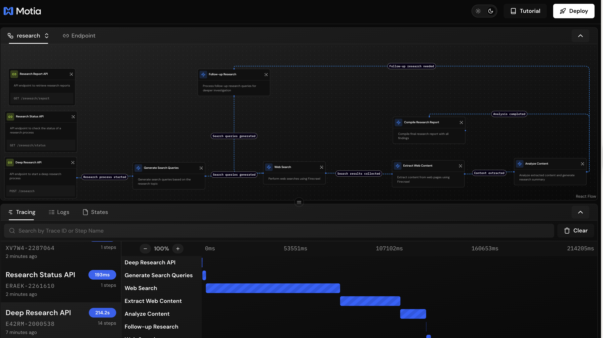
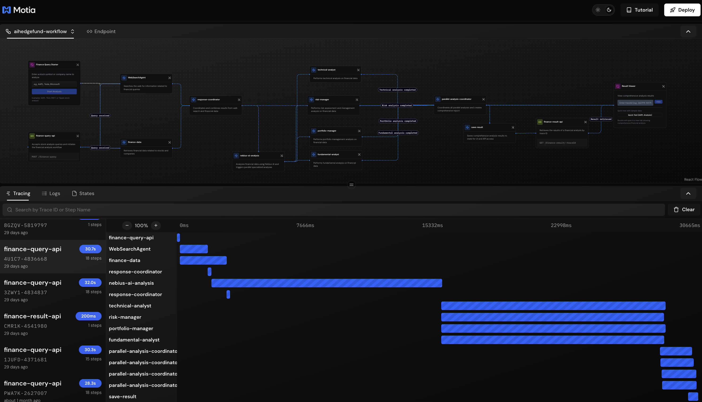
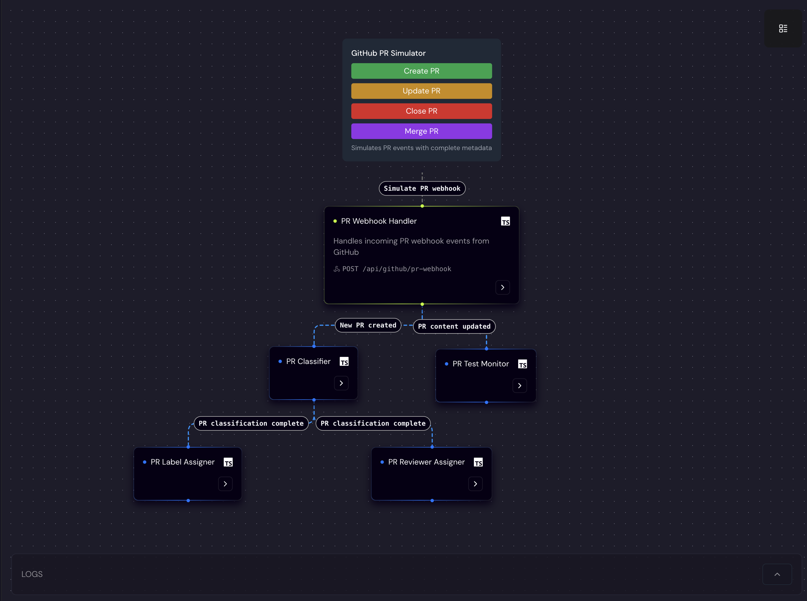
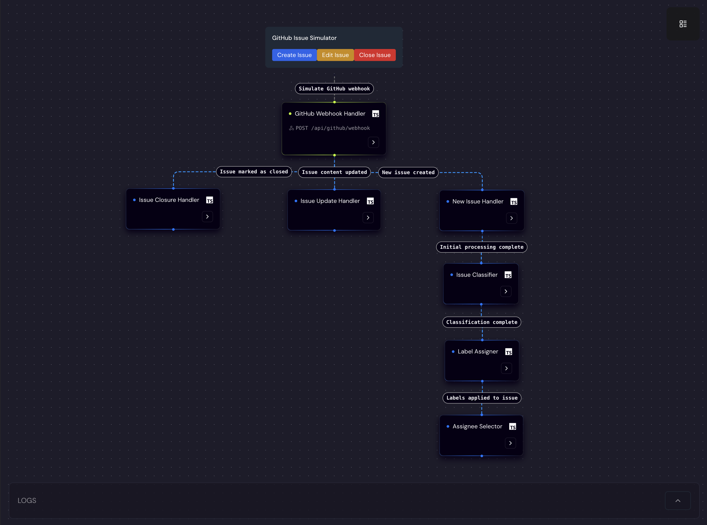
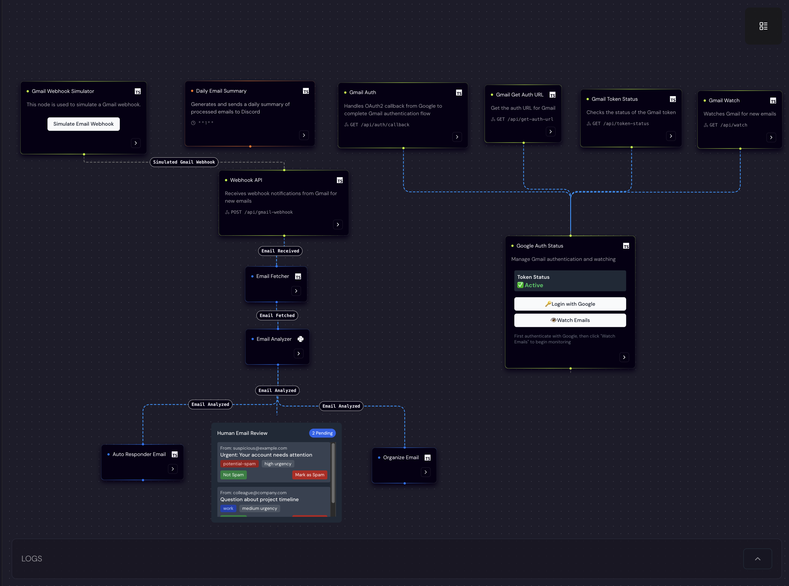
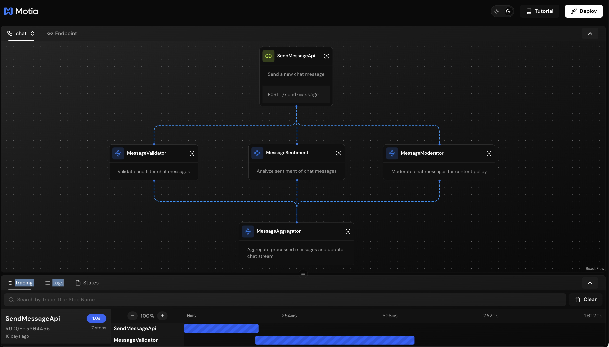
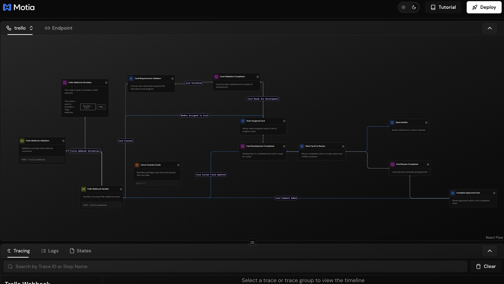
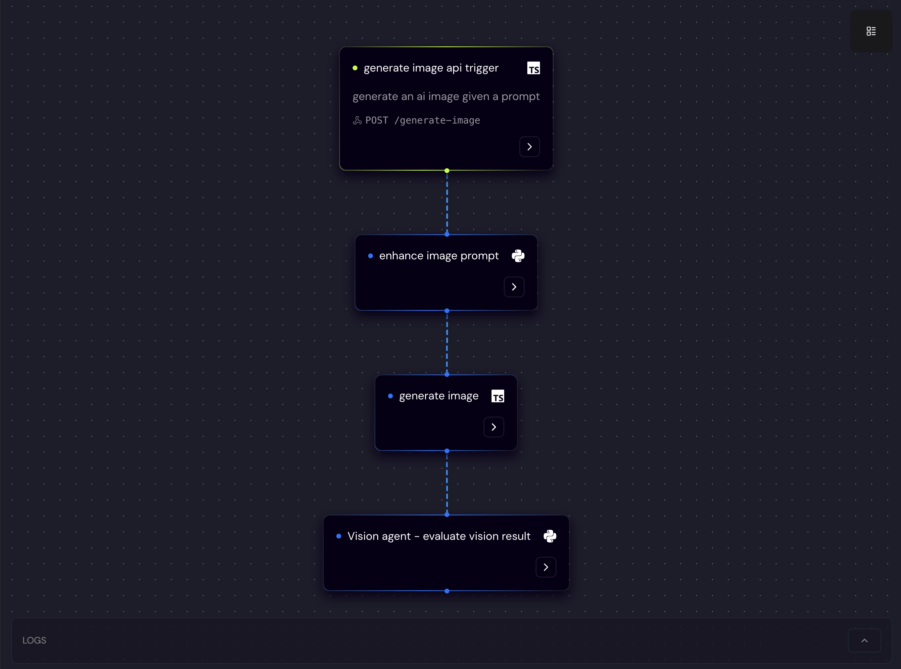
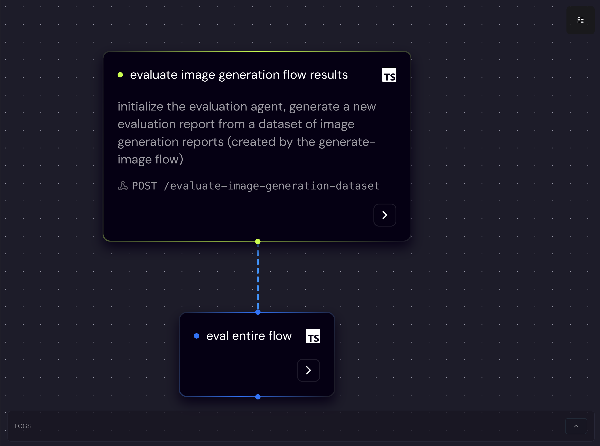

# Motia Examples 🚀

Welcome to the official examples repository for [Motia](https://motia.dev/) - a modern backend framework for building event-driven applications with built-in observability and state management.

## 📖 Documentation & Guided Tours

For detailed tutorials and guided walkthroughs of these examples, visit our comprehensive documentation:

- **[Examples Documentation](https://www.motia.dev/docs/examples)** - Step-by-step guides with code explanations
- **[Getting Started](https://www.motia.dev/docs/getting-started/quick-start)** - Quick start guide for Motia
- **[Core Concepts](https://www.motia.dev/docs/concepts/overview)** - Understanding Steps, Events, and Flows

## 🗂 Examples

## 🌟 Production-Ready Cloud Examples

### 🏆 ChessArena AI - LLM Chess Leaderboard

An advanced **AI chess battleground** where language models compete in real-time, evaluated by Stockfish for move-by-move quality analysis.

**Key Features:**
- **Multi-LLM Competition:** Multiple AI models compete simultaneously with live leaderboards  
- **Move-by-Move Evaluation:** Stockfish engine analyzes every move for quality scoring
- **Real-Time Streaming:** Live game updates using Motia Streams architecture
- **Advanced Analytics:** Comprehensive statistics tracking blunders, accuracy, and insights
- **Production Scalability:** Built for high-throughput concurrent games

**Evaluation System:**
- Every move scored against Stockfish recommendations
- Centipawn loss tracking for precise skill measurement  
- Blunder detection (>100 centipawn swings)
- Quality-based leaderboards over simple win/loss ratios

**Technologies:** TypeScript, Python, Stockfish Engine, OpenAI, Motia Streams

**🎯 Live Platform:** [ChessArena.ai](https://chessarena.ai)

[View Source Code →](https://github.com/MotiaDev/chessarena-ai)

### ⭐ GitHub Stars Counter

A **real-time GitHub stars counter** showcasing production-ready deployment capabilities - this exact implementation powers the live star count on the Motia website!

**Key Features:**
- **Real-Time Updates:** Instant star count updates across all connected clients using Motia Streams
- **Production Security:** GitHub webhook signature verification and request validation
- **One-Click Deployment:** Deploy instantly to Motia Cloud with built-in monitoring
- **Type-Safe Development:** Full TypeScript support with auto-generated types
- **Minimal Code:** Built with just 2 simple steps - webhook handler and real-time stream

**Technologies:** TypeScript, GitHub Webhooks, Motia Streams

**🚀 Live Demo:** [See it running on Motia.dev](https://motia.dev)

[View Source Code →](https://github.com/MotiaDev/github-stars-counter)

---

*Both examples demonstrate Motia's power for building production-ready, real-time applications that scale in the cloud with minimal infrastructure complexity.*

### AI Deep Research Agent

A powerful research assistant that performs comprehensive web research on any topic or question, providing in-depth analysis and reports.

**Key Features:**
- Deep Web Research: Searches the web, extracts content, and synthesizes findings
- Iterative Research Process: Supports multiple research depths for comprehensive exploration
- API Endpoints: REST API for initiating research and retrieving reports
- Parallel Processing: Efficiently processes search results and content extraction

**Technologies:** TypeScript, OpenAI, Firecrawl API

[View Example →](examples/ai-deep-research-agent)

### AI Hedge Fund - Comprehensive Financial Analysis Workflow

A sophisticated multi-agent financial analysis system that combines parallel processing, real-time market data, and specialized AI agents for comprehensive investment insights.

**Key Features:**
- **Multi-Agent Architecture**: 4 specialized AI analysts (Fundamental, Portfolio, Risk, Technical) running in parallel
- **Real-Time Market Data**: Integration with Alpha Vantage and Yahoo Finance APIs
- **Web Research Integration**: Automated web search for latest market news and analysis
- **Production-Ready Deployment**: Complete Docker containerization with docker-compose
- **State Management**: Persistent data storage across workflow steps with trace isolation
- **Interactive UI**: Custom React components for query input and result visualization
- **Comprehensive Analysis**: Generates detailed reports covering all aspects of investment analysis

**Architecture Highlights:**
- Parallel processing for maximum efficiency
- Error handling with graceful degradation
- TypeScript with full type safety and Zod validation
- Nebius AI integration for advanced analysis capabilities
- RESTful API endpoints for external integration

**Technologies:** TypeScript, Nebius AI, Alpha Vantage API, Yahoo Finance, Serper API, Docker

**🐳 Production Deployment:** Includes complete Docker setup with environment configuration

[View Example →](examples/ai-hedgefund)

### Finance Agent

A powerful event-driven financial analysis workflow built with Motia that combines web search, financial data, and AI analysis to provide comprehensive investment insights.

**Key Features:**
- Real-time Financial Analysis: Combines multiple data sources for comprehensive insights
- AI-Powered Insights: Leverages OpenAI GPT-4 for intelligent market analysis
- Web Search Integration: Aggregates latest market news and analysis
- Financial Data Integration: Real-time stock and company information

**Technologies:** TypeScript, Alpha Vantage API, SerperDev, OpenAI

[View Example →](examples/finance-agent)

### GitHub Integration Agent

A comprehensive agent for automating GitHub issue and pull request management using AI-powered classification and routing.

  
  

**Key Features:**
- AI-powered issue and PR classification
- Automatic label assignment based on content
- Smart reviewer suggestions based on expertise
- Automatic movement between stages in the development lifecycle

**Technologies:** TypeScript, OpenAI, GitHub API

[View Example →](examples/github-integration-workflow)

### Gmail Account Manager

An intelligent Gmail agent that monitors, analyzes, and automatically responds to incoming emails.

**Key Features:**
- Email classification and urgency detection
- Automated responses based on content analysis
- Smart email organization
- Daily summaries via Discord

**Technologies:** TypeScript, Python, Google APIs, Discord, Hugging Face

[View Example →](examples/gmail-workflow)

### PDF RAG Agent using Motia, Docling and Weaviate

An LLM chat-like question-answering system with RAG (Retrieval-Augmented Generation) to provide accurate answers from PDF documents.
The system leverages Docling to parse and intelligently chunk PDF documents, Weaviate as a vector database to store vectorized chunks, and OpenAI for embeddings and text generation.

  

**Key Features:**
- PDF document processing and chunking
- Vector storage using Weaviate
- Docling for PDF parsing and hybrid chunking
- OpenAI integration for embeddings and text generation
- Question answering using RAG pattern

**Technologies:** TypeScript, Python, Docling, Weaviate, OpenAI

[View Example →](examples/rag-docling-weaviate-agent)

### Real-Time Uptime Monitor

A production-ready website monitoring system that continuously checks site availability, sends intelligent Discord alerts, and provides comprehensive health reporting.

**Key Features:**
- Configurable cron-based website checking
- Smart Discord notifications with rate limiting
- Status change detection to prevent spam
- Built-in health check endpoint
- In-memory status storage with persistence
- Comprehensive error handling and logging

**Technologies:** JavaScript, Discord Webhooks, Cron Scheduling

[View Example →](examples/motia-uptime-monitor)

### Sentiment Analysis Workflow

A dynamic sentiment analysis application that uses an LLM to determine workflow routing, demonstrating event-driven decision making.

**Key Features:**
- Dynamic workflow routing based on sentiment
- OpenAI-powered sentiment analysis
- Event-driven architecture with conditional flows
- Real-time processing and response handling

**Technologies:** TypeScript, OpenAI

[View Example →](examples/sentimental-analysis)

### AI Health & Fitness Agent

An intelligent health and fitness assistant that analyzes user activity, provides personalized recommendations, and tracks wellness goals.

  
  

**Key Features:**
- Activity tracking and analysis
- Personalized fitness recommendations
- Health goal monitoring
- AI-powered insights and coaching

**Technologies:** TypeScript, Health APIs, AI Analysis

[View Example →](examples/ai-health-fitness)

### Blog to Tweet Automation

An automated content distribution system that transforms blog posts into engaging social media content.

  

**Key Features:**
- Automatic blog content extraction
- AI-powered tweet generation
- Social media scheduling
- Content optimization for platforms

**Technologies:** JavaScript, Social Media APIs, Content Processing

[View Example →](examples/blog-to-tweet)

### LinkedIn Content Agent

An intelligent content creation and management system for LinkedIn professional networking.

  

**Key Features:**
- Professional content generation
- LinkedIn API integration
- Engagement tracking and optimization
- Automated posting schedules

**Technologies:** JavaScript, LinkedIn API, Content Generation

[View Example →](examples/linkedIn-content-agent)

### Image Resizer Service

A high-performance image processing service that handles multiple formats and optimization strategies.

**Key Features:**
- Multiple image format support
- Batch processing capabilities
- Quality optimization
- Storage integration
- API-driven resizing operations

**Technologies:** TypeScript, Image Processing Libraries, Storage APIs

[View Example →](examples/image-resizer)

### Spamurai PR Agent

An intelligent GitHub PR management system that automatically detects and handles spam pull requests.

**Key Features:**
- Automated spam detection
- PR quality analysis
- Repository protection
- Intelligent filtering and classification

**Technologies:** TypeScript, GitHub API, Machine Learning

[View Example →](examples/Spamurai-pr-agent)

### Motia Docker Integration

A comprehensive example demonstrating how to containerize and deploy Motia applications with Docker.

**Key Features:**
- Docker containerization
- Multi-stage builds
- Production deployment configurations
- Container orchestration examples

**Technologies:** Docker, TypeScript, Deployment Tools

[View Example →](examples/motia-docker)

### Real-Time Chat Application

A comprehensive demonstration of real-time chat functionality with asynchronous message processing using the Motia Framework.

**Key Features:**
- Real-time messaging with WebSocket streaming
- Concurrent message processing (validation, sentiment analysis, moderation)
- Event-driven architecture with pub/sub messaging
- Type-safe message handling with Zod validation
- Live chat state updates and message aggregation

**Technologies:** TypeScript, Motia Streams, Event System

[View Example →](examples/chat-agent)

### Motia Parallel Execution

A demonstration of parallel task execution capabilities in Motia agents.

  

**Key Features:**
- Concurrent task processing
- Workload distribution
- Performance optimization
- Resource management

**Technologies:** TypeScript

[View Example →](examples/motia-parallel-execution)

### Research Assistant

An intelligent research assistant that helps gather and analyze information.

  

**Key Features:**
- Information gathering
- Data analysis
- Research synthesis
- Citation management

**Technologies:** TypeScript, OpenAI

[View Example →](examples/research-assistant)

### Streaming AI Chatbot

A real-time streaming chatbot implementation with AI capabilities.

  

**Key Features:**
- Real-time message streaming
- Interactive responses
- Token-by-token output
- WebSocket integration

**Technologies:** TypeScript, OpenAI Streaming

[View Example →](examples/streaming-ai-chatbot)

### Conversation Analyzer with Vision

An advanced agent that analyzes conversations with both text and visual understanding capabilities.

  

**Key Features:**
- Multi-modal conversation analysis
- Visual content processing
- Sentiment analysis
- Contextual understanding

**Technologies:** TypeScript, OpenAI Vision, Natural Language Processing

[View Example →](examples/conversation-analyzer-with-vision)

### Trello Task Automation

Streamline development processes with an intelligent task progression agent for Trello boards.

**Key Features:**
- Automated card movement between lists
- Task validation and requirement checking
- AI-generated task summaries
- Slack integration for notifications

**Technologies:** TypeScript, Trello API, OpenAI, Slack

[View Example →](examples/trello-flow)

### AI Image Generation and Evaluation

An agent that generates and evaluates AI images with feedback loops and quality metrics.

  
  

**Key Features:**
- Prompt enhancement with AI
- Image generation with Flux
- Evaluation of generated images
- Dataset reports with quality metrics

**Technologies:** TypeScript, Python, Claude, Flux, OpenAI

[View Example →](examples/vision-example)

## 🚀 Getting Started

Each example includes its own README with detailed setup instructions. Generally, you'll need:

1. Clone this repository
2. Navigate to the example directory
3. Install dependencies
4. Configure environment variables
5. Run the agent with Motia

### Meeting Transcription Example

A comprehensive example demonstrating local, privacy-friendly meeting audio processing using Motia, Whisper, and Streamlit.

**Key Features:**

- Complete Motia workflow from audio input to structured output
- Local AI processing with privacy-first approach
- Multiple step types (API, Event, Custom)
- Real-world meeting transcription with action item extraction
- Cross-platform UI with Streamlit

**Technologies:** TypeScript, Python, Whisper, Streamlit, Motia

[View Example →](examples/meeting-transcription/)

## 🤝 Contributing

We welcome contributions! If you've built an interesting agent with Motia, please share it by following our [contribution guidelines](CONTRIBUTING.md).

## 📝 License

This repository and its contents are licensed under the MIT License - see the [LICENSE](LICENSE) file for details.

## 📚 Learn More

- **[Motia Documentation](https://motia.dev/docs)** - Complete framework documentation
- **[Examples Documentation](https://www.motia.dev/docs/examples)** - Detailed tutorials for each example
- **[Getting Started Guide](https://www.motia.dev/docs/getting-started)** - Quick start tutorial
- **[Core Concepts](https://www.motia.dev/docs/concepts)** - Understanding Steps, Events, and Flows
- **[Deployment Guide](https://www.motia.dev/docs/deployment)** - Production deployment strategies
