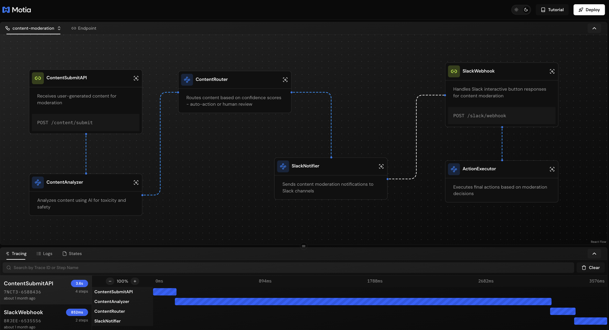

# Motia Examples 🚀

Welcome to the official examples repository for [Motia](https://motia.dev/) - a modern backend framework for building event-driven applications with built-in observability and state management.

## 📖 Documentation & Guided Tours

For detailed tutorials and guided walkthroughs of these examples, visit our comprehensive documentation:

- **[Examples Documentation](https://www.motia.dev/docs/examples)** - Step-by-step guides with code explanations
- **[Getting Started](https://www.motia.dev/docs/getting-started/quick-start)** - Quick start guide for Motia
- **[Core Concepts](https://www.motia.dev/docs/concepts/overview)** - Understanding Steps, Events, and Flows

## 🗂 Examples

## 🌟 Production-Ready Cloud Examples

### 🏆 ChessArena AI - LLM Chess Leaderboard

An advanced **AI chess battleground** where language models compete in real-time, evaluated by Stockfish for move-by-move quality analysis.

**Key Features:**
- **Multi-LLM Competition:** Multiple AI models compete simultaneously with live leaderboards  
- **Move-by-Move Evaluation:** Stockfish engine analyzes every move for quality scoring
- **Real-Time Streaming:** Live game updates using Motia Streams architecture
- **Advanced Analytics:** Comprehensive statistics tracking blunders, accuracy, and insights
- **Production Scalability:** Built for high-throughput concurrent games

**Evaluation System:**
- Every move scored against Stockfish recommendations
- Centipawn loss tracking for precise skill measurement  
- Blunder detection (>100 centipawn swings)
- Quality-based leaderboards over simple win/loss ratios

**Technologies:** TypeScript, Python, Stockfish Engine, OpenAI, Motia Streams

**🎯 Live Platform:** [ChessArena.ai](https://chessarena.ai)

[View Source Code →](https://github.com/MotiaDev/chessarena-ai)

### ⭐ GitHub Stars Counter

A **real-time GitHub stars counter** showcasing production-ready deployment capabilities - this exact implementation powers the live star count on the Motia website!

**Key Features:**
- **Real-Time Updates:** Instant star count updates across all connected clients using Motia Streams
- **Production Security:** GitHub webhook signature verification and request validation
- **One-Click Deployment:** Deploy instantly to Motia Cloud with built-in monitoring
- **Type-Safe Development:** Full TypeScript support with auto-generated types
- **Minimal Code:** Built with just 2 simple steps - webhook handler and real-time stream

**Technologies:** TypeScript, GitHub Webhooks, Motia Streams

**🚀 Live Demo:** [See it running on Motia.dev](https://motia.dev)

[View Source Code →](https://github.com/MotiaDev/github-stars-counter)

---

*Both examples demonstrate Motia's power for building production-ready, real-time applications that scale in the cloud with minimal infrastructure complexity.*

### AI Deep Research Agent

A powerful research assistant that performs comprehensive web research on any topic or question, providing in-depth analysis and reports.

**Key Features:**
- Deep Web Research: Searches the web, extracts content, and synthesizes findings
- Iterative Research Process: Supports multiple research depths for comprehensive exploration
- API Endpoints: REST API for initiating research and retrieving reports
- Parallel Processing: Efficiently processes search results and content extraction

**Technologies:** TypeScript, OpenAI, Firecrawl API

[View Example →](examples/ai-deep-research-agent)

### AI Hedge Fund - Comprehensive Financial Analysis Workflow

A sophisticated multi-agent financial analysis system that combines parallel processing, real-time market data, and specialized AI agents for comprehensive investment insights.

**Key Features:**
- **Multi-Agent Architecture**: 4 specialized AI analysts (Fundamental, Portfolio, Risk, Technical) running in parallel
- **Real-Time Market Data**: Integration with Alpha Vantage and Yahoo Finance APIs
- **Web Research Integration**: Automated web search for latest market news and analysis
- **Production-Ready Deployment**: Complete Docker containerization with docker-compose
- **State Management**: Persistent data storage across workflow steps with trace isolation
- **Interactive UI**: Custom React components for query input and result visualization
- **Comprehensive Analysis**: Generates detailed reports covering all aspects of investment analysis

**Architecture Highlights:**
- Parallel processing for maximum efficiency
- Error handling with graceful degradation
- TypeScript with full type safety and Zod validation
- Nebius AI integration for advanced analysis capabilities
- RESTful API endpoints for external integration

**Technologies:** TypeScript, Nebius AI, Alpha Vantage API, Yahoo Finance, Serper API, Docker

**🐳 Production Deployment:** Includes complete Docker setup with environment configuration

[View Example →](examples/ai-hedgefund)

### Finance Agent

A powerful event-driven financial analysis workflow built with Motia that combines web search, financial data, and AI analysis to provide comprehensive investment insights.

**Key Features:**
- Real-time Financial Analysis: Combines multiple data sources for comprehensive insights
- AI-Powered Insights: Leverages OpenAI GPT-4 for intelligent market analysis
- Web Search Integration: Aggregates latest market news and analysis
- Financial Data Integration: Real-time stock and company information

**Technologies:** TypeScript, Alpha Vantage API, SerperDev, OpenAI

[View Example →](examples/finance-agent)

### GitHub Integration Agent

A comprehensive agent for automating GitHub issue and pull request management using AI-powered classification and routing.

  
  

**Key Features:**
- AI-powered issue and PR classification
- Automatic label assignment based on content
- Smart reviewer suggestions based on expertise
- Automatic movement between stages in the development lifecycle

**Technologies:** TypeScript, OpenAI, GitHub API

[View Example →](examples/github-integration-workflow)

### Gmail Account Manager

An intelligent Gmail agent that monitors, analyzes, and automatically responds to incoming emails.

**Key Features:**
- Email classification and urgency detection
- Automated responses based on content analysis
- Smart email organization
- Daily summaries via Discord

**Technologies:** TypeScript, Python, Google APIs, Discord, Hugging Face

[View Example →](examples/gmail-workflow)

### PDF RAG Agent using Motia, Docling and Weaviate

An LLM chat-like question-answering system with RAG (Retrieval-Augmented Generation) to provide accurate answers from PDF documents.
The system leverages Docling to parse and intelligently chunk PDF documents, Weaviate as a vector database to store vectorized chunks, and OpenAI for embeddings and text generation.

  

**Key Features:**
- PDF document processing and chunking
- Vector storage using Weaviate
- Docling for PDF parsing and hybrid chunking
- OpenAI integration for embeddings and text generation
- Question answering using RAG pattern

**Technologies:** TypeScript, Python, Docling, Weaviate, OpenAI

[View Example →](examples/rag-docling-weaviate-agent)

### Real-Time Uptime Monitor

A production-ready website monitoring system that continuously checks site availability, sends intelligent Discord alerts, and provides comprehensive health reporting.

**Key Features:**
- Configurable cron-based website checking
- Smart Discord notifications with rate limiting
- Status change detection to prevent spam
- Built-in health check endpoint
- In-memory status storage with persistence
- Comprehensive error handling and logging

**Technologies:** JavaScript, Discord Webhooks, Cron Scheduling

[View Example →](examples/motia-uptime-monitor)

### Sentiment Analysis Workflow

A dynamic sentiment analysis application that uses an LLM to determine workflow routing, demonstrating event-driven decision making.

**Key Features:**
- Dynamic workflow routing based on sentiment
- OpenAI-powered sentiment analysis
- Event-driven architecture with conditional flows
- Real-time processing and response handling

**Technologies:** TypeScript, OpenAI

[View Example →](examples/sentimental-analysis)

### AI Health & Fitness Agent

An intelligent health and fitness assistant that analyzes user activity, provides personalized recommendations, and tracks wellness goals.

  
  

**Key Features:**
- Activity tracking and analysis
- Personalized fitness recommendations
- Health goal monitoring
- AI-powered insights and coaching

**Technologies:** TypeScript, Health APIs, AI Analysis

[View Example →](examples/ai-health-fitness)

### Blog to Tweet Automation

An automated content distribution system that transforms blog posts into engaging social media content.

  

**Key Features:**
- Automatic blog content extraction
- AI-powered tweet generation
- Social media scheduling
- Content optimization for platforms

**Technologies:** JavaScript, Social Media APIs, Content Processing

[View Example →](examples/blog-to-tweet)

### LinkedIn Content Agent

An intelligent content creation and management system for LinkedIn professional networking.

  

**Key Features:**
- Professional content generation
- LinkedIn API integration
- Engagement tracking and optimization
- Automated posting schedules

**Technologies:** JavaScript, LinkedIn API, Content Generation

[View Example →](examples/linkedIn-content-agent)

### Image Resizer Service

A high-performance image processing service that handles multiple formats and optimization strategies.

**Key Features:**
- Multiple image format support
- Batch processing capabilities
- Quality optimization
- Storage integration
- API-driven resizing operations

**Technologies:** TypeScript, Image Processing Libraries, Storage APIs

[View Example →](examples/image-resizer)

### Spamurai PR Agent

An intelligent GitHub PR management system that automatically detects and handles spam pull requests.

**Key Features:**
- Automated spam detection
- PR quality analysis
- Repository protection
- Intelligent filtering and classification

**Technologies:** TypeScript, GitHub API, Machine Learning

[View Example →](examples/Spamurai-pr-agent)

### Motia Docker Integration

A comprehensive example demonstrating how to containerize and deploy Motia applications with Docker.

**Key Features:**
- Docker containerization
- Multi-stage builds
- Production deployment configurations
- Container orchestration examples

**Technologies:** Docker, TypeScript, Deployment Tools

[View Example →](examples/motia-docker)

### Real-Time Chat Application

A comprehensive demonstration of real-time chat functionality with asynchronous message processing using the Motia Framework.

**Key Features:**
- Real-time messaging with WebSocket streaming
- Concurrent message processing (validation, sentiment analysis, moderation)
- Event-driven architecture with pub/sub messaging
- Type-safe message handling with Zod validation
- Live chat state updates and message aggregation

**Technologies:** TypeScript, Motia Streams, Event System

[View Example →](examples/chat-agent)

### Motia Parallel Execution

A demonstration of parallel task execution capabilities in Motia agents.

  

**Key Features:**
- Concurrent task processing
- Workload distribution
- Performance optimization
- Resource management

**Technologies:** TypeScript

[View Example →](examples/motia-parallel-execution)

### Research Assistant

An intelligent research assistant that helps gather and analyze information.

  

**Key Features:**
- Information gathering
- Data analysis
- Research synthesis
- Citation management

**Technologies:** TypeScript, OpenAI

[View Example →](examples/research-assistant)

### Streaming AI Chatbot

A real-time streaming chatbot implementation with AI capabilities.

  

**Key Features:**
- Real-time message streaming
- Interactive responses
- Token-by-token output
- WebSocket integration

**Technologies:** TypeScript, OpenAI Streaming

[View Example →](examples/streaming-ai-chatbot)

### Conversation Analyzer with Vision

An advanced agent that analyzes conversations with both text and visual understanding capabilities.

  

**Key Features:**
- Multi-modal conversation analysis
- Visual content processing
- Sentiment analysis
- Contextual understanding

**Technologies:** TypeScript, OpenAI Vision, Natural Language Processing

[View Example →](examples/conversation-analyzer-with-vision)

### Trello Task Automation

Streamline development processes with an intelligent task progression agent for Trello boards.

**Key Features:**
- Automated card movement between lists
- Task validation and requirement checking
- AI-generated task summaries
- Slack integration for notifications

**Technologies:** TypeScript, Trello API, OpenAI, Slack

[View Example →](examples/trello-flow)

### AI Image Generation and Evaluation

An agent that generates and evaluates AI images with feedback loops and quality metrics.

  
  

**Key Features:**
- Prompt enhancement with AI
- Image generation with Flux
- Evaluation of generated images
- Dataset reports with quality metrics

**Technologies:** TypeScript, Python, Claude, Flux, OpenAI

[View Example →](examples/vision-example)

## 🚀 Getting Started

Each example includes its own README with detailed setup instructions. Generally, you'll need:

1. Clone this repository
2. Navigate to the example directory
3. Install dependencies
4. Configure environment variables
5. Run the agent with Motia

### Meeting Transcription Example

A comprehensive example demonstrating local, privacy-friendly meeting audio processing using Motia, Whisper, and Streamlit.

**Key Features:**

- Complete Motia workflow from audio input to structured output
- Local AI processing with privacy-first approach
- Multiple step types (API, Event, Custom)
- Real-world meeting transcription with action item extraction
- Cross-platform UI with Streamlit

**Technologies:** TypeScript, Python, Whisper, Streamlit, Motia

[View Example →](examples/meeting-transcription/)

### AI AQI Alert System

A comprehensive Air Quality Index (AQI) analysis backend providing real-time air quality monitoring, health recommendations, trend analysis, and alert notifications.

  
  

**Key Features:**
- Real-time AQI analysis for any location
- AI-powered health recommendations based on AQI levels
- 7-day trend analysis
- Email alert system with customizable thresholds
- Beautiful dashboard plugin
- Multiple data sources (Firecrawl, OpenWeatherMap)

**Technologies:** TypeScript, OpenAI, Firecrawl, OpenWeatherMap, Resend

[View Example →](examples/ai-aqi-alert-system)

### AI Mortgage Alert System

An intelligent, real-time mortgage rate monitoring and analysis system with OpenAI, Couchbase Vector Search, and Resend.

**Key Features:**
- AI-powered mortgage rate trend analysis using OpenAI GPT-4
- Vector search with 1536-dimensional embeddings
- Beautiful HTML email alerts via Resend
- Automated monitoring with cron-based rate scraping
- CSV logging for all analyses
- Real-time processing of rate changes

**Technologies:** TypeScript, OpenAI, Couchbase, Resend

[View Example →](examples/ai-morgage-alert-system)

### AI Home Renovation Planner

A full-stack AI-powered renovation planning application with personalized design plans, budget-aware recommendations, and photorealistic rendering using Gemini 2.5 Flash.

**Key Features:**
- AI-powered design planning with specific materials and colors
- Budget-aware recommendations tailored to constraints
- Complete project roadmap with timeline and budget breakdown
- Photorealistic rendering using Gemini 2.5 Flash Image
- Natural language editing of renderings
- Real-time frontend updates
- Smart room and budget detection

**Technologies:** TypeScript, Python, Google Gemini 2.5 Flash, React

[View Example →](examples/ai-room-renovate)

### Airbnb Guest Assistant

An AI-powered guest assistant for Airbnb properties with RAG capabilities, conversation history tracking in Notion, and local search functionality.

**Key Features:**
- Smart chat API with RAG architecture
- Vector search with Pinecone integration
- Conversation history in Notion database
- SerpAPI integration for restaurant/attraction recommendations
- Document processing for property manuals
- Beautiful Workbench visualization

**Technologies:** TypeScript, OpenAI, Pinecone, Notion, SerpAPI

[View Example →](examples/airbnb-assistant)

### Currency Rate Monitor

A sophisticated Currency Rate Monitor with RAG using OpenAI embeddings, Weaviate vector database, Google Sheets logging, and Slack notifications.

**Key Features:**
- Webhook endpoint for currency rate data
- Text processing with automatic chunking
- Vector embeddings with OpenAI
- Weaviate vector database for semantic search
- RAG agent with intelligent query processing
- Google Sheets logging
- Slack error notifications

**Technologies:** TypeScript, OpenAI, Weaviate, Google Sheets, Slack

[View Example →](examples/currency-rate-monitor)

### GitHub Stars Video Generator

Generate beautiful animated videos showcasing your GitHub repository's star history using Motia and Remotion.

**Key Features:**
- Dual theme support (dark and light)
- Live video preview in Motia Workbench
- Real-time processing with live status updates
- High-quality output (1280x720 @ 60 FPS)
- Smooth animations with avatar scrolling
- One-click MP4 download

**Technologies:** TypeScript, Remotion, GitHub API

[View Example →](examples/git-stars-video)

### GitHub Commit Jenkins

A production-ready workflow that processes GitHub commits using AI-powered analysis with RAG (Retrieval-Augmented Generation).

**Key Features:**
- Webhook integration for GitHub commits
- Text processing with chunking
- Vector embeddings with OpenAI
- Vector storage in Supabase with pgvector
- RAG agent for commit analysis
- Google Sheets logging
- Slack error notifications

**Technologies:** TypeScript, Python, OpenAI, Supabase, Google Sheets, Slack

[View Example →](examples/github-commit-jenkins)

### Google ADK Agents on Motia

Build production-grade AI agents with Google's Agent Development Kit, simplified by Motia's event-driven architecture.

  
  

**Key Features:**
- Simple & multi-agent chat systems
- Fast polling for real-time updates (500ms)
- Beautiful formatted output with syntax highlighting
- Async event-driven processing
- Conversation history with session persistence
- Tool integration (search, code, weather, etc.)
- Full TypeScript with Zod validation

**Technologies:** TypeScript, Google Gemini 2.5 Flash, Motia

[View Example →](examples/google-adk-motia)

### Motia Research Assistant

A multi-agent research system combining Motia workflow orchestration with Mastra AI agents to deliver comprehensive business research reports in under 60 seconds.

**Key Features:**
- 8-step workflow pipeline
- Web search using Tavily API
- AI-powered analysis with OpenAI GPT-4o
- Fact verification with additional searches
- Professional report generation
- Quality metrics tracking

**Technologies:** TypeScript, Mastra, OpenAI, Tavily

[View Example →](examples/motia-research-assistant)

### Property Search Agent

A high-performance, event-driven real estate search system built with Motia and Agno, featuring parallel processing and interactive dashboard.

  
  

**Key Features:**
- 4 parallel processors (57% faster than sequential)
- Concurrent website scraping with Firecrawl
- AI-powered market analysis with Agno + OpenAI
- Property enrichment (schools, crime stats, walkability)
- Neighborhood analysis
- Interactive React dashboard plugin
- Beautiful UI components for Workbench

**Technologies:** TypeScript, Python, Agno, OpenAI, Firecrawl

[View Example →](examples/property-search-agent)

### Public Form Auto Triage

A Motia workflow implementing intelligent form triage using RAG with vector similarity search and LLM processing.

**Key Features:**
- Webhook integration for form submissions
- Text processing and embedding generation
- Vector storage in Supabase with pgvector
- RAG agent with Claude AI
- Window memory for conversation context
- Google Sheets logging
- Slack error notifications

**Technologies:** TypeScript, OpenAI, Anthropic, Supabase, Google Sheets, Slack

[View Example →](examples/public-form-auto-triage)

### SmartTravel Multi-Agent System

An intelligent travel planning system powered by 6 specialized AI agents working in harmony to create comprehensive, personalized travel itineraries.

  
  

**Key Features:**
- 6 specialized AI agents (Destination Explorer, Flight Search, Hotel Search, Dining, Itinerary, Budget)
- Real-time status tracking
- Beautiful React frontend with TanStack Router
- API-driven architecture
- Multi-agent orchestration
- Personalized planning based on travel style and interests

**Technologies:** TypeScript, OpenAI GPT-4o, React, TanStack Router

[View Example →](examples/smarttravel-multi-agent)

### AI Content Moderation

A complete content moderation system combining AI analysis with human review via Slack integration.

**Key Features:**
- Dual content support (text and images)
- Confidence-based routing (auto vs human review)
- Interactive Slack messages for human review
- Channel prioritization for high-risk content
- Audit trail with reviewer information
- State management for complete workflow tracking

**Technologies:** TypeScript, OpenAI, Slack

[View Example →](examples/ai-content-moderation)

### Car Alert System

AI-powered connected car alert processing system with intelligent response generation.

**Key Features:**
- Text chunking for large alerts
- OpenAI GPT-4 for intelligent responses
- Conversation memory per session
- Local JSON logging
- Optional Google Sheets integration
- No Redis required (uses Motia state)

**Technologies:** Python, OpenAI, Google Sheets

[View Example →](examples/car-alert)

### Competitor Price Scraper

A Motia workflow implementing a full RAG system for analyzing competitor pricing data with vector storage.

**Key Features:**
- Webhook endpoint for competitor data
- Text processing with configurable chunking
- OpenAI embeddings generation
- Supabase vector storage with pgvector
- RAG analysis using Anthropic Claude
- Window memory for conversation context
- Google Sheets logging
- Slack error notifications

**Technologies:** TypeScript, OpenAI, Anthropic, Supabase, Google Sheets, Slack

[View Example →](examples/competitor-price-scrapper)

### Email Marketing Automation

A comprehensive email marketing automation platform featuring AI-powered personalization, behavioral triggers, and scalable campaign management.

  
  

**Key Features:**
- Campaign creation and management API
- Smart user segmentation (VIP, new users, active, inactive)
- AI content personalization with Python
- Scheduled campaigns with automated delivery
- Real-time email analytics
- Behavioral trigger automation
- Welcome email series
- Unsubscribe management
- Beautiful React dashboard

**Technologies:** TypeScript, Python, OpenAI, Appwrite, SendGrid, React

[View Example →](examples/email-marketing-automation)

### Fast Likes Smart Feeds

A fast-response, event-driven like system demonstrating mixed TypeScript/Python microservices architecture with immediate API responses and asynchronous background processing.

**Key Features:**
- Micro-actions pattern with real-time integrations
- Database sync with Supabase
- Firebase Cloud Messaging for push notifications
- WebSocket broadcasting capability
- Parallel processing for maximum performance
- Event-driven architecture

**Technologies:** TypeScript, Python, Firebase, Supabase

[View Example →](examples/fast-likes-smart-feeds)

### Harvest Logbook RAG

A hands-on demonstration of building a production-ready RAG system with fine-grained authorization using SpiceDB.

**Key Features:**
- RAG pipeline with Motia's event-driven architecture
- Fine-grained authorization with SpiceDB
- Text chunking and embedding generation
- Vector storage with Pinecone
- Role-based access control
- Multi-tenant data access
- OpenAI and HuggingFace support

**Technologies:** TypeScript, OpenAI, Pinecone, SpiceDB

[View Example →](examples/harvest-logbook-rag)

### NVIDIA Docs AI Generator

An intelligent documentation generation system that automatically analyzes GitHub repositories and creates comprehensive documentation with architecture diagrams, code analysis, and test generation.

**Key Features:**
- AI-powered repository analysis using NVIDIA NIM LLMs
- Automatic architecture and workflow diagrams
- Comprehensive documentation generation
- Code quality analysis and improvement suggestions
- Automated test case generation
- Support for multiple programming languages

**Technologies:** TypeScript, NVIDIA NIM, Mermaid

[View Example →](examples/nvidia-docs-motia)

### Ollama Chat

A minimal example demonstrating real-time AI streaming and conversation state management using Motia with Ollama for local AI models.

**Key Features:**
- Real-time AI streaming with token-by-token responses
- Local AI models (Llama 3.1, CodeLlama, Mistral, etc.)
- Live state management with message history
- Event-driven architecture
- Privacy-focused (all processing local)
- No API keys required

**Technologies:** TypeScript, Ollama

[View Example →](examples/ollama-chat)

### RAG Dockling ChromaDB Ollama Agent

Multi-format document RAG agent supporting PDF, Markdown, HTML, and TXT files with Docling and vector databases.

**Key Features:**
- Multi-format document processing
- Docling for document parsing and hybrid chunking
- ChromaDB vector storage
- OpenAI or Ollama integration
- Question answering using RAG pattern
- Docker support for easy deployment

**Technologies:** TypeScript, Python, Docling, ChromaDB, OpenAI, Ollama

[View Example →](examples/rag-dockling-chromadb-ollama-agent)

### Real-time Todo App

A modern todo application featuring real-time streaming capabilities, React frontend, and type-safe API backend built with Motia.

  
  

**Key Features:**
- Real-time synchronization via Motia Streams
- Type-safe end-to-end with Zod validation
- Modern UI with TailwindCSS
- Inline editing functionality
- Optimistic updates with loading states
- Virtual events for loose coupling

**Technologies:** TypeScript, React, Motia Streams, TailwindCSS

[View Example →](examples/realtime-todo-app)

### UGC Workflow

An AI-powered pipeline that automatically transforms product images into professional user-generated content (UGC) videos for social media marketing.

**Key Features:**
- Multi-AI pipeline (GPT-4o, Gemini 2.5 Flash, Veo 3)
- Parallel processing for multiple variants
- Brand consistency maintenance
- Authentic UGC style creation
- Cloud storage with Box
- Event-driven architecture

**Technologies:** TypeScript, Python, OpenAI, Google Gemini, Veo 3, ImageKit, Box

[View Example →](examples/ugc-workflow)

## 🤝 Contributing

We welcome contributions! If you've built an interesting agent with Motia, please share it by following our [contribution guidelines](CONTRIBUTING.md).

## 📝 License

This repository and its contents are licensed under the MIT License - see the [LICENSE](LICENSE) file for details.

## 📚 Learn More

- **[Motia Documentation](https://motia.dev/docs)** - Complete framework documentation
- **[Examples Documentation](https://www.motia.dev/docs/examples)** - Detailed tutorials for each example
- **[Getting Started Guide](https://www.motia.dev/docs/getting-started)** - Quick start tutorial
- **[Core Concepts](https://www.motia.dev/docs/concepts)** - Understanding Steps, Events, and Flows
- **[Deployment Guide](https://www.motia.dev/docs/deployment)** - Production deployment strategies
