# 🏚️ AI Home Renovation Planner

A full-stack AI-powered renovation planning application built with **Motia** Backend Framework. Analyzes your space, creates personalized renovation plans, generates photorealistic renderings using **Gemini 2.5 Flash Image**, and allows iterative refinement with natural language edits.


## ✨ Features

- **🎨 AI-Powered Design Planning**: Creates detailed design plans with specific materials, colors, and features
- **💰 Budget-Aware Recommendations**: Tailors plans to your specific budget constraints
- **📊 Complete Project Roadmap**: Provides timeline, budget breakdown, contractor list, and action checklist
- **🖼️ Photorealistic Rendering**: Uses **Gemini 2.5 Flash** NanoBanana model for AI-generated visualizations
- **✏️ Natural Language Editing**: Refine renderings with simple instructions like "make the cabinets cream color"
- **⚡ Real-Time Updates**: Frontend auto-refreshes when new rendering versions are available
- **🎯 Smart Room Detection**: Automatically identifies room type, budget, and style from descriptions
- **🖥️ Modern Web UI**: Beautiful React frontend with real-time progress tracking

## 🏗️ Architecture

**Backend**: Event-driven Motia workflow with coordinator/dispatcher pattern  
**Frontend**: React + TypeScript + Vite + TailwindCSS + Zustand  
**AI**: Google Gemini 2.5 Flash (text) + Gemini 2.5 Flash Image (rendering)

```mermaid
graph LR
    A[React Frontend] --> B[Start Renovation API]
    B --> C{Route Request}
    C -->|General Question| D[Info Handler]
    C -->|Renovation Planning| E[Visual Assessor]
    E --> F[Design Planner]
    F --> G[Project Coordinator]
    G --> H[Generate Rendering 🎨]
    H --> I[Get Result API]
    D --> I
    I --> J[Frontend Dashboard]
    J --> K[Edit Rendering ✏️]
    K --> H
```



## 🚀 Quick Start

### Prerequisites

- **Node.js 18+**
- **Python 3.9+**
- **Motia CLI** (install: `npx motia@latest create`)
- **Google Gemini API Key** ([Get it here](https://aistudio.google.com/app/apikey))

### Installation

```bash
# 1. Clone the repository
git clone <your-repo-url>
cd Room-Renovate

# 2. Install Node.js and Python dependencies
npm install
python_modules/bin/pip install -r requirements.txt

# 3. Set up environment variables
cp env.example .env

# Edit .env and add your GOOGLE_API_KEY
npm run dev

# 4 For frontend, run:
cd frontend && npm run dev

# The application will be available at:
- **Backend**: `http://localhost:3000`
- **Frontend**: `http://localhost:5173`
```


## 🎯 Usage

### Web Interface (Recommended)

1. Open `http://localhost:5173` in your browser
2. Enter your renovation details:
   - **Description**: "I want to renovate my kitchen with modern farmhouse style"
   - **Budget**: $20,000 (optional)
3. Click **"Generate Renovation Plan"**
4. View your comprehensive plan with:
   - Design details and color palette
   - Budget breakdown
   - Timeline estimate
   - Action checklist
5. Click **"View Rendering"** to see AI-generated visualization
6. Use **"Refine Rendering"** to make edits:
   - "Make the cabinets cream color"
   - "Add pendant lights over the island"
   - "Change flooring to darker oak"

### API Usage

#### Start Renovation
```bash
POST http://localhost:3000/renovation/start
Content-Type: application/json

{
  "message": "I want to renovate my kitchen with modern farmhouse style",
  "budget": 20000,
  "roomType": "kitchen",
  "style": "modern"
}
```

**Response:**
```json
{
  "sessionId": "abc123",
  "message": "Starting renovation assessment",
  "routedTo": "VisualAssessor"
}
```

#### Get Renovation Plan
```bash
GET http://localhost:3000/renovation/{sessionId}/result
```


**Response:**
```json
{
  "sessionId": "abc123",
  "completed": true,
  "roadmap": {
    "projectSummary": {
      "roomType": "kitchen",
      "style": "modern",
      "scope": "moderate",
      "squareFootage": 120
    },
    "budget": {
      "materials": 8000,
      "labor": 9000,
      "permits": 500,
      "contingency": 2500,
      "total": 20000
    },
    "timeline": {
      "duration": "3-6 weeks",
      "scope": "moderate"
    },
    "designPlan": {
      "approach": "preserve_layout",
      "materials": ["..."],
      "colors": {
        "cabinets": "glossy white",
        "walls": "Soft white",
        "accents": "Natural wood tones"
      },
      "features": ["..."]
    },
    "contractors": ["General Contractor", "Electrician", "Plumber"],
    "actionChecklist": ["..."]
  }
}
```

#### Get Rendering
```bash
GET http://localhost:3000/renovation/{sessionId}/rendering
```

**Response:**
```json
{
  "sessionId": "abc123",
  "renderingCompleted": true,
  "rendering": {
    "imageBase64": "iVBORw0KGgoAAAANSUhEUg...",
    "mimeType": "image/png",
    "prompt": "A modern kitchen with...",
    "generatedAt": "2025-11-07T12:00:00Z",
    "model": "gemini-2.5-flash-image",
    "version": 1
  },
  "message": "Rendering completed successfully"
}
```

#### Edit Rendering
```bash
POST http://localhost:3000/renovation/{sessionId}/edit
Content-Type: application/json

{
  "editPrompt": "Make the cabinets cream color instead of white"
}
```

## 📂 Project Structure

```
Room-Renovate/
├── frontend/                          # React frontend application
│   ├── src/
│   │   ├── pages/
│   │   │   ├── Home.tsx              # Landing page
│   │   │   ├── RenovationForm.tsx    # Input form
│   │   │   ├── Dashboard.tsx         # Plan display
│   │   │   └── RenderingViewer.tsx   # Image viewer & editor
│   │   ├── services/
│   │   │   └── renovationApi.ts      # API client
│   │   ├── stores/
│   │   │   └── renovationStore.ts    # Zustand state
│   │   └── types/
│   │       └── renovation.ts         # TypeScript types
│   └── package.json
│
├── steps/                             # Motia workflow steps
│   ├── renovation/
│   │   ├── start_renovation.step.ts          # API entry point
│   │   ├── info_handler.step.ts              # General Q&A
│   │   ├── visual_assessor.step.ts           # Room analysis
│   │   ├── design_planner.step.ts            # Design creation
│   │   ├── project_coordinator.step.ts       # Roadmap generation
│   │   ├── get_renovation_result.step.ts     # Results API
│   │   ├── get_rendering.step.ts             # Rendering retrieval
│   │   ├── generate_rendering_step.py        # 🎨 Gemini image generation
│   │   ├── edit_rendering_api.step.ts        # Edit trigger
│   │   ├── edit_rendering_step.py            # 🎨 Gemini image editing
│   │   └── *.step.tsx                        # Workbench UI overrides
│   └── utils/
│       └── renovation-tools.ts                # Utilities
│
├── requirements.txt                   # Python dependencies
├── package.json                       # Node.js dependencies
├── env.example                        # Environment template
├── TESTING_GUIDE.md                   # Comprehensive testing guide
├── quick-test.sh                      # CLI test script
└── README.md
```

## 🔧 Configuration

### Environment Variables

Create a `.env` file in the project root:

```env
# Required: Google Gemini API Key
GOOGLE_API_KEY=your_api_key_here

# Optional: Custom port (default: 3000)
PORT=3000
```

### Supported Room Types

- Kitchen
- Bathroom
- Bedroom
- Living Room
- Dining Room
- Office
- Basement

### Supported Styles

- Modern
- Farmhouse
- Industrial
- Minimalist
- Traditional
- Contemporary
- Rustic
- Coastal

## 🎨 Event Topics

The workflow uses these event topics for communication:

| Topic | Description |
|-------|-------------|
| `renovation.info` | General information requests |
| `renovation.assess` | Start visual assessment |
| `renovation.design` | Create design plan |
| `renovation.coordinate` | Generate final roadmap |
| `renovation.render` | Generate rendering with Gemini |
| `renovation.edit` | Edit rendering with Gemini |

## 💾 State Management

The workflow stores data in Motia state grouped by `sessionId`:

- `message` - User's renovation description
- `budget` - User-provided budget
- `roomType` - Detected/provided room type
- `style` - Detected/provided style
- `assessment` - Room assessment results
- `designPlan` - Design specifications
- `roadmap` - Complete renovation plan
- `rendering` - Generated image data
- `editHistory` - Edit version history

## 🧪 Testing

### Quick Test (Command Line)

```bash
chmod +x quick-test.sh
./quick-test.sh
```

### Manual Testing

See [TESTING_GUIDE.md](./TESTING_GUIDE.md) for comprehensive testing instructions including:
- API endpoint testing with curl
- Frontend testing scenarios
- Image generation testing
- Edit functionality testing
- Budget and room type detection testing

### Example Test Prompts

```bash
# Kitchen renovation
curl -X POST http://localhost:3000/renovation/start \
  -H "Content-Type: application/json" \
  -d '{
    "message": "I want to renovate my small galley kitchen with modern farmhouse style",
    "budget": 25000
  }'

# Bedroom makeover
curl -X POST http://localhost:3000/renovation/start \
  -H "Content-Type: application/json" \
  -d '{
    "message": "Transform my boring bedroom into a cozy retreat with accent wall",
    "budget": 12000
  }'

# Bathroom upgrade
curl -X POST http://localhost:3000/renovation/start \
  -H "Content-Type: application/json" \
  -d '{
    "message": "My tiny bathroom needs a spa-like retreat with walk-in shower",
    "budget": 15000
  }'
```

## 🔍 Development

### Generate TypeScript Types

```bash
npm run generate-types
```

### View Motia Workbench

```bash
npm run dev
# Open http://localhost:3000/workbench
```

The Workbench visualizes your workflow with:
- API entry points
- Event step connections
- Data flow through the pipeline

### Build

```bash
npm run build
```

### Clean

```bash
npm run clean
```

## 💡 Key Features Explained

### Budget Awareness

The system respects user-provided budgets:
- Form input: `$20,000`
- Backend: Stores in Motia state
- Visual Assessor: Retrieves and uses stored budget
- Design Planner: Tailors recommendations to budget
- Result: Accurate budget breakdown

### Room Type Detection

Smart detection with priority matching:
- "master bedroom" → bedroom (not "bath")
- "bathroom" → bathroom
- "living room" → living_room
- Fallback: Defaults to "living_room" if unclear

### Dynamic Color Palette

Frontend displays actual colors from backend:
- "glossy white" → #FAFAFA (light gray)
- "natural wood tones" → #C19A6B (tan)
- Custom borders for visibility
- Supports 15+ color variants

### Auto-Refresh for Edits

Frontend polls backend every 3 seconds:
- Detects new rendering versions
- Auto-updates UI when edit completes
- No manual refresh needed

### Prompt Enhancement

Rendering prompts are enhanced for quality:
1. User description → coordinator prompt
2. Coordinator prompt → Gemini enhancement
3. Enhanced prompt → Gemini 2.5 Flash Image
4. Full prompt stored for display

## 🐛 Troubleshooting

### "No module named 'pydantic'" error

```bash
python_modules/bin/pip install pydantic google-generativeai python-dotenv
```

### "GOOGLE_API_KEY environment variable not set"

1. Get API key from https://aistudio.google.com/app/apikey
2. Add to `.env` file: `GOOGLE_API_KEY=your_key_here`
3. Restart the server

### Rendering takes too long

- Gemini 2.5 Flash Image generation takes 30-60 seconds
- Check backend logs for progress
- Frontend shows loading stages

### Edit doesn't work

- Wait for initial rendering to complete
- Check that `renderingCompleted` is `true`
- Verify edit prompt is descriptive
- Check backend logs for errors

### Budget ignored

- Ensure budget is passed in API request or form
- Check Motia state: `budget` key should exist
- Visual assessor logs should show "stored budget"

### Wrong room type detected

- Be specific: "bedroom" not "bed"
- Use full names: "master bathroom" not "master bath"
- Provide `roomType` explicitly if needed

## 📚 References

### Cost Estimation

| Room Type | Scope | Cost per sq ft |
|-----------|-------|----------------|
| **Kitchen** | Cosmetic | $50-100 |
| | Moderate | $150-250 |
| | Full | $300-500 |
| **Bathroom** | Cosmetic | $75-125 |
| | Moderate | $200-350 |
| | Full | $400-600 |
| **Bedroom** | Cosmetic | $30-80 |
| | Moderate | $75-200 |
| | Full | $150-400 |

### Timeline Estimates

- **Cosmetic Refresh**: 1-2 weeks
- **Moderate Renovation**: 3-6 weeks
- **Full Transformation**: 2-4 months

## 📄 License

MIT

## 🆘 Support

**Motia Questions**:
- [Motia Documentation](https://docs.motia.dev)
- [Motia Discord](https://discord.gg/motia)

## 📖 Testing Guide
- [TESTING_GUIDE.md](./TESTING_GUIDE.md)

---

⚠️ **Note**: This is a demonstration application. For real renovation projects, always consult licensed contractors and professionals! 🏗️
