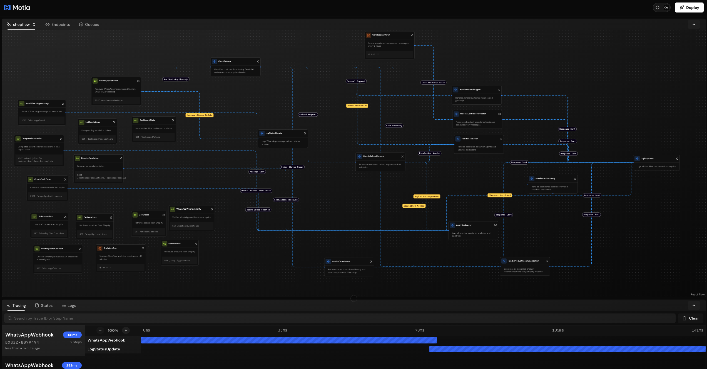
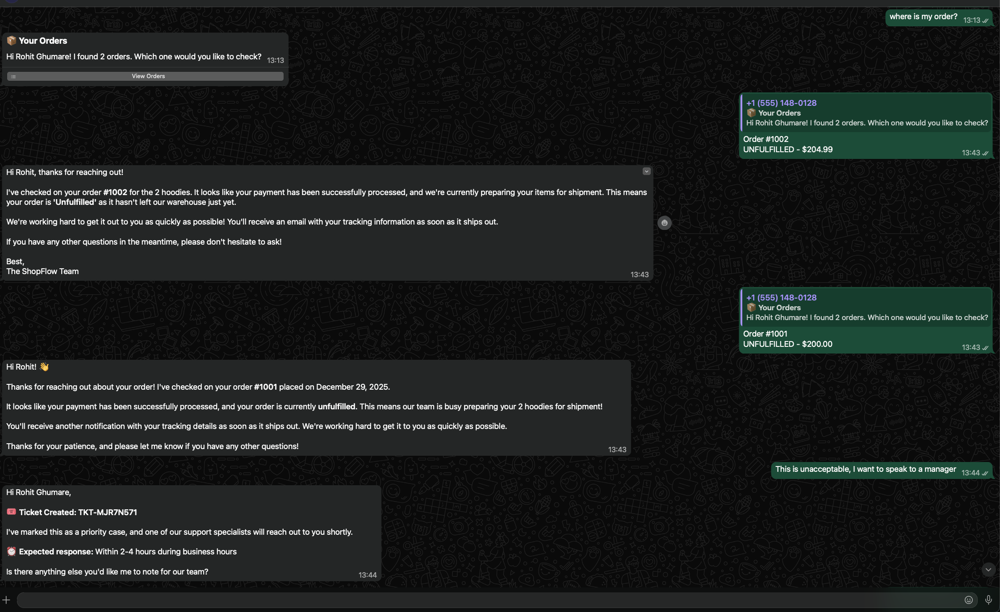

# ShopFlow 🛍️

**Automate e-commerce customer support via WhatsApp using AI**

ShopFlow is a Motia-powered backend that handles order tracking, product recommendations, cart recovery, and support escalations—all through conversational AI on WhatsApp.



---

## 📱 What It Does



**Customer sends:** "Where is my order?"  
**ShopFlow responds:** Order status, tracking info, and details—all within 2-3 seconds.

---

## 🚀 Quick Start

### Step 1: Install Dependencies

```bash
npm install
```

### Step 2: Configure Environment

Create `.env` in project root:

```bash
# Shopify
SHOPIFY_STORE=your-store.myshopify.com
SHOPIFY_ACCESS_TOKEN=shpat_xxxxxxxxxxxxxxxxxxxxx
SHOPIFY_API_VERSION=2024-10

# WhatsApp Business API
WHATSAPP_PHONE_NUMBER_ID=your_phone_number_id
WHATSAPP_ACCESS_TOKEN=your_access_token
WHATSAPP_VERIFY_TOKEN=shopflow_verify_token_2024
WHATSAPP_API_VERSION=v22.0

# Gemini AI
GEMINI_API_KEY=your_gemini_api_key
```

### Step 3: Start Development Server

```bash
npm run dev
```

Open **http://localhost:3000** to see the Workbench.

### Step 4: Expose to Internet (for WhatsApp Webhooks)

```bash
ngrok http 3000
```

Copy the `https://xxxxx.ngrok.io` URL for webhook configuration.

---

## 🔧 Setup WhatsApp

1. **Meta Developer Console** → Create App → WhatsApp
2. **API Setup** → Copy Phone Number ID + Generate Access Token
3. **Add Test Numbers** → Manage phone number list → Add your phone
4. **Configure Webhook**:
   - URL: `https://your-ngrok-url.ngrok.io/webhooks/whatsapp`
   - Verify Token: `shopflow_verify_token_2024`
   - Subscribe to: `messages`

---

## 🔧 Setup Shopify

1. **Shopify Admin** → Settings → Apps → Develop apps → Create app
2. **Configure Scopes**:
   - `read_products`, `write_products`
   - `read_orders`, `write_orders`
   - `read_draft_orders`, `write_draft_orders`
   - `read_inventory`, `write_inventory`
   - `read_locations`
3. **Install App** → Copy Admin API Access Token

---

## ✅ Verify Setup

```bash
# Check WhatsApp config
curl http://localhost:3000/whatsapp/status

# Check Shopify products
curl http://localhost:3000/shopify/products?limit=3

# Check dashboard
curl http://localhost:3000/dashboard/stats
```

---

## 💬 Test WhatsApp Prompts

Send these messages to your WhatsApp Business number:

| Message | What Happens |
|---------|--------------|
| `Where is my order?` | Shows order status from Shopify |
| `Track order #1001` | Finds specific order details |
| `Show me products` | Lists available products |
| `I want a refund` | Creates refund request + escalation |
| `I need help` | General support response |
| `I want to speak to a manager` | Creates escalation ticket |

---

## 📡 API Endpoints

### WhatsApp

```bash
# Send template message (first contact)
curl -X POST http://localhost:3000/whatsapp/send \
  -H "Content-Type: application/json" \
  -d '{"to": "YOUR_PHONE", "type": "template", "templateName": "hello_world"}'

# Send text message (within 24h window)
curl -X POST http://localhost:3000/whatsapp/send \
  -H "Content-Type: application/json" \
  -d '{"to": "YOUR_PHONE", "type": "text", "text": "Hello from ShopFlow!"}'
```

### Shopify

```bash
# Products
curl http://localhost:3000/shopify/products

# Orders
curl http://localhost:3000/shopify/orders

# Locations
curl http://localhost:3000/shopify/locations

# Draft Orders
curl http://localhost:3000/shopify/draft-orders

# Create Draft Order
curl -X POST http://localhost:3000/shopify/draft-orders \
  -H "Content-Type: application/json" \
  -d '{
    "lineItems": [{"variantId": "gid://shopify/ProductVariant/ID", "quantity": 1}],
    "email": "customer@example.com"
  }'

# Complete Draft Order
curl -X POST http://localhost:3000/shopify/draft-orders/DRAFT_ID/complete
```

### Dashboard

```bash
# Stats
curl http://localhost:3000/dashboard/stats

# Escalations
curl http://localhost:3000/dashboard/escalations

# Resolve Escalation
curl -X POST http://localhost:3000/dashboard/escalations/TICKET_ID/resolve \
  -H "Content-Type: application/json" \
  -d '{"resolution": "Resolved via phone call"}'
```

---

## 🔄 The Flow

```
Customer Message (WhatsApp)
        ↓
  WhatsApp Webhook (API)
        ↓
  Classify Intent (Gemini AI)
        ↓
   ┌────┴────┬────────┬─────────┬──────────┐
   ↓         ↓        ↓         ↓          ↓
 Order    Product   Cart     Refund    General
 Status   Recommend Recovery Request   Support
   ↓         ↓        ↓         ↓          ↓
   └────┬────┴────────┴─────────┴──────────┘
        ↓
  Send Response (WhatsApp)
        ↓
  Analytics Logger
```

---

## 📁 Project Structure

```
src/
├── shopflow/                    # All workflow steps
│   ├── whatsapp-webhook.step.ts # Receive messages
│   ├── classify-intent.step.ts  # AI classification
│   ├── handle-*.step.ts         # Intent handlers
│   ├── api-*.step.ts            # REST endpoints
│   └── cron-*.step.ts           # Scheduled jobs
├── services/
│   ├── shopify.service.ts       # Shopify GraphQL
│   ├── whatsapp.service.ts      # WhatsApp API
│   └── gemini.service.ts        # Gemini AI
└── middlewares/
```

---

## 🛠️ Commands

```bash
npm run dev            # Start dev server
npm run generate-types # Generate TypeScript types
npm run start          # Production mode
npm run build          # Build for deployment
```

---

## 💳 Safe Testing

- **Draft orders don't charge anyone** - just quotes
- **Completing draft order** = accounting status only
- **Delete test orders** anytime in Shopify Admin

---

## 🔗 Links

- [Motia Docs](https://motia.dev/docs)
- [WhatsApp Business API](https://developers.facebook.com/docs/whatsapp/cloud-api)
- [Shopify GraphQL API](https://shopify.dev/docs/api/admin-graphql)
- [Gemini AI](https://ai.google.dev/docs)

---

Built with ❤️ using [Motia](https://motia.dev)
