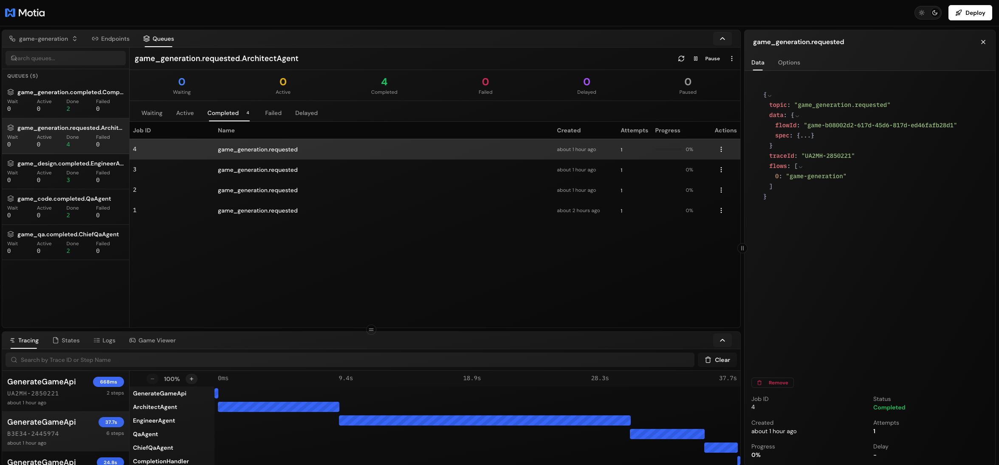
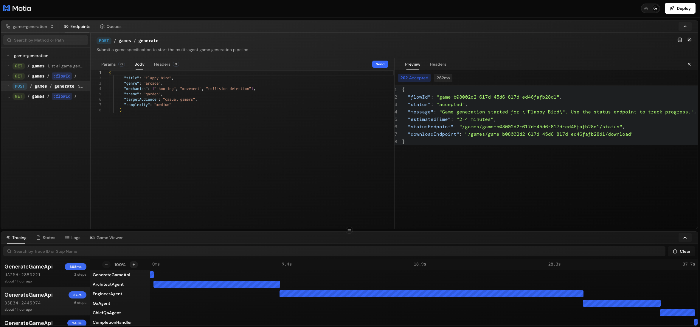

# 🎮 Multi-Agent Game Generation Pipeline

An intelligent, event-driven backend system that orchestrates the full game development lifecycle from spec to executable Python code using multiple AI agents powered by Google Gemini.


## Overview

This production-ready Motia application demonstrates how to build complex, multi-step AI agent workflows with:

- **Event-driven architecture** - Stateful workflow orchestration with BullMQ
- **Multi-agent collaboration** - Specialized AI roles working together
- **Feedback loops** - Automatic revision cycles for quality assurance
- **In-browser game player** - Play generated games directly in Workbench using Pyodide
- **Redis adapters** - Distributed state, cron, and streams for horizontal scaling
- **Docker deployment** - Production-ready containerized setup
- **Observability** - Full visibility into agent reasoning and decisions
- **Robust error handling** - Retry mechanisms and JSON recovery


### Event Queue Visualization



*Real-time monitoring of the event-driven pipeline with BullMQ queues*

## 🚀 Quick Start

### Prerequisites

- Node.js 18+
- npm or yarn
- Google Gemini API key

### Installation

```bash
# Clone the repository
git clone https://github.com/motia-dev/motia-examples.git
cd examples/multi-agent-game-generation

# Install dependencies
npm install

# Set up environment variables
cp .env.example .env
# Edit .env and add your GEMINI_API_KEY

# Start Redis (if not already running)
docker run -d -p 6379:6379 redis:alpine

# Generate TypeScript types
npm run generate-types

# Start the development server
npm run dev
```

### Generate Your First Game

```bash
# Submit a game generation request
curl -X POST http://localhost:3000/games/generate \
  -H "Content-Type: application/json" \
  -d '{
    "title": "Space Invaders Clone",
    "genre": "arcade",
    "mechanics": ["shooting", "movement", "collision detection", "scoring"],
    "theme": "retro space",
    "targetAudience": "casual gamers",
    "complexity": "medium"
  }'

# Response:
# {
#   "flowId": "game-abc123...",
#   "status": "accepted",
#   "message": "Game generation started...",
#   "statusEndpoint": "/games/game-abc123.../status",
#   "downloadEndpoint": "/games/game-abc123.../download"
# }
```

### Check Progress

```bash
curl http://localhost:3000/games/{flowId}/status
```

### Download the Game

```bash
curl http://localhost:3000/games/{flowId}/download
```

## 🎮 Game Viewer Plugin

The project includes a **Game Viewer** plugin for the Motia Workbench that lets you:


*Play generated games directly in the browser using Pyodide (Python WebAssembly)*

### Features

| Feature | Description |
|---------|-------------|
| 📋 **Games List** | Browse all generated games with status, scores, and grades |
| 🔄 **Auto-refresh** | Updates every 5 seconds to show new games |
| ▶️ **Play in Browser** | Run console-based Python games directly using Pyodide |
| 📄 **Code Viewer** | Browse generated files with syntax highlighting |
| 📋 **Copy Code** | One-click copy functionality |
| ⬇️ **Download** | Download all game files at once |
| 📐 **Architecture View** | See the AI architect's design overview |

### In-Browser Game Player

The Game Viewer uses **Pyodide** (Python compiled to WebAssembly) to run games directly in your browser:

- ✅ **Console games** - Text adventures, number guessing, quiz games
- ✅ **Simple games** - ASCII art games, turn-based games
- ⚠️ **Pygame games** - Download and run locally (GUI not supported in browser)

### Accessing the Game Viewer

1. Start the dev server: `npm run dev`
2. Open Workbench: `http://localhost:3000/__workbench`
3. Click the **🎮 Game Viewer** tab at the bottom

## 📚 API Reference

### Available Endpoints



*All available API endpoints with their schemas and configurations*

### POST /games/generate

Start a new game generation pipeline.

**Request Body:**

| Field | Type | Required | Description |
|-------|------|----------|-------------|
| `title` | string | Yes | Name of the game (1-100 chars) |
| `genre` | string | Yes | Game genre (e.g., "arcade", "puzzle", "rpg") |
| `mechanics` | string[] | Yes | List of game mechanics |
| `theme` | string | Yes | Visual/narrative theme |
| `targetAudience` | string | Yes | Intended player demographic |
| `complexity` | enum | Yes | `"simple"`, `"medium"`, or `"complex"` |
| `additionalRequirements` | string | No | Extra instructions |

**Response (202 Accepted):**

```json
{
  "flowId": "game-uuid",
  "status": "accepted",
  "message": "Game generation started...",
  "estimatedTime": "2-4 minutes",
  "statusEndpoint": "/games/{flowId}/status",
  "downloadEndpoint": "/games/{flowId}/download"
}
```

### GET /games/:flowId/status

Get the current status of a game generation flow.

**Response (200 OK):**

```json
{
  "flowId": "game-uuid",
  "status": "coding",
  "currentStep": "engineer-agent",
  "progress": {
    "architect": "completed",
    "engineer": "in_progress",
    "qaReview": "pending",
    "chiefQa": "pending"
  },
  "gameTitle": "Space Invaders Clone",
  "createdAt": "2024-01-01T00:00:00.000Z",
  "updatedAt": "2024-01-01T00:01:00.000Z",
  "revisionCount": 0,
  "logs": [...]
}
```

### GET /games/:flowId/download

Download the completed game files.

**Response (200 OK):**

```json
{
  "flowId": "game-uuid",
  "gameTitle": "Space Invaders Clone",
  "status": "completed",
  "files": [
    {
      "filename": "main.py",
      "content": "# Complete Python code..."
    }
  ],
  "mainFile": "main.py",
  "runInstructions": "python main.py",
  "metadata": {
    "genre": "arcade",
    "complexity": "medium",
    "qaScore": 85,
    "qualityGrade": "B"
  }
}
```

### GET /games

List all game generation flows.

**Response (200 OK):**

```json
{
  "games": [
    {
      "flowId": "game-uuid",
      "title": "Space Invaders Clone",
      "genre": "arcade",
      "complexity": "medium",
      "status": "completed",
      "createdAt": "2024-01-01T00:00:00.000Z",
      "qaScore": 85,
      "qualityGrade": "B"
    }
  ],
  "total": 1
}
```

## 🔧 Configuration

### Environment Variables

| Variable | Required | Description |
|----------|----------|-------------|
| `GEMINI_API_KEY` | Yes | Google Gemini API key from [Google AI Studio](https://makersuite.google.com/app/apikey) |
| `REDIS_URL` | No | Redis connection URL (default: `redis://localhost:6379`) |
| `PORT` | No | Server port (default: 3000) |

#### Running Redis

**Local Development:**

```bash
# Using Docker (recommended)
docker run -d -p 6379:6379 redis:alpine

# Or using Homebrew (macOS)
brew install redis
brew services start redis
```

**Production Options:**
- AWS ElastiCache
- Redis Cloud
- Google Cloud Memorystore
- Azure Cache for Redis

> **📝 Note**: Use `REDIS_URL=redis://host:port` format in production. The `{ host, port }` format shown in some Motia docs doesn't work correctly with current adapter versions.

## 🐳 Docker Deployment

### Production-Ready Setup with Redis


*Complete Docker setup with Motia, Redis, and optional Redis Commander*

The application uses **official Motia Docker support** with distributed Redis adapters for production-grade deployments.

### Quick Start

```bash
# Generate Dockerfile using Motia CLI
npx motia@latest docker setup

# Build and run with Docker Compose
docker-compose up -d

# Check logs
docker-compose logs -f motia

# Stop services
docker-compose down
```

### What's Included

| Service | Purpose | Port |
|---------|---------|------|
| **Motia App** | Game generation backend | 3000 |
| **Redis** | Distributed state, cron, streams | 6379 |
| **Redis Commander** | Web UI for debugging (optional) | 8081 |

### Redis Adapter Configuration


*Redis adapters successfully connected in Docker environment*

> **⚠️ Important**: The official Motia docs show `{ host, port }` format, but you must use `{ url }` format for Redis adapters to work correctly.

**Working Configuration:**

```typescript
const redisUrl = `redis://${process.env.REDIS_HOST}:${process.env.REDIS_PORT}`

export default config({
  adapters: {
    state: new RedisStateAdapter({ url: redisUrl }),
    cron: new RedisCronAdapter({ url: redisUrl }),
    streams: new RedisStreamAdapterManager({ url: redisUrl })
  }
})
```

### Environment Variables

The `docker-compose.yml` automatically sets:

```yaml
environment:
  REDIS_HOST: redis
  REDIS_PORT: 6379
  GEMINI_API_KEY: ${GEMINI_API_KEY}
```

### Verify Deployment

```bash
# Check container status
docker-compose ps

# Verify Redis connection (should show no errors)
docker-compose logs motia | grep -i "redis"

# Test API
curl http://localhost:3000/__motia/game-viewer/games

# Access services
open http://localhost:3000                    # Workbench
open http://localhost:8081                    # Redis Commander (with --profile debug)
```

### Scaling to Multiple Instances

With Redis adapters, you can run multiple Motia instances sharing the same state:

```yaml
services:
  motia-1:
    build: .
    ports: ["3000:3000"]
    environment:
      REDIS_HOST: redis
      
  motia-2:
    build: .
    ports: ["3001:3000"]
    environment:
      REDIS_HOST: redis
```

All instances will share game state, event queues, and cron locks through Redis.

### Complexity Levels

| Level | Files | Estimated Time | Features |
|-------|-------|----------------|----------|
| `simple` | 1 | 1-2 min | Basic mechanics, single file |
| `medium` | 2-3 | 2-4 min | Multiple files, moderate complexity |
| `complex` | 4-5 | 3-5 min | Advanced mechanics, full architecture |

## 📁 Project Structure

```
day7automation/
├── steps/
│   └── game-generation/
│       ├── generate-game-api.step.ts    # POST /games/generate
│       ├── architect-agent.step.ts       # Senior Game Architect
│       ├── engineer-agent.step.ts        # Senior Software Engineer
│       ├── qa-agent.step.ts              # QA Engineer
│       ├── chief-qa-agent.step.ts        # Chief QA Engineer
│       ├── revision-handler.step.ts      # Revision routing
│       ├── completion-handler.step.ts    # Final delivery
│       ├── get-status-api.step.ts        # GET /games/:id/status
│       ├── download-game-api.step.ts     # GET /games/:id/download
│       └── list-games-api.step.ts        # GET /games
├── plugins/
│   └── components/
│       └── game-viewer/
│           └── index.tsx                 # Game Viewer Workbench plugin
├── src/
│   ├── services/
│   │   └── gemini/
│   │       ├── index.ts                  # Service exports
│   │       ├── architect-agent.ts        # Architect AI logic
│   │       ├── engineer-agent.ts         # Engineer AI logic
│   │       ├── qa-agent.ts               # QA AI logic
│   │       └── chief-qa-agent.ts         # Chief QA AI logic
│   └── utils/
│       └── flow-helpers.ts               # State management utilities
├── middlewares/
│   └── error-handler.middleware.ts       # Error handling
├── docs/
│   └── img/                              # Screenshots
│       ├── workbench.png
│       ├── game-viewer-plugin.png
│       ├── queues.png
│       └── endpoints.png
├── motia.config.ts                       # Motia configuration + plugins
├── package.json
└── README.md
```

## 🛡️ Error Handling

The system includes robust error handling for AI responses:

| Error Type | Handling Strategy |
|------------|-------------------|
| **Truncated JSON** | Attempt to repair and extract partial results |
| **Malformed JSON** | Multiple repair strategies with retry |
| **Rate Limiting** | Automatic 5s delay and retry (up to 3 times) |
| **API Errors** | Graceful fallback with default responses |
| **Parse Failures** | Recovery from partial data when possible |

## 🔍 Observability

The system provides full visibility into the multi-agent workflow:

- **Structured Logging** - Every agent logs decisions and progress
- **State Tracking** - All artifacts stored and retrievable
- **Event Tracing** - Full event chain visible in Workbench
- **Error Context** - Detailed error messages with trace IDs

Access the Motia Workbench at `http://localhost:3000/__workbench` to:
- Visualize the workflow graph
- Monitor real-time event flow
- Inspect state at each step
- Review logs and errors
- **Play generated games** in the Game Viewer

## 🛠️ Development

```bash
# Run development server with hot reload
npm run dev

# Generate TypeScript types after modifying step configs
npm run generate-types

# Build for production
npm run build
```

## 📝 Example Game Specs

### Simple Console Game (runs in browser)

```json
{
  "title": "Number Guessing Game",
  "genre": "puzzle",
  "mechanics": ["random generation", "user input", "feedback"],
  "theme": "classic",
  "targetAudience": "beginners",
  "complexity": "simple"
}
```

### Medium Arcade Game

```json
{
  "title": "Snake Game",
  "genre": "arcade",
  "mechanics": ["movement", "collision", "growth", "scoring"],
  "theme": "retro",
  "targetAudience": "casual gamers",
  "complexity": "medium"
}
```

### Complex Strategy Game

```json
{
  "title": "Tower Defense",
  "genre": "strategy",
  "mechanics": ["tower placement", "enemy waves", "upgrades", "resource management"],
  "theme": "fantasy",
  "targetAudience": "strategy enthusiasts",
  "complexity": "complex"
}
```

## 🤝 Contributing

1. Fork the repository
2. Create a feature branch
3. Make your changes
4. Run `npm run generate-types`
5. Submit a pull request

## 📄 License

MIT License - see LICENSE file for details.

---

## 🏗️ Built With

- **[Motia](https://motia.dev)** - Event-driven backend framework
- **Google Gemini 2.0 Flash** - AI agents for game generation
- **Redis** - Distributed state management
- **Motia** - Event queue processing
- **Pyodide** - Python WebAssembly runtime
- **TypeScript** - Type-safe development

---

Built with ❤️ using [Motia](https://motia.dev) and Google Gemini
