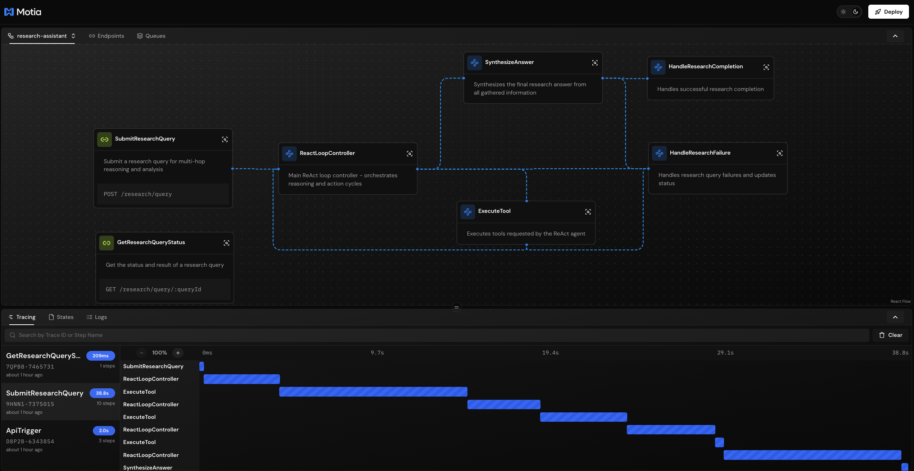
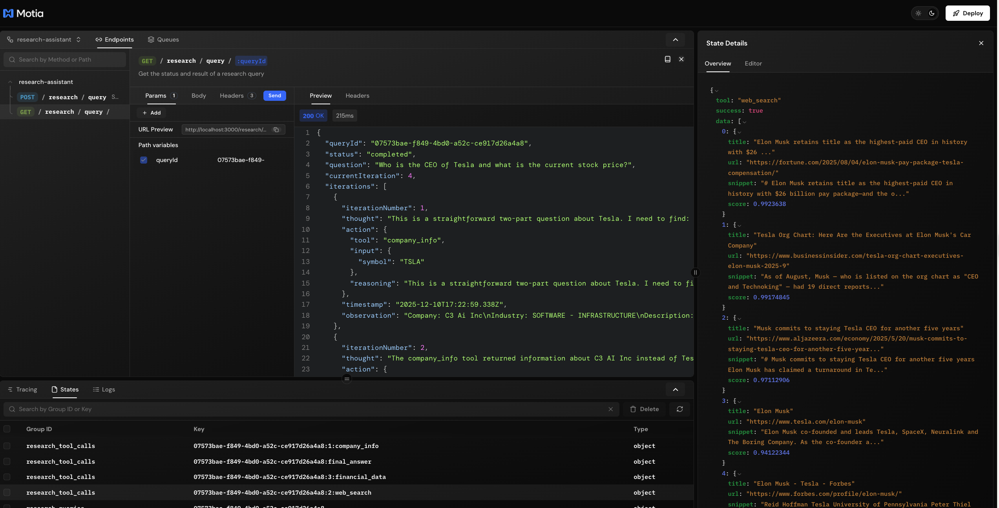

# ReAct Research Assistant

An intelligent research assistant that implements the **ReAct (Reason + Act) pattern** to answer complex, multi-hop questions. Built with [Motia](https://motia.dev) for production-ready, event-driven backend orchestration.



## Overview

This service exposes an API where users submit questions requiring multi-step inference:
- Competitive analysis
- Market research
- Technical troubleshooting
- Regulatory compliance queries
- Investment research

The system orchestrates an adaptive loop where an LLM agent:
1. **Reasons** about what information it needs
2. **Acts** by executing tool calls (web search, financial data APIs)
3. **Observes** results and re-reasons based on new data
4. **Iterates** until it synthesizes a comprehensive, grounded answer

## Quick Start

### 1. Install Dependencies

```bash
npm install
```

### 2. Set Environment Variables

Create a `.env` file:

```env
# LLM Configuration (choose one provider)
LLM_PROVIDER=anthropic  # or 'google'

# Anthropic (Claude Opus 4.5)
ANTHROPIC_API_KEY=your-anthropic-api-key
ANTHROPIC_MODEL=claude-opus-4-5-20251101

# Google (Gemini Pro)
GOOGLE_API_KEY=your-google-api-key
GOOGLE_MODEL=gemini-2.0-flash

# Tool APIs
TAVILY_API_KEY=your-tavily-api-key
ALPHA_VANTAGE_API_KEY=your-alpha-vantage-api-key

# Optional Configuration
LLM_MAX_TOKENS=4096
LLM_TEMPERATURE=0.7
```

### 3. Generate Types

```bash
npm run generate-types
```

### 4. Start Development Server

```bash
npm run dev
```

The server will start on `http://localhost:3000`.

## API Endpoints

### Submit Research Query

```bash
POST /research/query
Content-Type: application/json

{
  "question": "Who is the CEO of Legendary Entertainment and what was the budget of their most recent film?",
  "context": {
    "industry": "entertainment",
    "timeframe": "2024",
    "maxIterations": 10
  }
}
```

**Response (202 Accepted):**
```json
{
  "queryId": "uuid-here",
  "status": "pending",
  "message": "Research query accepted. Processing will begin shortly.",
  "estimatedTime": "30-120 seconds depending on complexity"
}
```

### Get Query Status

```bash
GET /research/query/:queryId
```

**Response (200 OK):**
```json
{
  "queryId": "uuid-here",
  "status": "completed",
  "question": "...",
  "currentIteration": 5,
  "iterations": [...],
  "result": {
    "answer": "Comprehensive answer with citations...",
    "citations": [...],
    "reasoningTrace": [...],
    "metadata": {
      "totalIterations": 5,
      "totalToolCalls": 8,
      "totalTokens": 12000,
      "executionTimeMs": 45000,
      "model": "claude-opus-4-5-20251101"
    }
  }
}
```


## Real-Time Streaming

Subscribe to research progress updates via WebSocket:

```javascript
const ws = new WebSocket('ws://localhost:3000/__streams/researchProgress');

ws.onmessage = (event) => {
  const progress = JSON.parse(event.data);
  console.log('Progress:', progress);
  // { queryId, status, iteration, tool, timestamp, ... }
};

// Subscribe to a specific query
ws.send(JSON.stringify({
  type: 'subscribe',
  groupId: 'your-query-id'
}));
```

## Available Tools

| Tool | Description |
|------|-------------|
| `web_search` | General web search via Tavily API |
| `news_search` | Recent news search with timeframe |
| `financial_data` | Stock quotes, fundamentals via Alpha Vantage |
| `company_info` | Company overview and executive info |

## Project Structure

```
├── steps/
│   └── research/
│       ├── submit-query.step.ts      # POST /research/query
│       ├── get-query-status.step.ts  # GET /research/query/:queryId
│       ├── react-loop.step.ts        # Main ReAct loop controller
│       ├── execute-tool.step.ts      # Tool execution handler
│       ├── synthesize-answer.step.ts # Final answer synthesis
│       ├── handle-failure.step.ts    # Error handling
│       ├── handle-completion.step.ts # Completion handler
│       └── research-progress.stream.ts # Real-time streaming
├── middlewares/
│   ├── error-handler.middleware.ts   # Error handling
│   └── request-logger.middleware.ts  # Request logging
├── src/services/
│   ├── types.ts                      # TypeScript types
│   ├── llm-service.ts                # LLM integration (Claude/Gemini)
│   └── tool-service.ts               # Tool implementations
├── motia.config.ts                   # Motia configuration
└── package.json
```

## Event Flow

```
research.query.requested
       │
       ▼
┌─────────────────┐
│ ReactLoopController │◄────────────────┐
└────────┬────────┘                      │
         │                               │
         ▼                               │
research.tool.execute                    │
         │                               │
         ▼                               │
┌─────────────────┐                      │
│   ExecuteTool   │                      │
└────────┬────────┘                      │
         │                               │
         ▼                               │
research.observation.ready ──────────────┘
         │
         ▼ (when complete)
research.synthesis.ready
         │
         ▼
┌─────────────────┐
│ SynthesizeAnswer│
└────────┬────────┘
         │
         ▼
research.completed
```

## Configuration Options

### Query Context

| Field | Type | Description |
|-------|------|-------------|
| `industry` | string | Focus area (e.g., "finance", "tech") |
| `timeframe` | string | Time focus (e.g., "2024", "last 30 days") |
| `preferredSources` | string[] | Preferred data sources |
| `maxIterations` | number | Max ReAct iterations (1-20) |
| `budget.maxTokens` | number | Token budget limit |
| `budget.maxToolCalls` | number | Tool call limit |

## Observability

View the Motia Workbench for:
- Visual workflow representation
- Real-time event tracing
- State inspection
- Logs and metrics

Access at: `http://localhost:3000/__workbench`

## Production Considerations

1. **Latency**: Multi-hop queries take 30-120 seconds. Return query ID immediately and stream progress.

2. **Cost Control**: Configure `maxIterations` and token budgets per tenant.

3. **Error Handling**: The system recovers from tool failures and retries with alternative approaches.

4. **Scaling**: Use Redis adapters for horizontal scaling (see `motia.config.ts`).

## License

Apache License 2.0
