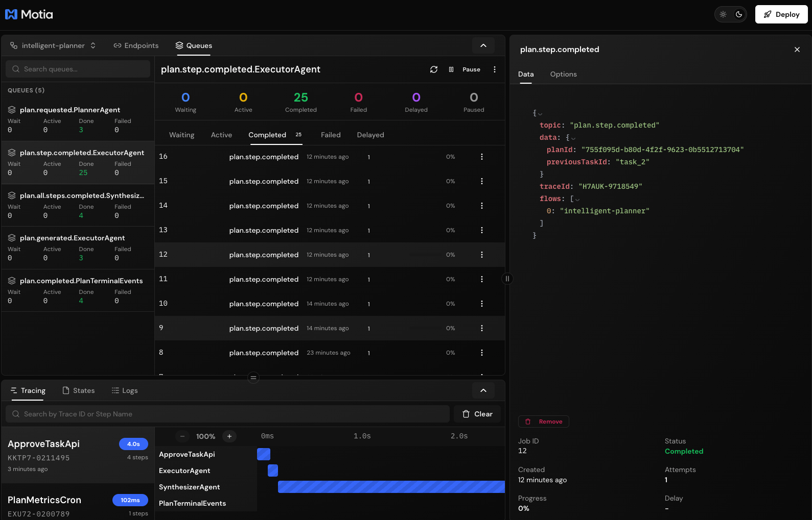

# Intelligent Task Planning & Execution Backend

A **Motia-based** enterprise workflow orchestration system implementing the **Planning Architecture** for structured, multi-step task execution with AI-powered planning, intelligent failure handling, and human-in-the-loop approvals.


## Overview

This backend demonstrates an advanced **Planning Architecture** where:
- 🤖 **Planner Agent** (Gemini 3 Pro) decomposes high-level objectives into structured sub-tasks
- ⚙️ **Executor Agent** runs tasks step-by-step with tool routing and dependency management
- 📊 **Synthesizer Agent** generates comprehensive reports with LLM-powered insights
- 🔄 **Intelligent Re-planning** adapts when tasks fail or environments change
- 👥 **Human-in-the-Loop** approval gates for critical operations
- 📧 **Real-time Notifications** via Resend email integration

Unlike ReAct agents that figure out their path step-by-step, this system **front-loads planning**, creating explicit, auditable execution flows perfect for enterprise workflows like feature launches, financial closes, or incident response.



## Features

### 🎯 Planning Phase
- **LLM-Powered Decomposition**: Gemini 3 Pro breaks down objectives into actionable sub-tasks
- **Dependency Management**: Explicit task dependencies ensure correct execution order
- **Multi-Tool Support**: 11 built-in tools (Jira, GitHub, Slack, Email, etc.)
- **Context-Aware**: Uses stakeholders, constraints, deadlines, and resources

### ⚡ Execution Phase
- **Step-by-Step Execution**: Tasks run in dependency order with automatic retries
- **Tool Routing**: Automatic routing to appropriate tool executors
- **State Management**: Full execution history persisted for auditing
- **Output Chaining**: Previous task outputs feed into downstream tasks

### 🛡️ Reliability
- **Automatic Retries**: Exponential backoff for transient failures
- **Intelligent Re-planning**: LLM generates alternative approaches when tasks fail
- **Human Escalation**: Critical failures trigger stakeholder notifications
- **Approval Gates**: Human verification for high-risk operations

### 📊 Observability
- **Real-time Status**: Query execution progress via REST API
- **Visual Timeline**: See which tasks are queued, running, completed, or failed
- **Synthesis Reports**: LLM-generated summaries with metrics and recommendations
- **Audit Trail**: Complete history of all decisions and actions

## Quick Start

### Prerequisites

```bash
# Required environment variables
export GEMINI_API_KEY=your_gemini_api_key
export RESEND_API_KEY=your_resend_api_key
export FROM_EMAIL=onboarding@resend.dev
export ALERT_RECIPIENTS=your-email@example.com
```

### Installation

```bash
# Install dependencies
npm install

# Start development server with hot reload
npm run dev
```

The server starts at `http://localhost:3000` with the Motia Workbench UI for visual debugging.

### Your First Plan

```bash
curl -X POST http://localhost:3000/plans/execute \
  -H "Content-Type: application/json" \
  -d '{
    "objective": "Launch feature X across three teams",
    "context": {
      "stakeholders": ["eng-lead@company.com", "pm@company.com"],
      "priority": "high"
    }
  }'
```

**Response:**
```json
{
  "planId": "uuid-here",
  "status": "pending",
  "message": "Plan request accepted. Use GET /plans/{id} to track progress."
}
```

### Check Plan Status

```bash
curl http://localhost:3000/plans/{planId}
```

**Response includes:**
- Full plan with all tasks and dependencies
- Real-time execution state
- Visual timeline showing task progress
- Synthesis report (when complete)

## API Endpoints

### Submit Plan
```http
POST /plans/execute
Content-Type: application/json

{
  "objective": "string (required)",
  "context": {
    "stakeholders": ["email@example.com"],
    "constraints": ["constraint1"],
    "priority": "low|medium|high|critical",
    "domain": "string"
  },
  "tenantId": "string (optional)",
  "callbackUrl": "https://your-webhook.com (optional)"
}
```

### Get Plan Status
```http
GET /plans/:id
```

### Approve Task
```http
POST /plans/:id/tasks/:taskId/approve
Content-Type: application/json

{
  "approved": true,
  "approvedBy": "admin",
  "notes": "Approved for production"
}
```

## Use Cases

### 🚀 Feature Launch
```bash
curl -X POST http://localhost:3000/plans/execute \
  -H "Content-Type: application/json" \
  -d '{
    "objective": "Launch feature X across three teams",
    "context": {
      "stakeholders": ["pm@company.com", "eng@company.com"],
      "priority": "high"
    }
  }'
```

**Generated Plan:**
1. Create Jira tickets for each team
2. Verify code reviews and tests pass
3. Deploy to staging via CI/CD
4. Run smoke tests
5. **Approval Gate** - Stakeholder sign-off
6. Deploy to production
7. Monitor and notify

### 💰 Financial Close
```bash
curl -X POST http://localhost:3000/plans/execute \
  -H "Content-Type: application/json" \
  -d '{
    "objective": "Process Q4 financial close",
    "context": {
      "stakeholders": ["cfo@company.com"],
      "priority": "critical",
      "domain": "finance"
    }
  }'
```

### 🚨 Incident Response
```bash
curl -X POST http://localhost:3000/plans/execute \
  -H "Content-Type: application/json" \
  -d '{
    "objective": "Respond to production outage",
    "context": {
      "stakeholders": ["oncall@company.com"],
      "priority": "critical",
      "domain": "incident-response"
    }
  }'
```

## Available Tools

The executor supports 11 tool types for comprehensive workflow automation:

| Tool | Description | Example Use |
|------|-------------|-------------|
| `web_search` | Search the web | Research solutions, gather data |
| `slack_notification` | Send Slack messages | Team notifications |
| `database_query` | Execute DB queries | Data validation, lookups |
| `jira_ticket` | Create/update Jira | Track implementation work |
| `approval_gate` | Wait for human approval | Critical checkpoints |
| `github_check` | Check PR/test status | Verify code quality |
| `cicd_webhook` | Trigger deployments | Automated releases |
| `email_send` | Send emails via Resend | Stakeholder updates |
| `http_request` | Make HTTP calls | External API integration |
| `data_transform` | Transform data | ETL operations |
| `delay` | Wait for duration | Rate limiting, scheduling |

## Development Commands

```bash
# Start development server with hot reload
npm install

# Generate TypeScript types
npm run generate-types

# Build for deployment
npm run dev

```

## Email Setup

This system uses **Resend** for email notifications. 

**Test Mode Limitation**: Resend's test API only allows sending to the account owner's email. To send to multiple recipients:

1. Verify a domain at [resend.com/domains](https://resend.com/domains)
2. Update `FROM_EMAIL` to use your verified domain
3. Set `ALERT_RECIPIENTS` to your desired recipients

## Metrics & Observability

The system tracks comprehensive metrics via scheduled cron jobs:

### Plan Metrics (every 5 minutes)
- Total plans by status
- Plans created/completed in last hour/day
- Average completion time
- Success rate

### Plan Cleanup (daily at 2 AM)
- Archive completed plans older than 7 days
- Clean up failed/cancelled plans older than 30 days
- Remove orphaned execution states

Access metrics via state:
```bash
# Get current metrics
curl http://localhost:3000/__motia/state/metrics/current
```

## Learn More

- [Motia Documentation](https://motia.dev/docs) - Complete guides and API reference
- [Planning Architecture](https://blog.langchain.dev/planning-agents/) - Deep dive into planning patterns
- [Discord Community](https://discord.gg/motia) - Get help and connect with developers

## License

Apache License 2.0

---

**Built with ❤️ using [Motia](https://motia.dev) - The unified backend framework**
