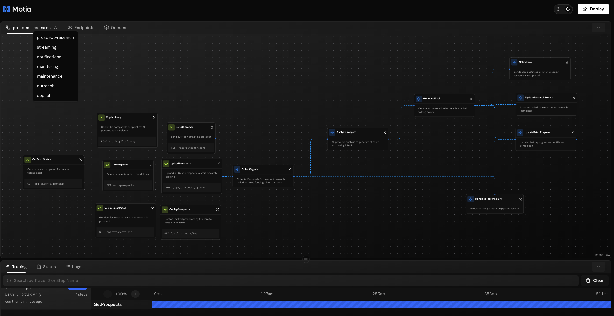
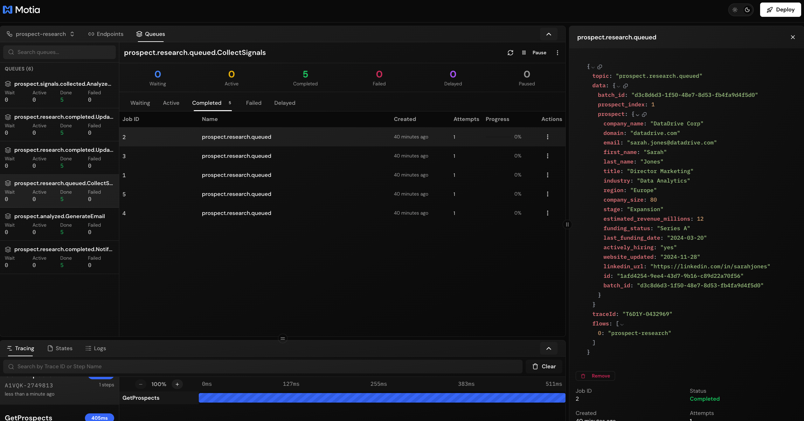
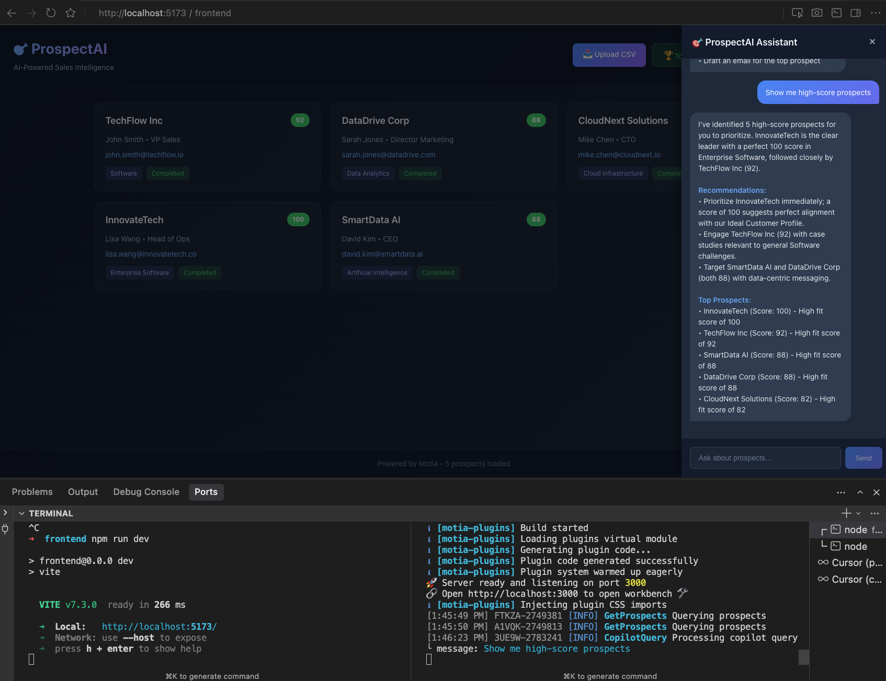
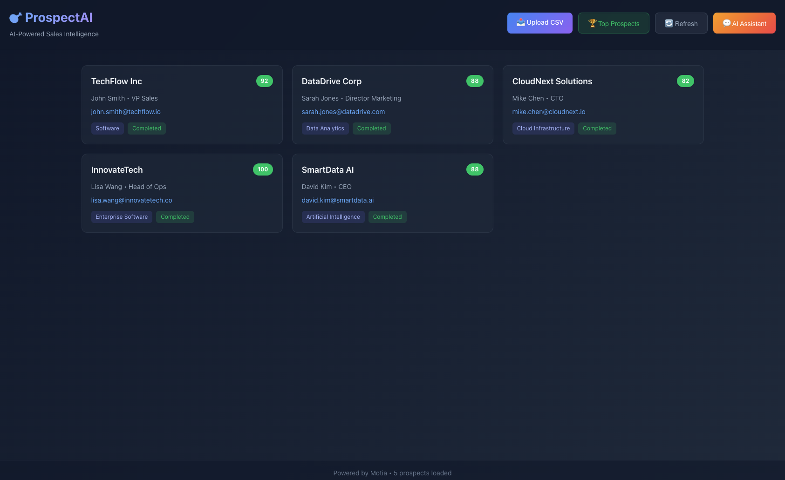

# ProspectAI - AI-Powered Sales Intelligence Platform

[](https://motia.dev)
[](https://www.typescriptlang.org/)
[](https://react.dev)
[](https://opensource.org/licenses/MIT)


ProspectAI automates prospect research using AI. Upload a CSV of prospects and get back AI-powered fit scores, buying intent signals, and personalized email drafts.

**Perfect for:**
- 🎯 Sales teams researching prospects at scale
- 🤖 Building AI-powered sales tools
- 📊 Learning Motia's event-driven architecture
- 🚀 Prototyping sales automation

## ✨ Features

- 📤 **CSV Upload**: Upload prospect lists and process automatically
- 🤖 **AI Analysis**: Gemini 3 Pro or Claude Opus 4.5 generates fit scores (0-100)
- ✉️ **Email Drafts**: AI-generated personalized outreach emails
- 📡 **Signal Collection**: Gather 15+ data points via NewsAPI
- 🔔 **Slack Alerts**: Real-time notifications for high-scoring prospects
- 💬 **AI Assistant**: Natural language queries like "Who should I call this week?"
- 📊 **Job Queue**: Real-time monitoring with BullMQ
- 🎨 **Workbench**: Visual flow designer
- 💾 **Built-in State**: Motia's Redis-backed state - no external database needed

## 📸 Screenshots

### Multi-Flow Workbench


### Queue Management


### AI Assistant


### CopilotKit Integration


## 🚀 Quick Start

### 1. Install

```bash
git clone https://github.com/MotiaDev/motia-examples.git
cd examples/ai-agents/specialized-agents/ai-prospect-agent
npm install
cd frontend && npm install && cd ..
```

### 2. Configure Environment

Create `.env` file:

```env
# AI Provider (at least one required)
GEMINI_API_KEY=your_gemini_api_key
ANTHROPIC_API_KEY=your_anthropic_api_key

# Optional services
NEWS_API_KEY=your_newsapi_key
SLACK_WEBHOOK_URL=https://hooks.slack.com/services/xxx/xxx/xxx
RESEND_API_KEY=your_resend_api_key
FROM_EMAIL=your_from_email@example.com
```

**Get Free API Keys:**
- **Gemini**: https://aistudio.google.com/app/apikey (1500 req/day free)
- **Claude**: https://console.anthropic.com ($5 free credits)
- **NewsAPI**: https://newsapi.org/register (100 req/day free)
- **Slack**: https://api.slack.com/messaging/webhooks (free)

### 3. Start Backend

```bash
npm run dev
```

🚀 **Backend**: http://localhost:3000  
📊 **Workbench**: http://localhost:3000

### 4. Start Frontend (separate terminal)

```bash
cd frontend
npm run dev
```

🖥️ **Frontend**: http://localhost:5173

### 5. Upload Test Data

1. Open http://localhost:5173
2. Click **"📤 Upload CSV"**
3. Select `test_prospects_small.csv` (5 prospects)
4. Watch prospects appear with AI-generated fit scores!

## Architecture

```
CSV Upload → Parse & Validate → Queue Research Jobs
                    ↓
        ┌───────────────────────────┐
        │  Research Pipeline        │
        │                           │
        │  Collect Signals          │
        │       ↓                   │
        │  AI Analysis (Gemini)     │
        │       ↓                   │
        │  Generate Email           │
        └───────────────────────────┘
                    ↓
        Slack Alert → State → Stream → Frontend
```

## Tech Stack

| Component | Technology |
|-----------|------------|
| Framework | Motia (event-driven orchestration) |
| AI | Gemini 3 Pro / Claude Opus 4.5 |
| News | NewsAPI |
| Storage | Motia State (Redis) |
| Frontend | React 19 + Vite |

## 📋 Test Data

Included test files:
- **`test_prospects_small.csv`** - 5 prospects (recommended)
- **`prospectai_test_data_1000.csv`** - 1000 prospects

### CSV Format Required

```csv
company_name,domain,email,first_name,last_name,title,industry,region,company_size,stage,estimated_revenue_millions,funding_status,last_funding_date,actively_hiring,website_updated,linkedin_url
```

## 🔌 API Endpoints

### Prospect Management
- `POST /api/prospects/upload` - Upload CSV
- `GET /api/prospects` - Query prospects
- `GET /api/prospects/:id` - Get prospect details
- `GET /api/prospects/top` - Get top-ranked prospects

### AI Assistant
- `POST /api/copilot/query` - Natural language queries
- `POST /api/copilot/actions` - Execute actions

### Outreach
- `POST /api/outreach/send` - Send email

### Real-Time
- `GET /api/sse/subscribe/:batchId` - SSE stream

## 🖥️ Frontend Features

- **📊 Dashboard**: Grid view with color-coded fit scores
- **📤 CSV Upload**: Drag & drop interface
- **🏆 Top Prospects**: Quick filter for high scores
- **💬 AI Sidebar**: Ask questions in plain English
- **⚡ Real-Time**: Live updates via SSE

## 📂 Project Structure

```
day14automation/
├── frontend/           # React frontend
│   └── src/
│       ├── App.tsx
│       └── App.css
├── src/
│   ├── api/           # HTTP endpoints
│   ├── events/        # Background jobs
│   ├── cron/          # Scheduled tasks
│   └── streams/       # Real-time streams
├── motia.config.ts
└── package.json
```

## 💾 State Management

```typescript
// Store data
await state.set('prospects', prospectId, data)

// Retrieve data
const prospect = await state.get('prospects', prospectId)

// Get all
const all = await state.getGroup('prospects')
```

**State Groups:**
- `prospects` - Prospect data
- `batches` - Upload batches
- `research_results` - AI analysis
- `batch_scores` - Score tracking

## 📊 Event Flow

```
1. prospect.research.queued     → CollectSignals
2. prospect.signals.collected   → AnalyzeProspect  
3. prospect.analyzed            → GenerateEmail
4. prospect.research.completed  → NotifySlack + UpdateBatchProgress
5. prospect.research.failed     → HandleResearchFailure
```

## ⏰ Scheduled Tasks

| Task | Schedule | Description |
|------|----------|-------------|
| DailyNewsMonitor | 8 AM daily | Monitor news for prospects |
| WeeklySummary | Monday 9 AM | Weekly Slack summary |
| StaleDataCleanup | Sunday 2 AM | Clean old data |

## 📜 Scripts

```bash
npm run dev            # Start dev server
npm run generate-types # Regenerate types
```

## 🔧 Troubleshooting

### Backend won't start

```bash
# Kill any existing processes
pkill -f "motia"

# Clean and restart
rm -rf .motia/compiled
npm run dev
```

### Redis errors

```bash
# Clean Redis data
rm -rf .motia/
pkill -f "redis-server"
npm run dev
```

### No prospects showing

⚠️ **Data is lost on restart** (in-memory Redis)

**Solution**: Re-upload your CSV file after restarting

### Frontend not connecting

1. Check backend: `curl http://localhost:3000/health`
2. Verify CORS in `motia.config.ts`
3. Check API URL in `frontend/src/App.tsx`

### Large datasets (500+ prospects)

For large uploads, increase Node memory:

```bash
NODE_OPTIONS="--max-old-space-size=8192" npm run dev
```

**Recommended**: Use smaller batches (100-500 prospects)

## 📚 Resources

- **Motia Docs**: https://motia.dev/docs
- **Motia GitHub**: https://github.com/MotiaDev/motia
- **Example Projects**: https://motia.dev/docs/examples

## 🤝 Contributing

Contributions welcome! Submit issues or PRs.

## 📄 License

MIT License - free for commercial use.

---

**Built with ❤️ using [Motia](https://motia.dev)**

⭐ Star this repo if you find it useful!
