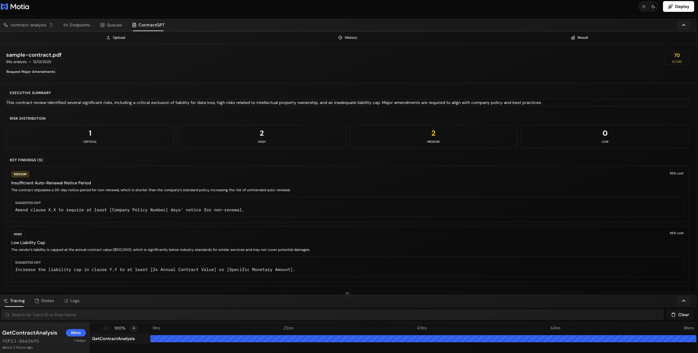

# ContractGPT

> AI-powered legal contract analysis and generation using Gemini Interactions API

ContractGPT is a Motia-powered backend service that automates legal contract analysis and generation through a multi-agent reflection pipeline. The system uses Google's Gemini Interactions API (including `gemini-3-pro-preview` and `deep-research-pro-preview-12-2025`) to provide comprehensive contract review in under 90 seconds.


## 🎯 Features

### Contract Analysis Engine
Upload any contract (PDF, Word, text) and get a comprehensive risk assessment:

- **Generator Agent**: Initial analysis identifying 20+ risk categories
- **Critic Agent**: Meta-analysis for accuracy, false positives, and missed policies
- **Refiner Agent**: Final synthesis with executive summary and actionable recommendations

### Contract Generation Wizard
Answer structured questions and get a policy-compliant draft contract:

- Template-based generation for common contract types
- Automatic policy validation
- GC review flagging for complex deals

### Real-time Progress Streaming
- Server-Sent Events (SSE) for live progress updates
- Track analysis through Generator → Critic → Refiner stages
- Immediate notification on completion

### Complete Audit Trail
- Full state persistence of all analysis artifacts
- Query intermediate results (draft analysis, critique)
- Compliance-ready logging

### 🎨 Beautiful Workbench Plugin
- **Drag & Drop Upload**: Upload PDF, DOCX, or text files directly in Workbench
- **Real-time Progress**: Watch analysis progress through all 3 agents
- **Visual Results**: Beautiful risk cards, score displays, and action items
- **History Panel**: View all past analyses with scores and details

## 🏗️ Architecture

```
┌─────────────────────────────────────────────────────────────────────┐
│                         ContractGPT Flow                             │
└─────────────────────────────────────────────────────────────────────┘

    POST /contracts/analyze
           │
           ▼
    ┌──────────────┐
    │   Ingest     │ Extract text, store in state
    │   (API)      │ Emit: contract.requested
    └──────────────┘
           │
           ▼
    ┌──────────────┐
    │  Generator   │ Gemini 3 Pro analysis
    │  (Event)     │ 20+ risk categories
    └──────────────┘ Emit: analysis.draft_generated
           │
           ▼
    ┌──────────────┐
    │   Critic     │ Meta-analysis
    │  (Event)     │ Policy compliance check
    └──────────────┘ Emit: analysis.critique_completed
           │
           ▼
    ┌──────────────┐
    │   Refiner    │ Final synthesis
    │  (Event)     │ Executive summary, action items
    └──────────────┘ Emit: analysis.completed
           │
           ▼
    GET /contracts/:id/analysis
    (Returns RefinedAnalysis)
```

## 🚀 Quick Start

### Prerequisites

- Node.js 18+
- npm or yarn
- Google Cloud API key with Gemini API access

### Installation

```bash
# Install dependencies
npm install

# Set up environment variables
export GEMINI_API_KEY=your_api_key_here

# Start development server
npm run dev
```

### Generate Types

After making changes to step configurations:

```bash
npx motia generate-types
```

## 📡 API Endpoints

### Analyze Contract

```http
POST /contracts/analyze
Content-Type: application/json

{
  "document": "base64_encoded_document_or_plain_text",
  "documentType": "pdf" | "docx" | "text",
  "fileName": "contract.pdf",
  "context": {
    "customerName": "Acme Corp",
    "dealValue": 100000,
    "dealCurrency": "USD",
    "contractType": "msa",
    "jurisdiction": "Delaware",
    "urgency": "normal"
  },
  "useDeepResearch": false
}
```

**Response (202 Accepted):**
```json
{
  "id": "contract-uuid",
  "status": "processing",
  "message": "Contract analysis initiated",
  "createdAt": "2024-01-15T10:30:00Z",
  "estimatedCompletionSeconds": 90
}
```

### Get Analysis Status/Results

```http
GET /contracts/:id/analysis?includeIntermediate=true
```

**Response (200 OK):**
```json
{
  "id": "contract-uuid",
  "status": "completed",
  "progress": {
    "currentStep": "Complete",
    "completedSteps": ["Document Processing", "Generator", "Critic", "Refiner"],
    "percentComplete": 100
  },
  "result": {
    "executiveSummary": "This contract presents moderate risk...",
    "overallScore": 72,
    "recommendedAction": "request_minor_amendments",
    "risks": [...],
    "keyNegotiationPoints": [...],
    "actionItems": [...]
  }
}
```

### Generate Contract

```http
POST /contracts/generate
Content-Type: application/json

{
  "contractType": "nda",
  "customerType": "mid_market",
  "dealValue": 50000,
  "jurisdiction": "California",
  "term": {
    "duration": 2,
    "unit": "years",
    "autoRenewal": false
  },
  "keyTerms": {
    "liabilityCap": 100000,
    "confidentialityLevel": "enhanced",
    "terminationNoticeDays": 30
  },
  "parties": {
    "provider": { "name": "Your Company Inc" },
    "customer": { "name": "Customer Corp" }
  }
}
```

### List Contracts

```http
GET /contracts?status=completed&limit=20&offset=0
```

## 🔄 Real-time Progress Stream

Subscribe to analysis progress via SSE:

```javascript
const eventSource = new EventSource('/streams/analysisProgress?groupId=contract-uuid');

eventSource.onmessage = (event) => {
  const progress = JSON.parse(event.data);
  console.log(`${progress.step}: ${progress.message} (${progress.progress}%)`);
};
```

## 📊 Risk Categories

The system identifies 20+ risk categories:

| Category | Description |
|----------|-------------|
| `liability_gap` | Missing or insufficient liability provisions |
| `liability_cap_exceeded` | Liability cap exceeds policy limits |
| `indemnification_issue` | One-sided or excessive indemnification |
| `payment_term_anomaly` | Non-standard payment terms |
| `ip_ownership_issue` | Unclear IP ownership or assignment |
| `confidentiality_gap` | Weak confidentiality provisions |
| `compliance_violation` | Regulatory compliance issues |
| `termination_clause_issue` | Problematic termination provisions |
| `auto_renewal_risk` | Automatic renewal concerns |
| `non_standard_clause` | Unusual or non-standard language |
| ... | And many more |

## 🛡️ Company Policies

The Critic agent validates against configurable company policies:

- **Liability Caps**: Max 12x annual fees for enterprise deals
- **Insurance Requirements**: Minimum coverage by customer type
- **Payment Terms**: Standard Net 30, approval for Net 60+
- **Termination**: Minimum notice periods
- **IP Ownership**: Pre-existing IP retention
- **Confidentiality**: Minimum 3-year period
- **Data Protection**: GDPR compliance requirements

## 🔧 Configuration

### Environment Variables

```bash
# Required
GEMINI_API_KEY=your_gemini_api_key

# Optional
REDIS_URL=redis://localhost:6379
LOG_LEVEL=info
```

## 🎨 Workbench Plugin

The ContractGPT plugin adds a beautiful panel to the Motia Workbench for:

### Upload Tab
- Drag & drop file upload (PDF, DOCX, TXT)
- Deal context form (customer, value, contract type)
- Deep Research toggle for thorough analysis
- Real-time upload and processing progress


### History Tab
- List of all analyzed contracts
- Quick score preview
- Status indicators (processing, completed, failed)
- Click to view full details

### Details Tab
- Large score display with color-coded severity
- Executive summary
- Risk breakdown by severity (critical/high/medium/low)
- Individual risk cards with suggested edits
- Key negotiation points
- Action items with priorities



### Custom Node UI
Each step in the flow diagram has a custom visual:
- 📤 **Upload**: Violet gradient with upload icon
- 🤖 **Generator**: Emerald gradient with robot emoji
- 🔍 **Critic**: Amber gradient with magnifier emoji  
- ✨ **Refiner**: Blue gradient with sparkle emoji
- ✅ **Success**: Green gradient with checkmark
- ❌ **Failed**: Red gradient with error icon

## 🤖 Gemini Interactions API

This project uses the new Gemini Interactions API which provides:

- **Stateful Conversations**: Automatic context management
- **Structured Output**: JSON schema enforcement
- **Deep Research Agent**: Comprehensive research capabilities
- **Function Calling**: Tool integration
- **Streaming**: Real-time response generation

Example usage:

```typescript
import { getGeminiService } from './services/gemini-interactions'

const gemini = getGeminiService()

// Structured output
const response = await gemini.createStructuredInteraction(
  "Analyze this contract...",
  DraftAnalysisJsonSchema,
  { model: 'gemini-3-pro-preview' }
)

// Deep research (for complex analysis)
const research = await gemini.deepResearch(
  "Research best practices for SaaS contracts...",
  { maxWaitMs: 300000 }
)
```

## 📈 Observability

Motia provides built-in observability:

- **Workbench**: Visual flow designer at `http://localhost:3000`
- **Tracing**: Full execution traces for debugging
- **Metrics**: Pipeline timing, risk statistics
- **Logs**: Structured logging throughout

## 🧪 Testing

```bash
# Analyze a sample contract
curl -X POST http://localhost:3000/contracts/analyze \
  -H "Content-Type: application/json" \
  -d '{
    "document": "This Agreement is entered into between Company A and Company B...",
    "documentType": "text",
    "context": {
      "customerName": "Test Customer",
      "dealValue": 50000,
      "contractType": "msa"
    }
  }'

# Check status
curl http://localhost:3000/contracts/{id}/analysis
```

## 📜 License

Apache License 2.0

## 🙏 Acknowledgments

- [Motia](https://motia.dev) - Event-driven backend framework
- [Google Gemini](https://ai.google.dev) - AI models and Interactions API
