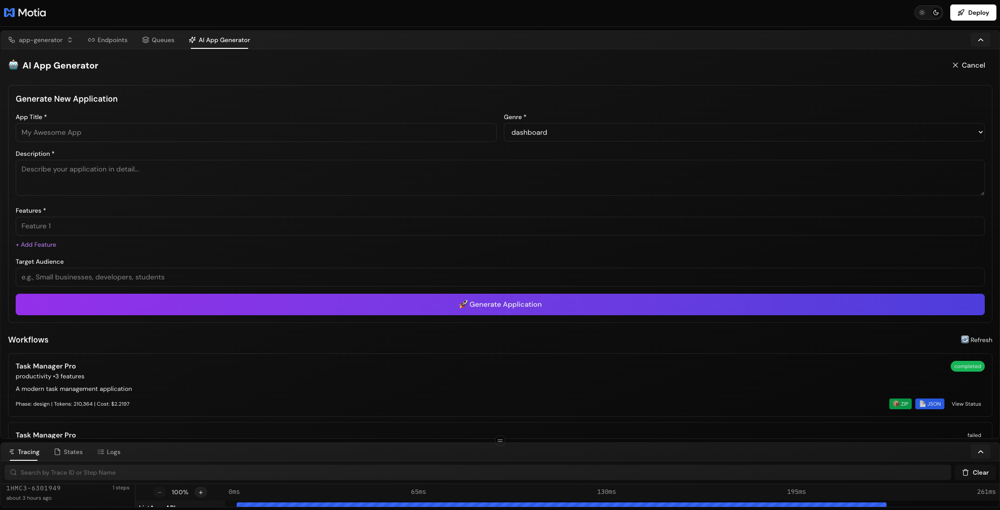
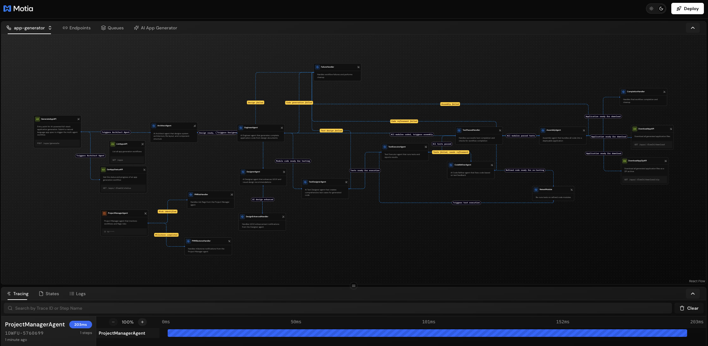
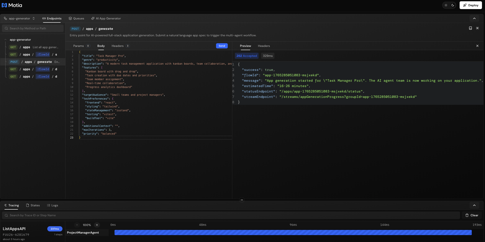
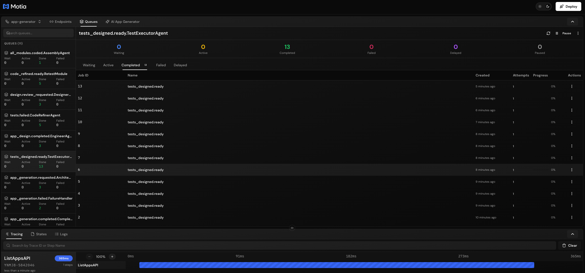

# 🤖 Motia AI Full-Stack Application Generator

An event-driven AI agent orchestration system that builds complete web applications from natural-language specifications. This system mimics a real development team with specialized AI agents managed by Motia's runtime.



## 🏗️ Architecture



The system orchestrates a team of specialized AI agents:

| Agent | Model | Role |
|-------|-------|------|
| **Architect** | Gemini 3 Pro | Designs system architecture, file layout, and component structure |
| **Engineer** | Claude Opus 4.5 | Generates production-ready code for each component |
| **Test Designer** | Claude Opus 4.5 | Creates comprehensive Jest/Vitest test cases |
| **Test Executor** | - | Runs tests and reports results |
| **Code Refiner** | Claude Opus 4.5 | Fixes code based on test feedback |
| **Designer** | Gemini 3 Pro | Enhances UI/UX with color schemes and typography |
| **Project Manager** | - | Monitors progress and flags risks (cron job) |
| **Assembly** | - | Bundles final application with build configs |

## 🚀 Quick Start

### 1. Install Dependencies

```bash
npm install
```

### 2. Configure API Keys

Copy the environment template and add your API keys:

```bash
cp env.example .env
```

Edit `.env` and add your keys:

```env
# Google Gemini API Key (for Architect and Designer agents)
# Get your key at: https://makersuite.google.com/app/apikey
GEMINI_API_KEY=your_gemini_api_key_here

# Anthropic Claude API Key (for Engineer and Test Designer agents)
# Get your key at: https://console.anthropic.com/
ANTHROPIC_API_KEY=your_anthropic_api_key_here
```

### 3. Start the Development Server

```bash
npm run dev
```

### 4. Open the Workbench

Navigate to [http://localhost:3000](http://localhost:3000) to view the visual workflow editor.

## 📡 API Endpoints



### Generate a New Application

```bash
POST /apps/generate
```

**Request Body:**
```json
{
  "title": "Task Manager Pro",
  "genre": "productivity",
  "description": "A modern task management application with kanban boards",
  "features": [
    "Kanban board with drag and drop",
    "Task creation with due dates",
    "Team member assignment",
    "Progress analytics"
  ],
  "targetAudience": "Small teams and project managers",
  "techPreferences": {
    "frontend": "React",
    "styling": "Tailwind CSS",
    "stateManagement": "Zustand"
  }
}
```

**Supported Genres:**
- `e-commerce`, `dashboard`, `content-editor`, `social-platform`
- `portfolio`, `blog`, `saas`, `landing-page`, `admin-panel`
- `chat-app`, `marketplace`, `booking-system`, `productivity`
- `task-manager`, `crm`, `analytics`, `custom`

### Check Generation Status

```bash
GET /apps/:flowId/status
```

### Download Generated Application

```bash
GET /apps/:flowId/download
GET /apps/:flowId/download/zip  # Download as ZIP archive
```


### List All Applications

```bash
GET /apps
```


## 🎯 Example Usage

```bash
# Generate a new app
curl -X POST http://localhost:3000/apps/generate \
  -H "Content-Type: application/json" \
  -d '{
    "title": "E-commerce Dashboard",
    "genre": "dashboard",
    "description": "Analytics dashboard for e-commerce metrics",
    "features": [
      "Sales overview charts",
      "Order management table",
      "Customer insights",
      "Inventory tracking"
    ]
  }'

# Response:
# {
#   "success": true,
#   "flowId": "app-1234567890-abc123",
#   "message": "App generation started...",
#   "estimatedTime": "15-25 minutes",
#   "statusEndpoint": "/apps/app-1234567890-abc123/status",
#   "streamEndpoint": "/streams/appGenerationProgress?groupId=app-1234567890-abc123"
# }

# Check status
curl http://localhost:3000/apps/app-1234567890-abc123/status

# Download when complete
curl http://localhost:3000/apps/app-1234567890-abc123/download
```

## 📊 Real-Time Streaming

Subscribe to progress updates via Server-Sent Events:

```javascript
const eventSource = new EventSource(
  'http://localhost:3000/streams/appGenerationProgress?groupId=YOUR_FLOW_ID'
);

eventSource.onmessage = (event) => {
  const progress = JSON.parse(event.data);
  console.log(`Phase: ${progress.phase}, Progress: ${progress.progress}%`);
  console.log(`Message: ${progress.message}`);
};
```

## 🔄 Workflow Phases

1. **Requested** - Initial request received, workflow initialized
2. **Designing** - Architect agent creates system architecture
3. **Coding** - Engineer agent generates code for each component
4. **Testing** - Test Designer creates tests, Test Executor runs them
5. **Refining** - Code Refiner fixes any failing tests (iterative loop)
6. **Assembling** - Assembly agent bundles final application
7. **Completed** - Application ready for download


## 🛠️ Development

### Generate Types

After modifying step configurations:

```bash
npm run generate-types
```

### Project Structure

```
├── steps/
│   └── app-generator/
│       ├── agents/
│       │   ├── architect-agent.step.ts
│       │   ├── engineer-agent.step.ts
│       │   ├── test-designer-agent.step.ts
│       │   ├── test-executor-agent.step.ts
│       │   ├── code-refiner-agent.step.ts
│       │   ├── designer-agent.step.ts
│       │   ├── project-manager-agent.step.ts
│       │   └── assembly-agent.step.ts
│       ├── generate-app-api.step.ts
│       ├── get-status-api.step.ts
│       ├── download-app-api.step.ts
│       └── list-apps-api.step.ts
├── src/
│   ├── services/
│   │   └── llm/
│   │       ├── gemini.service.ts
│   │       └── claude.service.ts
│   └── types/
│       └── app-generator.types.ts
├── plugins/
│   └── app-generator/
│       └── index.ts
└── middlewares/
    └── core.middleware.ts
```

## 🔒 Cost Management

Token usage and costs are tracked for each workflow:

- Gemini 3 Pro: ~$0.00125/1K input, ~$0.005/1K output
- Claude Opus 4.5: ~$0.015/1K input, ~$0.075/1K output

View costs in the workflow status response or Workbench tracing panel.

## 📈 Monitoring

The **Project Manager Agent** runs every 2 minutes to:
- Check workflow health
- Flag risks and blockers
- Monitor progress across all active workflows

View real-time logs and traces in the Workbench at:
- **Tracing** tab - Execution timeline
- **States** tab - Workflow state data
- **Logs** tab - Detailed logs



## 🤝 Contributing

1. Fork the repository
2. Create a feature branch
3. Add your changes following Motia patterns in `.cursor/rules/`
4. Submit a pull request

## 📄 License

MIT License

---

Built with [Motia](https://motia.dev) - Event-driven backend framework for AI workflows
