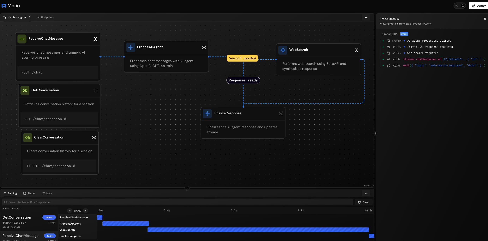

# AI Chat Agent - Motia Backend

A scalable AI chat agent backend built with Motia. Features OpenAI GPT-4o-mini integration with SerpAPI web search capabilities and conversation memory.

## Architecture



## Features

- **Chat Endpoint**: RESTful API for sending messages
- **AI Agent**: GPT-4o-mini powered intelligent responses
- **Web Search**: SerpAPI integration for real-time information
- **Conversation Memory**: Window buffer memory (last 20 messages)
- **Real-time Streaming**: Stream-based response updates
- **Session Management**: Per-session conversation history

## Quick Start

### 1. Install Dependencies

```bash
npm install
```

### 2. Set Environment Variables

Create a `.env` file or set these environment variables:

```bash
# Required
OPENAI_API_KEY=sk-your-openai-api-key

# Optional (for web search)
SERPAPI_KEY=your-serpapi-key

# Optional
OPENAI_BASE_URL=https://api.openai.com/v1
```

### 3. Generate Types

```bash
npm run generate-types
```

### 4. Start Development Server

```bash
npm run dev
```

The server starts at `http://localhost:3000`

## API Endpoints

### Send Chat Message

```bash
POST /chat
Content-Type: application/json

{
  "sessionId": "unique-session-id",
  "message": "What's the weather like today?",
  "userId": "optional-user-id"
}
```

**Response:**
```json
{
  "success": true,
  "sessionId": "unique-session-id",
  "messageId": "generated-uuid",
  "status": "processing"
}
```

### Get Conversation History

```bash
GET /chat/:sessionId
```

**Response:**
```json
{
  "sessionId": "unique-session-id",
  "messages": [
    {
      "role": "user",
      "content": "Hello",
      "timestamp": "2025-01-01T00:00:00.000Z"
    },
    {
      "role": "assistant",
      "content": "Hi! How can I help you?",
      "timestamp": "2025-01-01T00:00:01.000Z"
    }
  ]
}
```

### Clear Conversation

```bash
DELETE /chat/:sessionId
```

## Workflow Steps

| Step | Type | Description |
|------|------|-------------|
| `ReceiveChatMessage` | API | Receives chat messages, stores in history, emits for processing |
| `ProcessAIAgent` | Event | Processes with OpenAI, determines if search needed |
| `WebSearch` | Event | Performs SerpAPI search and synthesizes results |
| `FinalizeResponse` | Event | Stores response in stream and conversation history |
| `GetConversation` | API | Retrieves conversation history |
| `ClearConversation` | API | Clears session history |

## Real-time Updates

Subscribe to the `chatResponse` stream for real-time response updates:

```typescript
// Connect to stream for session updates
// Stream provides status: 'processing' | 'searching' | 'analyzing' | 'complete' | 'error'
```

## Configuration

### Environment Variables

| Variable | Required | Default | Description |
|----------|----------|---------|-------------|
| `OPENAI_API_KEY` | Yes | - | OpenAI API key |
| `SERPAPI_KEY` | No | - | SerpAPI key for web search |
| `OPENAI_BASE_URL` | No | `https://api.openai.com/v1` | Custom OpenAI endpoint |

### Models

The AI agent uses `gpt-4o-mini` by default. This can be changed in `process-ai-agent.step.ts`.

## Development

### Project Structure

```
steps/
├── chat-agent/
│   ├── receive-chat-message.step.ts   # Chat API endpoint
│   ├── process-ai-agent.step.ts       # AI processing
│   ├── web-search.step.ts             # SerpAPI search
│   ├── finalize-response.step.ts      # Response finalization
│   ├── get-conversation.step.ts       # Get history API
│   └── clear-conversation.step.ts     # Clear history API
├── streams/
│   └── chat-response.stream.ts        # Real-time stream
├── hello/                              # Example steps (can remove)
src/
└── services/
    ├── openai.service.ts              # OpenAI client
    └── serpapi.service.ts             # SerpAPI client
middlewares/
└── core.middleware.ts                 # Error handling middleware
```

### Running Tests

```bash
npm run dev
# Then test with curl or Postman
curl -X POST http://localhost:3000/chat \
  -H "Content-Type: application/json" \
  -d '{"sessionId": "test-123", "message": "Hello, who are you?"}'
```

## Scaling

Motia provides built-in scalability:

- **Event-driven**: Long-running tasks (OpenAI, SerpAPI) are handled asynchronously
- **State Management**: Redis-backed state for conversation memory
- **Streams**: Real-time updates without polling
- **Retry Mechanisms**: Event steps have built-in retry on failure

## License

MIT


