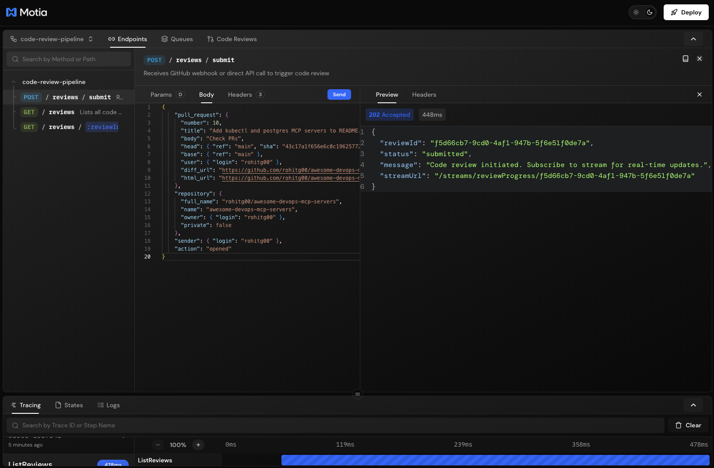

# 🤖 AI Code Review Service

> A production-ready, multi-agent reflection pipeline for automated code review, built on Motia's event-driven runtime.


## Overview

This service automates code review and refinement through a sophisticated multi-agent pipeline:
## Features

### Multi-Agent Reflection Pipeline

1. **Generator Agent** - Analyzes code diffs using Claude Opus 4.5 to identify:
   - Security vulnerabilities
   - Bugs and logic errors
   - Performance issues
   - Style inconsistencies
   - Maintainability concerns
   - Test coverage gaps

2. **Critic Agent** - Meta-analyzes the draft review for:
   - Accuracy of findings
   - Completeness of coverage
   - Actionability of suggestions
   - Missed issues

3. **Refiner Agent** - Produces the final review with:
   - Prioritized, consolidated findings
   - Code snippets for suggested fixes
   - Auto-generated test assertions
   - Business impact explanations

### GitHub Integration


- **Webhook Support** - Automatically triggers on PR events
- **Inline Comments** - Posts findings directly on code lines
- **Commit Status** - Sets pass/fail based on quality score
- **PR Review** - Submits formal review (approve/request changes/comment)


### Real-time Progress

- **WebSocket Streams** - Subscribe to live pipeline updates
- **Workbench Dashboard** - Beautiful GitHub-themed UI
- **Stage Tracking** - Monitor each agent's progress

### Production Ready

- **State Persistence** - All artifacts stored durably
- **Automatic Retries** - Built-in failure handling
- **Horizontal Scaling** - Redis/RabbitMQ adapters available
- **Observability** - Full tracing and metrics

## Quick Start


### Prerequisites

- Node.js 18+
- npm or yarn
- Anthropic API key (for Claude)
- GitHub token (for GitHub integration)

### Installation

```bash
# Clone the repository
git clone https://github.com/MotiaDev/motia-examples.git
cd examples/ai-code-reviewer-agent

# Install dependencies
npm install

# Edit .env with your API keys
nano .env

# Start development server
npm run dev
```

### Environment Variables

```env
# Required
ANTHROPIC_API_KEY=sk-ant-api03-xxxxx
GITHUB_TOKEN=ghp_xxxxx

# Optional
GITHUB_WEBHOOK_SECRET=your-webhook-secret
REVIEW_SCORE_THRESHOLD=70
SLACK_WEBHOOK_URL=https://hooks.slack.com/...
```

## API Reference



### Submit Review

```bash
POST /reviews/submit
```

**GitHub Webhook Format:**
```json
{
  "action": "opened",
  "pull_request": {
    "number": 123,
    "title": "Add new feature",
    "head": { "ref": "feature-branch", "sha": "abc123" },
    "base": { "ref": "main" }
  },
  "repository": {
    "full_name": "owner/repo"
  }
}
```

**Direct API Format:**
```json
{
  "repository": { "full_name": "owner/repo" },
  "diff": "diff --git a/file.js...",
  "branch": "feature-branch",
  "sender": { "login": "developer" }
}
```

**Response:**
```json
{
  "reviewId": "uuid",
  "status": "submitted",
  "message": "Code review initiated",
  "streamUrl": "/streams/reviewProgress/{reviewId}"
}
```

### Get Review Details

```bash
GET /reviews/:reviewId?includeArtifacts=true
```

**Response:**
```json
{
  "reviewId": "uuid",
  "repository": "owner/repo",
  "status": "completed",
  "finalScore": 85,
  "recommendation": "approve",
  "stages": {
    "submitted": { "timestamp": "..." },
    "draft_generated": { "timestamp": "..." },
    "critique_completed": { "timestamp": "..." },
    "review_completed": { "timestamp": "..." }
  },
  "refined": {
    "findings": [...],
    "executiveSummary": "..."
  }
}
```

### List Reviews

```bash
GET /reviews?repository=owner/repo&status=completed&limit=20
```

### Real-time Stream

```javascript
const ws = new WebSocket('ws://localhost:3000/streams/reviewProgress/{reviewId}')

ws.onmessage = (event) => {
  const { type, payload } = JSON.parse(event.data)
  if (type === 'update') {
    console.log('Stage:', payload.stage)
    console.log('Progress:', payload.metadata.progress + '%')
  }
}
```

## Architecture

### File Structure

```
steps/
├── code-review/
│   ├── api/
│   │   ├── submit-review.step.ts      # GitHub webhook endpoint
│   │   ├── submit-review.step.tsx     # Custom UI node
│   │   ├── get-review.step.ts         # Get review details
│   │   └── list-reviews.step.ts       # List all reviews
│   ├── events/
│   │   ├── generate-draft.step.ts     # Generator agent
│   │   ├── generate-draft.step.tsx    # Custom UI node
│   │   ├── critique-draft.step.ts     # Critic agent
│   │   ├── critique-draft.step.tsx    # Custom UI node
│   │   ├── refine-review.step.ts      # Refiner agent
│   │   ├── refine-review.step.tsx     # Custom UI node
│   │   ├── post-github-feedback.step.ts
│   │   ├── post-github-feedback.step.tsx
│   │   ├── send-notification.step.ts
│   │   └── send-notification.step.tsx
│   └── streams/
│       └── review-progress.stream.ts  # Real-time updates
├── plugins/
│   └── components/
│       ├── code-review-dashboard.tsx  # Workbench plugin
│       └── code-review-dashboard.css  # Plugin styles
└── motia.config.ts                    # Plugin registration
```

### Event Flow

```
code_review.requested
        │
        ▼
review.draft_generated
        │
        ▼
review.critique_completed
        │
        ▼
review.completed
        │
        ├──► review.github_posted
        │
        └──► review.notification
```

### State Groups

| Group | Purpose |
|-------|---------|
| `reviews` | Review metadata and status |
| `drafts` | Generator output |
| `critiques` | Critic output |
| `refined` | Final refined review |
| `deliveries` | Delivery records |

## Workbench UI

The service includes a beautiful GitHub-themed dashboard accessible in Motia Workbench:


- **Active Reviews** - Monitor in-progress reviews
- **History** - Browse completed reviews
- **Pipeline Progress** - Visual stage tracker
- **Findings Summary** - Severity breakdown
- **Real-time Updates** - Live progress streaming

## Configuration

### Score Thresholds

Configure in `.env`:

```env
# Minimum score for CI pass (0-100)
REVIEW_SCORE_THRESHOLD=70
```

### LLM Settings

The pipeline uses Claude Opus 4.5 with tuned parameters:

- **Generator**: temperature=0.3 (focused analysis)
- **Critic**: temperature=0.2 (precise validation)
- **Refiner**: temperature=0.2 (consistent output)

### Scaling

For production deployments with Redis:

```typescript
// motia.config.ts
import { RedisStateAdapter } from '@motiadev/adapter-redis-state'
import { BullMQEventAdapter } from '@motiadev/adapter-bullmq-events'

export default config({
  adapters: {
    state: new RedisStateAdapter({ url: process.env.REDIS_URL }),
    events: new BullMQEventAdapter({ url: process.env.REDIS_URL })
  }
})
```

## Observability


### Built-in Tracing

Every step is automatically traced with:
- LLM call latencies
- Decision points
- Finding additions/removals
- Error details

### Metrics

Available via Motia's observability plugin:
- Average review time
- Findings per review
- Score distribution
- Error rates

## Contributing

1. Fork the repository
2. Create a feature branch
3. Make your changes
4. Run tests
5. Submit a PR

## License

MIT License - see LICENSE file for details.

---

Built with [Motia](https://motia.dev) - The event-driven backend framework.
