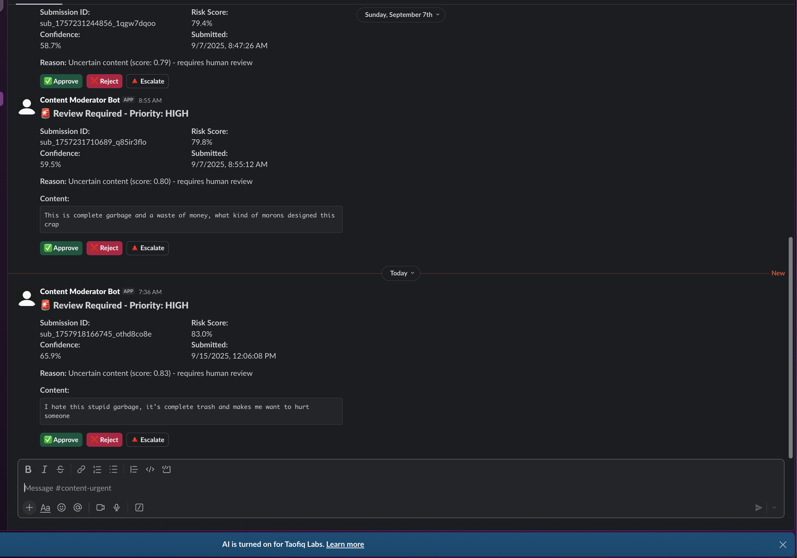
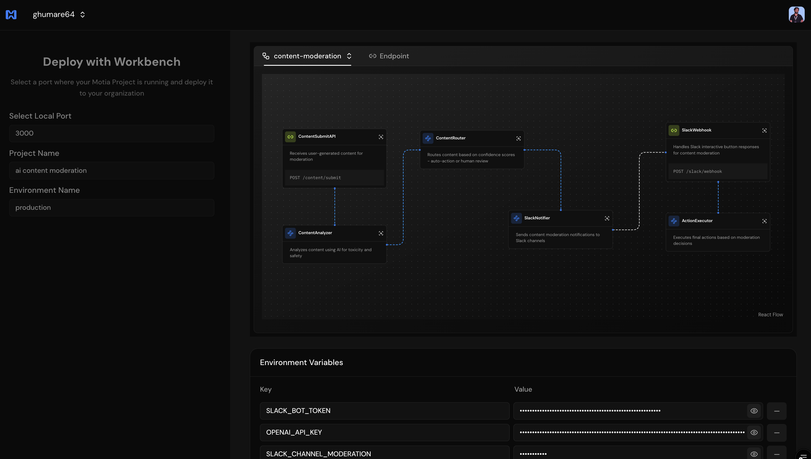
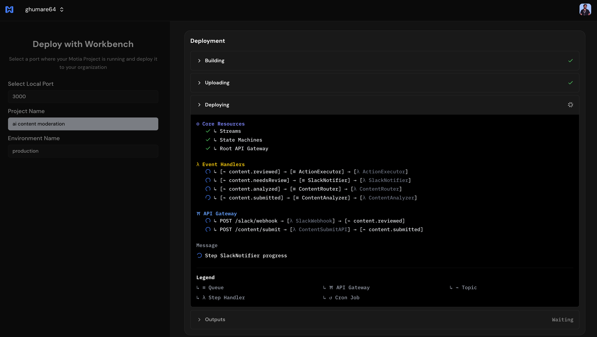

# AI Content Moderation with Human-in-the-Loop

A complete content moderation system built with [Motia](https://motia.dev) that combines AI analysis with human review via Slack integration.


## Overview

This system processes user-generated content (text and images) through AI analysis and routes uncertain content to human moderators via interactive Slack messages. Content with high confidence scores is automatically approved or rejected, while borderline content requires human review.


### Workflow Steps

1. **Content Submit API** - Receives text and/or image content for moderation
2. **AI Analysis** - Uses OpenAI for text toxicity detection and image safety analysis
3. **Content Router** - Routes based on confidence scores (auto vs human review)
4. **Slack Notifier** - Sends interactive messages to Slack channels for human review
5. **Slack Webhook** - Handles approve/reject/escalate button responses
6. **Action Executor** - Executes final decisions and completes the workflow

## Features

- **Dual content support**: Text and image moderation
- **Confidence-based routing**: Auto-approve clean content, auto-reject toxic content, human review for uncertain cases
- **Slack integration**: No custom dashboard needed - uses existing Slack workspace
- **Channel prioritization**: High-risk content goes to urgent channels
- **Interactive buttons**: Approve, reject, or escalate decisions with one click
- **Audit trail**: All decisions logged with reviewer information and timestamps
- **State management**: Complete workflow tracking and error handling

## Prerequisites

- Node.js 18+
- Motia CLI and framework
- OpenAI API key
- Slack bot token and signing secret
- Slack channels for moderation notifications

## Environment Setup

Create a `.env` file:

```env
OPENAI_API_KEY=<your_openai_api_key>
SLACK_BOT_TOKEN=<your_slack_bot_token>
SLACK_SIGNING_SECRET=<your_slack_signing_secret>
SLACK_CHANNEL_MODERATION=<channel_for_normal_priority>
SLACK_CHANNEL_URGENT=<channel_for_high_priority>
SLACK_CHANNEL_ESCALATED=<channel_for_escalated_content>
```

## Installation

```bash
pnpm install
pnpm run dev
```

## Usage

### Submit Content for Moderation

**Text content:**

```bash
curl -X POST http://localhost:3000/content/submit \
  -H "Content-Type: application/json" \
  -d '{
    "text": "Your content here",
    "userId": "user123",
    "platform": "web"
  }'
```

**Image content:**

```bash
curl -X POST http://localhost:3000/content/submit \
  -H "Content-Type: application/json" \
  -d '{
    "imageUrl": "https://example.com/image.jpg",
    "userId": "user123",
    "platform": "web"
  }'
```

**Both text and image:**

```bash
curl -X POST http://localhost:3000/content/submit \
  -H "Content-Type: application/json" \
  -d '{
    "text": "Check out this image",
    "imageUrl": "https://cdn.britannica.com/16/234216-050-C66F8665/beagle-hound-dog.jpg",
    "userId": "user123",
    "platform": "web"
  }'
```

### Decision Logic

- **Auto-approve**: Content with risk score ≤ 5%
- **Auto-reject**: Content with risk score ≥ 95%
- **Human review**: Content with risk score between 5-95%

### Slack Integration Setup

1. Create a Slack app with chat:write permissions
2. Enable Interactive Components and set webhook URL to: `https://your-domain.com/slack/webhook`
3. Install the app to your workspace
4. Configure channel environment variables

### Example Slack Output



## Project Structure

```
steps/
├── 01-content-submit-api.step.ts     # Content submission endpoint
├── 02-content-analyzer.step.ts      # AI analysis using OpenAI
├── 03-content-router.step.ts        # Confidence-based decision routing
├── 04-slack-notifier.step.ts        # Slack message creation
├── 05-slack-webhook.step.ts         # Interactive button handling
└── 06-action-executor.step.ts       # Final action execution
```

## API Reference

### POST /content/submit

Submit content for moderation.

**Request Body:**

```typescript
{
  text?: string;           // Optional text content
  imageUrl?: string;       // Optional image URL
  userId: string;          // User identifier
  platform?: string;      // Platform source (default: "web")
}
```

**Response:**

```typescript
{
  message: string;
  submissionId: string;
}
```

## Configuration

### Adjusting Confidence Thresholds

Modify thresholds in `03-content-router.step.ts`:

```typescript
if (overallScore <= 0.05) {
  decision = "approved"; // Auto-approve threshold
} else if (overallScore >= 0.95) {
  decision = "rejected"; // Auto-reject threshold
} else {
  decision = "review"; // Human review range
}
```

### Channel Routing

Content is routed to different Slack channels based on risk level:

- **High risk** (≥70%): Urgent channel
- **Medium risk** (50-70%): Escalated channel
- **Low risk** (<50%): Normal moderation channel

## Dependencies

- `@slack/web-api` - Slack API client
- `openai` - OpenAI API client

## 🌐 Deployment

### Deploy to Motia Cloud

You can deploy your AI Content Moderation system to Motia Cloud using either the CLI or the web interface.

#### Using the Motia CLI

Deploy with a specific version:

```bash
motia cloud deploy --api-key your-api-key-here --version-name 1.0.0
```

Deploy to a specific environment with environment variables:

```bash
motia cloud deploy --api-key your-api-key-here \
  --version-name 1.0.0 \
  --env-file .env.production \
  --environment-id env-id
```

#### Using the Web Interface

For a visual deployment experience, use the Motia Cloud web interface:

1. Have your local project running (`npm run dev`)
2. Go to **Import from Workbench** on [Motia Cloud](https://motia.cloud)

3. Select the port your local project is running on (default: 3000)
4. Choose the project and environment name
5. Add environment variables:
   - `OPENAI_API_KEY`
   - `SLACK_BOT_TOKEN`
   - `SLACK_SIGNING_SECRET`
   - `SLACK_CHANNEL_MODERATION`
   - `SLACK_CHANNEL_URGENT`
   - `SLACK_CHANNEL_ESCALATED`
6. Click **Deploy** and watch the magic happen! ✨



For detailed instructions, see the [Motia Cloud Deployment Guide](https://motia.dev/docs/deployment-guide/motia-cloud/deployment#using-web-interface).

## License

MIT
