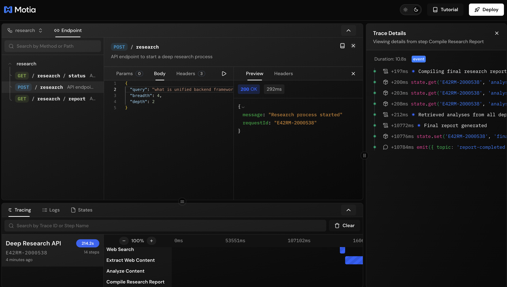
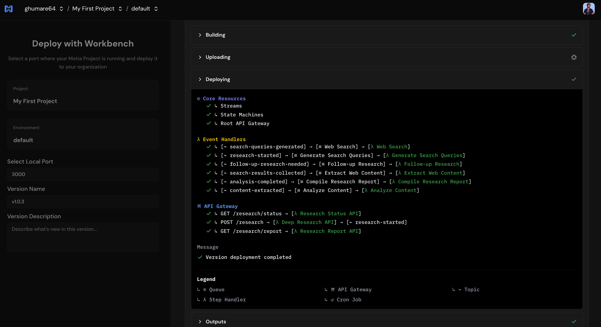

# Deep Research Agent with Motia Framework

A powerful research assistant that leverages the Motia Framework to perform comprehensive web research on any topic and any question.


## Features

* **Deep Web Research**: Automatically searches the web, extracts content, and synthesizes findings
* **Iterative Research Process**: Supports multiple layers of research depth for comprehensive exploration
* **Event-Driven Architecture**: Built using Motia Framework's event system for robust workflow management
* **Parallel Processing**: Efficiently processes search results and content extraction
* **API Endpoints**: REST API access for initiating research and retrieving reports
* **Stateful Processing**: Maintains research state throughout the entire process

## How It Works

The Deep Research Agent works through a series of event-driven steps:

1. **Research Initiation**: Submit a research query via the API
2. **Query Generation**: Generate specific search queries based on the research topic
3. **Web Search**: Perform web searches using Firecrawl to find relevant content
4. **Content Extraction**: Extract and process content from the found web pages
5. **Analysis**: Analyze the extracted content to generate insights
6. **Follow-up Research**: Optionally perform deeper research based on initial findings
7. **Report Compilation**: Generate a comprehensive research report
8. **Result Retrieval**: Access the final report via API

## Prerequisites

* Node.js 18 or later
* OpenAI API key
* Firecrawl API key

## Setup

1. Clone this repository:```
git clone <repository-url>
cd ai_deep_research_agent
```

2. Install dependencies:
```
npm install
```

3. Copy the example environment file and configure your API keys:
```
cp .env.example .env
```

4. Edit the `.env` file with your actual API keys:
```
# Required
OPENAI_API_KEY=your-openai-api-key-here
FIRECRAWL_API_KEY=your-firecrawl-api-key-here

# Optional
# OPENAI_MODEL=gpt-4o
# FIRECRAWL_API_URL=http://your-firecrawl-instance-url

# Rate Limiting Configuration (Optional)
# FIRECRAWL_CONCURRENCY_LIMIT=2          # Number of concurrent requests (default: 2)
# FIRECRAWL_BATCH_DELAY_MS=2000          # Delay between batches in ms (default: 2000)
```

5. Start the Motia development server:
```
npm run dev
```

6. Access the Motia Workbench in your browser at `http://localhost:3000`

## Project Structure

```
.
├── steps/                  # Motia step definitions
│   ├── research-api.step.ts        # API endpoint to start research
│   ├── status-api.step.ts          # API endpoint to check research status
│   ├── report-api.step.ts          # API endpoint to get research report
│   ├── generate-queries.step.ts    # Generate search queries from topic
│   ├── search-web.step.ts          # Perform web searches
│   ├── extract-content.step.ts     # Extract content from search results
│   ├── analyze-content.step.ts     # Analyze extracted content
│   ├── follow-up-research.step.ts  # Perform deeper research
│   └── compile-report.step.ts      # Compile final research report
├── services/               # External service integrations
│   ├── openai.service.ts           # OpenAI API integration
│   └── firecrawl.service.ts        # Firecrawl API integration
├── .env.example            # Example environment variables
├── package.json            # Project dependencies
└── tsconfig.json           # TypeScript configuration
```

## API Usage

### Start Research

```bash
curl -X POST http://localhost:3000/research \
  -H "Content-Type: application/json" \
  -d '{
    "query": "What are the latest developments in quantum computing?",
    "breadth": 4,
    "depth": 2
  }'
```

**API Details:**
```
POST /research
Content-Type: application/json

{
  "query": "The research topic or question",
  "breadth": 4,  // Number of search queries to generate (1-10)
  "depth": 2     // Depth of research iterations (1-5)
}
```

**Response:**
```json
{
  "requestId": "unique-trace-id"
}
```

### Check Research Status

```bash
curl "http://localhost:3000/research/status?requestId=your-trace-id-here"
```

**API Details:**
```
GET /research/status?requestId=unique-trace-id
```

**Response:**
```json
{
  "message": "Research status retrieved successfully",
  "requestId": "unique-trace-id",
  "originalQuery": "The research topic or question",
  "status": "in-progress",
  "progress": {
    "currentDepth": 1,
    "totalDepth": 2,
    "percentComplete": 50
  },
  "reportAvailable": false
}
```



### Get Research Report

```bash
curl "http://localhost:3000/research/report?requestId=your-trace-id-here"
```

**API Details:**
```
GET /research/report?requestId=unique-trace-id
```

**Response:**
```json
{
  "message": "Research report retrieved successfully",
  "report": {
    "title": "Research Report Title",
    "overview": "Executive summary...",
    "sections": [
      {
        "title": "Section Title",
        "content": "Section content..."
      }
    ],
    "keyTakeaways": [
      "Key takeaway 1",
      "Key takeaway 2"
    ],
    "sources": [
      {
        "title": "Source Title",
        "url": "Source URL"
      }
    ],
    "originalQuery": "The research topic or question",
    "metadata": {
      "depthUsed": 2,
      "completedAt": "2025-03-18T16:45:30Z"
    }
  },
  "requestId": "unique-trace-id"
}
```

## Quick Start Testing

Here's a complete workflow to test the Deep Research Agent:

1. **Start Research:**
```bash
# Start a research session
curl -X POST http://localhost:3000/research \
  -H "Content-Type: application/json" \
  -d '{
    "query": "What are the benefits of renewable energy?",
    "breadth": 3,
    "depth": 2
  }'
```

2. **Check Status (copy the requestId from step 1):**
```bash
curl "http://localhost:3000/research/status?requestId=YOUR_REQUEST_ID"
```

3. **Get Report (when status shows "completed"):**
```bash
curl "http://localhost:3000/research/report?requestId=YOUR_REQUEST_ID"
```

## Event Flow

The research process follows this event flow:

```
research-api → research-started → generate-queries → search-queries-generated → search-web →
search-results-collected → extract-content → content-extracted → analyze-content →
[analysis-completed OR follow-up-research-needed] →
[compile-report OR follow-up-research → search-queries-generated] → report-completed
```

## Technologies Used

- **Motia Framework**: Event-driven architecture for workflow orchestration
- **OpenAI API**: For generating queries, analyzing content, and creating reports
- **Firecrawl**: Web search and content extraction API
- **TypeScript**: Type-safe development
- **Zod**: Runtime validation for API requests and responses

## 🌐 Deployment

### Deploy to Motia Cloud

You can deploy your AI Deep Research Agent to Motia Cloud using either the CLI or the web interface.

#### Using the Motia CLI

Deploy with a specific version:

```bash
motia cloud deploy --api-key your-api-key-here --version-name 1.0.0
```

Deploy to a specific environment with environment variables:

```bash
motia cloud deploy --api-key your-api-key-here \
  --version-name 1.0.0 \
  --env-file .env.production \
  --environment-id env-id
```

#### Using the Web Interface

For a visual deployment experience, use the Motia Cloud web interface:

1. Have your local project running (`npm run dev`)
2. Go to **Import from Workbench** on [Motia Cloud](https://cloud.motia.dev)
3. Select the port your local project is running on (default: 3000)
4. Choose the project and environment name
5. Add environment variables:
   - `OPENAI_API_KEY`
   - `FIRECRAWL_API_KEY`
   - `FIRECRAWL_CONCURRENCY_LIMIT=1` (recommended for production)
   - `FIRECRAWL_BATCH_DELAY_MS=3000` (recommended for production)
6. Click **Deploy** and watch the magic happen! ✨



For detailed instructions, see the [Motia Cloud Deployment Guide](https://www.motia.dev/docs/deployment-guide/motia-cloud/deployment#using-web-interface).

## Deployment Considerations

When deploying to Motia Cloud or other serverless environments, be aware of:

### Message Size Limits
AWS SNS has a 256KB message size limit. This project automatically:
- Truncates large content before emitting events (max 10,000 characters per content)
- Stores full content in state for analysis
- Retrieves full content from state during analysis

### Rate Limiting
Firecrawl API has rate limits. This project handles them by:
- **Concurrent request limiting**: Set `FIRECRAWL_CONCURRENCY_LIMIT` (default: 2)
- **Batch delays**: Set `FIRECRAWL_BATCH_DELAY_MS` (default: 2000ms between batches)
- **Automatic retries**: Retry up to 3 times with exponential backoff for 429 errors

### Recommended Configuration for Deployment
```env
FIRECRAWL_CONCURRENCY_LIMIT=1           # More conservative for production
FIRECRAWL_BATCH_DELAY_MS=3000          # Longer delay to avoid rate limits
```

## Troubleshooting

### "Invalid parameter: Message too long"
This occurs when content exceeds AWS SNS limits. The fix is already implemented - ensure you're using the latest version.

### "Status code: 429" (Rate Limit)
If you hit rate limits:
1. Reduce `FIRECRAWL_CONCURRENCY_LIMIT` to 1
2. Increase `FIRECRAWL_BATCH_DELAY_MS` to 3000-5000ms
3. Reduce the `breadth` parameter in your research requests

## License

MIT License 
