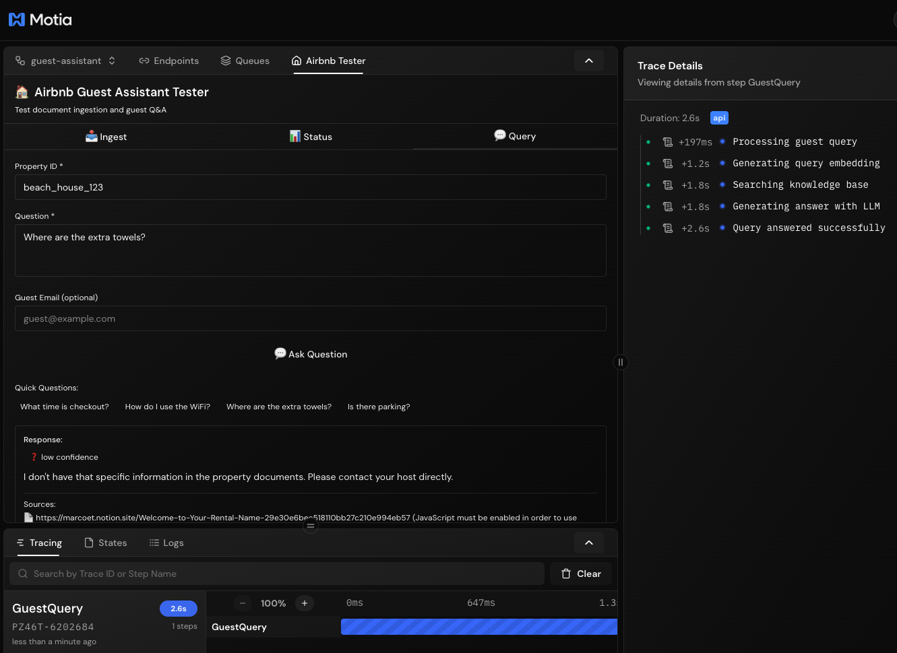
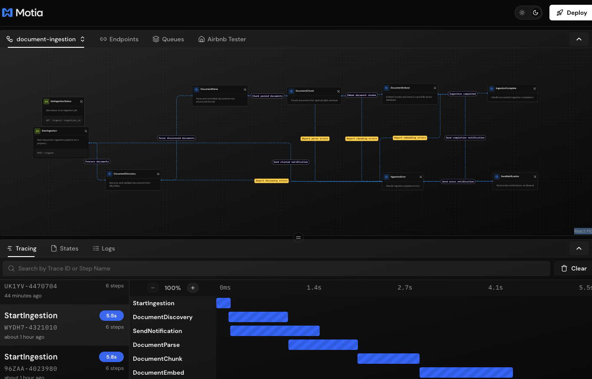
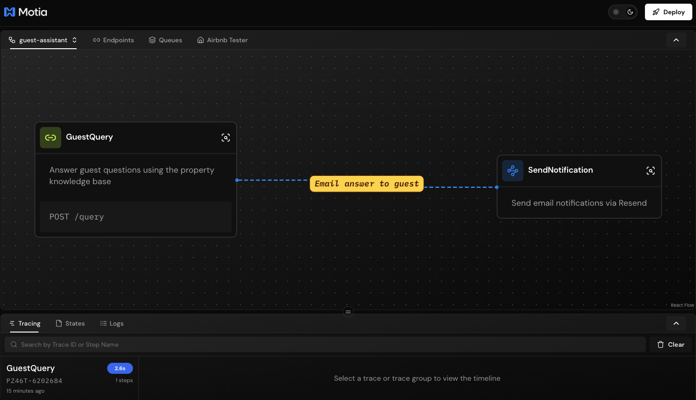
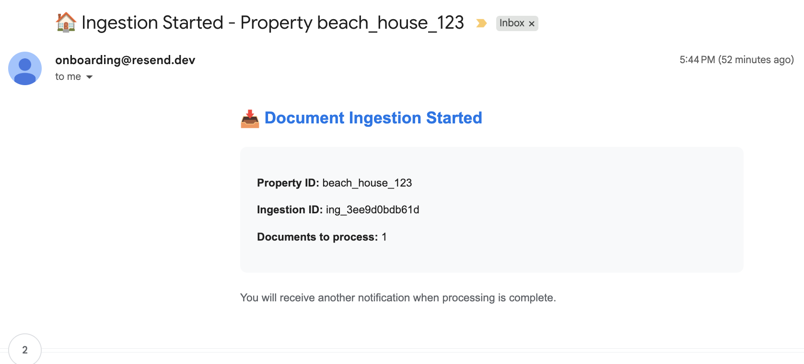

# 🏠 Airbnb Property Guest Assistant

An intelligent property assistant powered by **Motia** that turns host documents (house manuals, local guides, check-in instructions) into a **LanceDB-backed knowledge base** for answering guest questions instantly.

## 🎯 Overview

This system provides:
- **Document Ingestion Pipeline**: Ingest PDFs, Word docs, Markdown, and HTML from URLs or files
- **Vector Knowledge Base**: Store and search property documents using LanceDB
- **AI-Powered Q&A**: Answer guest questions using GPT-4 with retrieved context
- **Email Notifications**: Send updates via Resend when ingestion completes or guests ask questions
- **Workbench Plugin**: Test the entire workflow directly from Motia Workbench UI

## 📸 Screenshots

### Workbench Plugin - Ingest Documents


### Workbench Plugin - Check Status


### Workbench Plugin - Ask Questions


### Document Ingestion Workflow


### Guest Query Workflow


## 📧 Email Notifications

### Ingestion Started


### Ingestion Complete


### Guest Answer


---


## 🚀 Quick Start

### Prerequisites

- Node.js 18+
- Python 3.10+
- OpenAI API Key
- Resend API Key (for email notifications)

### Installation

```bash
# Install Node.js dependencies
npm install

# Python dependencies are auto-installed by Motia
# Or manually: pip install -r requirements.txt

# Generate TypeScript types
npx motia generate-types
```

### Environment Variables

Create a `.env` file:

```env
# Required
OPENAI_API_KEY=sk-your-openai-api-key

# Email Notifications
RESEND_API_KEY=re_your-resend-api-key
# Note: Emails are sent from onboarding@resend.dev (Resend's test address)

# LanceDB Storage (optional, defaults to ./data/lancedb)
LANCE_DB_PATH=./data/lancedb
```

### Start the Server

```bash
npm run dev
```

The server starts at:
- **API**: `http://localhost:3000`
- **Workbench**: `http://localhost:3000` (visual workflow designer)

## 🧪 Workbench Testing Plugin

The project includes a custom **Airbnb Tester** plugin for testing workflows directly in Motia Workbench!

### Access the Plugin

1. Start the server: `npm run dev`
2. Open `http://localhost:3000`
3. Click **"Airbnb Tester"** in the top navigation

### Plugin Features

| Tab | Description |
|-----|-------------|
| **📥 Ingest** | Test document ingestion with property ID, URL, doc type, language |
| **📊 Status** | Check ingestion progress with visual progress bar |
| **💬 Query** | Ask guest questions with quick question shortcuts |

## 📚 API Reference

### POST /ingest - Start Document Ingestion

Start ingesting documents for a property.

**Request:**
```json
{
  "property_id": "beach_house_123",
  "sources": [
    {
      "url": "https://notion.so/your-house-manual",
      "doc_type": "house_manual",
      "language": "en"
    }
  ],
  "notify_email": "host@example.com",
  "overwrite_existing": true
}
```

**Response (202 Accepted):**
```json
{
  "ingestion_id": "ing_abc123def456",
  "property_id": "beach_house_123",
  "status": "processing",
  "documents_queued": 1,
  "created_at": "2024-01-15T10:30:00Z"
}
```

**Document Types:**
- `house_manual` - Property welcome guide, amenities, room info
- `local_guide` - Neighborhood info, restaurants, attractions
- `appliance_manual` - How to use specific appliances
- `policy` - House rules, cancellation, checkout policies

---

### GET /ingest/:ingestion_id - Check Ingestion Status

**Response (200 OK):**
```json
{
  "ingestion_id": "ing_abc123def456",
  "property_id": "beach_house_123",
  "status": "completed",
  "progress": {
    "documents_discovered": 1,
    "documents_parsed": 1,
    "documents_chunked": 1,
    "documents_embedded": 1,
    "total_documents": 1
  },
  "chunks_created": 15,
  "errors": [],
  "created_at": "2024-01-15T10:30:00Z",
  "updated_at": "2024-01-15T10:32:15Z"
}
```

---

### POST /query - Ask a Question

Query the property knowledge base.

**Request:**
```json
{
  "property_id": "beach_house_123",
  "question": "What time is checkout?",
  "language": "en",
  "guest_email": "guest@example.com"
}
```

**Response (200 OK):**
```json
{
  "answer": "Checkout time is 11:00 AM. Please ensure all dishes are washed and trash is taken out before leaving.",
  "confidence": "high",
  "sources": ["house-manual (Check-out Instructions)"],
  "property_id": "beach_house_123"
}
```

## 🗂️ LanceDB Schema

Documents are stored with the following schema:

| Field | Type | Description |
|-------|------|-------------|
| `id` | string | Unique chunk identifier |
| `property_id` | string | Property/listing identifier |
| `content` | string | Text content of the chunk |
| `section_title` | string | Heading/section name |
| `doc_type` | string | house_manual, local_guide, etc. |
| `language` | string | ISO 639-1 language code |
| `is_critical` | bool | Safety, rules, emergency info |
| `source_url` | string | Original document URL |
| `source_filename` | string | Original filename |
| `ingestion_id` | string | Ingestion job ID |
| `updated_at` | string | Last update timestamp |
| `vector` | float[1536] | OpenAI embedding |

## 📁 Project Structure

```
├── steps/
│   ├── ingestion/
│   │   ├── start_ingestion_api_step.py      # POST /ingest
│   │   ├── get_ingestion_status_api_step.py # GET /ingest/:id
│   │   ├── document_discovery_step.py       # Fetch & validate documents
│   │   ├── document_parse_step.py           # Parse PDF/DOCX/HTML/MD
│   │   ├── document_chunk_step.py           # Split into retrieval chunks
│   │   ├── document_embed_step.py           # Embed & store in LanceDB
│   │   ├── ingestion_complete_step.py       # Handle completion
│   │   └── ingestion_error_step.py          # Handle errors
│   ├── query/
│   │   └── guest_query_api_step.py          # POST /query
│   └── notifications/
│       └── send_notification_step.py        # Email via Resend
├── plugins/
│   └── components/
│       └── airbnb-tester/
│           └── index.tsx                    # Workbench testing UI
├── src/
│   └── services/
│       ├── lancedb_service.py               # Vector DB operations
│       ├── embeddings_service.py            # OpenAI embeddings
│       ├── llm_service.py                   # GPT-4 Q&A generation
│       ├── document_parser.py               # Parse documents
│       ├── chunking_service.py              # Smart text chunking
│       └── email_service.py                 # Resend emails
├── docs/
│   └── img/                                 # Screenshots & images
├── data/
│   └── lancedb/                             # Vector database storage
├── motia.config.ts                          # Motia configuration + plugins
├── requirements.txt                         # Python dependencies
├── package.json                             # Node.js dependencies
└── README.md
```

## 🔄 Workflow Flows

### Document Ingestion Flow

```
POST /ingest
    │
    ├──▶ send-notification (ingestion started)
    │
    ▼
document-discovery (fetch & validate)
    │
    ▼
document-parse (extract text & structure)
    │
    ▼
document-chunk (split into retrieval chunks)
    │
    ▼
document-embed (generate embeddings, store in LanceDB)
    │
    ├──▶ ingestion-complete (log success)
    │
    └──▶ send-notification (email host)
```

### Guest Q&A Flow

```
POST /query
    │
    ├──▶ Generate query embedding (OpenAI)
    │
    ├──▶ Vector search (LanceDB)
    │
    ├──▶ Generate answer (GPT-4)
    │
    └──▶ send-notification (optional email to guest)
```

## 💡 Example Usage

### Using the Workbench Plugin (Recommended)

1. Open `http://localhost:3000`
2. Click **"Airbnb Tester"** tab
3. Fill in property ID and document URL
4. Click **"Start Ingestion"**
5. Copy the ingestion ID to check status
6. Switch to Query tab to ask questions

### Using cURL

```bash
# Ingest a Notion page
curl -X POST http://localhost:3000/ingest \
  -H "Content-Type: application/json" \
  -d '{
    "property_id": "beach_house_123",
    "sources": [{
      "url": "https://notion.so/your-house-manual",
      "doc_type": "house_manual",
      "language": "en"
    }],
    "notify_email": "host@example.com"
  }'

# Check status
curl http://localhost:3000/ingest/ing_abc123

# Ask a question
curl -X POST http://localhost:3000/query \
  -H "Content-Type: application/json" \
  -d '{
    "property_id": "beach_house_123",
    "question": "What is the WiFi password?"
  }'
```

## 🐛 Troubleshooting

### "No property documents found"

Make sure you've ingested documents for the property_id before querying.

### Ingestion fails at parsing stage

- Check file size (max 50MB)
- Ensure supported format: PDF, DOCX, HTML, Markdown, TXT
- Verify URL is publicly accessible

### Embeddings fail

- Verify `OPENAI_API_KEY` is set correctly
- Check OpenAI API quota

### Emails not sending

- Verify `RESEND_API_KEY` is set
- Emails are sent from `onboarding@resend.dev` (Resend's test address)
- For production, verify your domain in Resend dashboard

### State/Job data issues

- The system handles Motia's nested state structure automatically
- If jobs aren't found, ensure the server hasn't restarted (state is in-memory by default)

## 📝 License

MIT License - see LICENSE file for details.
