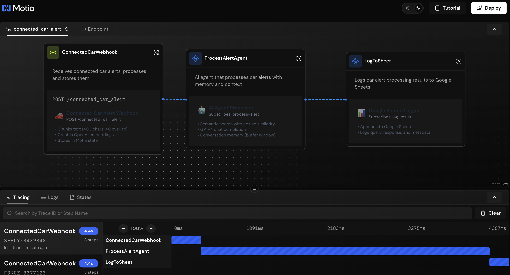
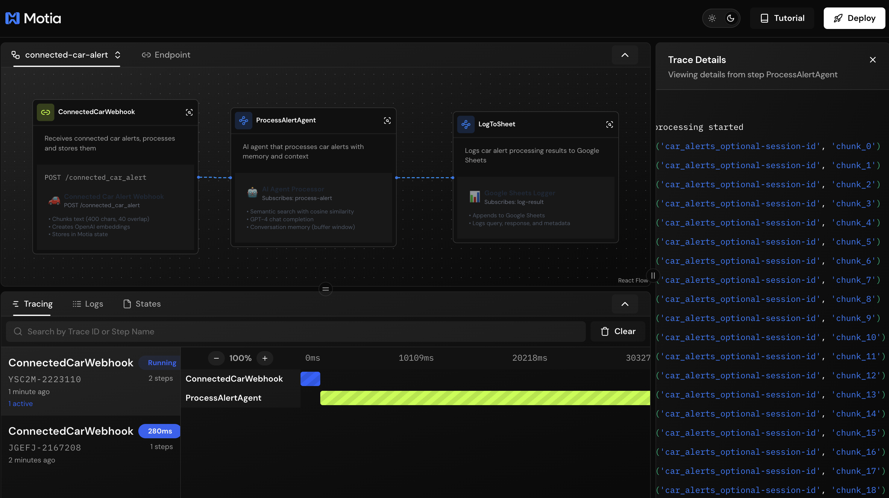

# Connected Car Alert - Motia Workflow

AI-powered car alert processing system converted from n8n to Motia.



## Quick Start

```bash
# Install dependencies
npm install
pip install -r requirements.txt

# Set environment variables
export OPENAI_API_KEY=your_key_here

# Run
npm run dev

# Test
curl -X POST http://localhost:3000/connected_car_alert \
  -H "Content-Type: application/json" \
  -d '{"text": "Engine temp: 240°F. Oil pressure low.", "query": "What should I do?"}'
```



## Architecture

```
POST /connected_car_alert → Chunk text → Store in state → AI Agent → Log to JSON
```

**3 Steps:**
1. `webhook_step.py` - API endpoint, chunks text (400 chars, 40 overlap), stores in state
2. `agent_step.py` - Retrieves chunks, calls OpenAI GPT-4, maintains conversation memory
3. `log_to_sheet_step.py` - Logs to `logs/car_alerts.json` (or Google Sheets if configured)

## Features

- ✅ Text chunking for large alerts
- ✅ OpenAI GPT-4 for intelligent responses
- ✅ Conversation memory (per session)
- ✅ Local JSON logging (no external dependencies)
- ✅ Optional Google Sheets integration
- ✅ No Redis required (uses Motia state)

## Environment Variables

```bash
# Required
OPENAI_API_KEY=sk-your-key

# Optional (for Google Sheets)
GOOGLE_SERVICE_ACCOUNT_JSON='{"type":"service_account",...}'
GOOGLE_SHEETS_ID=your_sheet_id
GOOGLE_SHEETS_TAB_NAME=Log
```

## Logs

All interactions are logged to `logs/car_alerts.json`:

```json
[
  {
    "timestamp": "2025-10-24T10:56:21.386022",
    "session_id": "43585439-6b7a-40d8-9257-b22d5b78d83a",
    "query": "What should I do?",
    "response": "Pull over safely...",
    "num_chunks_used": 1
  }
]
```

## Conversation Memory

Use the same `session_id` to maintain conversation context:

```bash
# First query
curl -X POST http://localhost:3000/connected_car_alert \
  -H "Content-Type: application/json" \
  -d '{"text": "Engine temp warning", "query": "Is this bad?", "session_id": "my-session"}'

# Follow-up (remembers previous context)
curl -X POST http://localhost:3000/connected_car_alert \
  -H "Content-Type: application/json" \
  -d '{"text": "Now at 250°F", "query": "Should I pull over?", "session_id": "my-session"}'
```

## State Management

- **Chunks**: `car_alerts_{session_id}` → stores text chunks
- **Memory**: `memory_{session_id}` → stores conversation history (last 20 messages)

## Key Differences from n8n

| Feature | n8n | Motia |
|---------|-----|-------|
| Vector Store | Redis | Motia State |
| Search | Semantic (embeddings) | Context-based (all chunks) |
| Memory | LangChain | Custom state-based |
| Logging | Google Sheets | Local JSON (Sheets optional) |

## Files

```
steps/connected_car/
├── webhook_step.py      # API endpoint
├── webhook_step.tsx     # UI visualization
├── agent_step.py        # AI processing
├── agent_step.tsx       # UI visualization
├── log_to_sheet_step.py # Logging
└── log_to_sheet_step.tsx # UI visualization

services/
├── openai_service.py    # OpenAI operations
└── sheets_service.py    # Google Sheets (optional)
```

## Troubleshooting

- **No response:** Check `OPENAI_API_KEY` is set
- **Logs not appearing:** Check `logs/` directory was created
- **Memory issues:** Restart server (fixed state wrapping issue)

## Workbench

View workflow visualization at `http://localhost:3000/__workbench`
