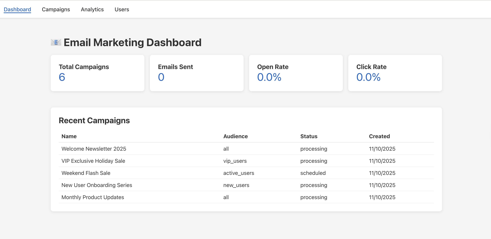
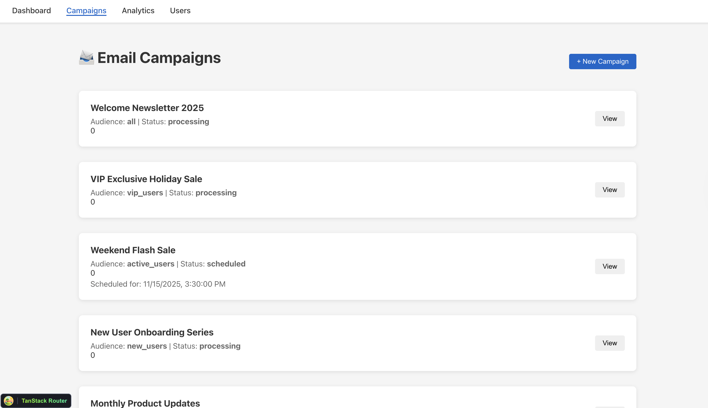
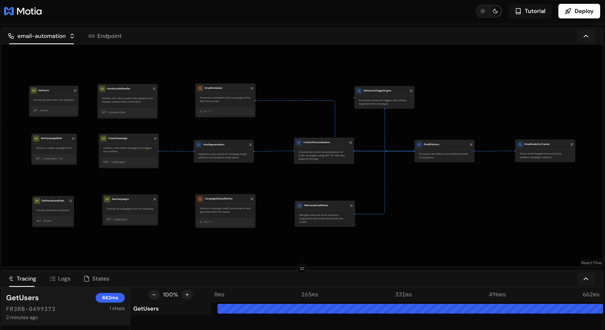
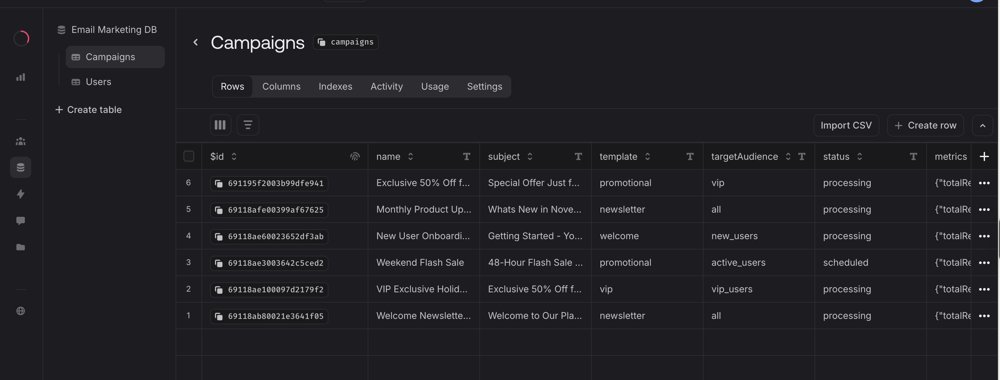
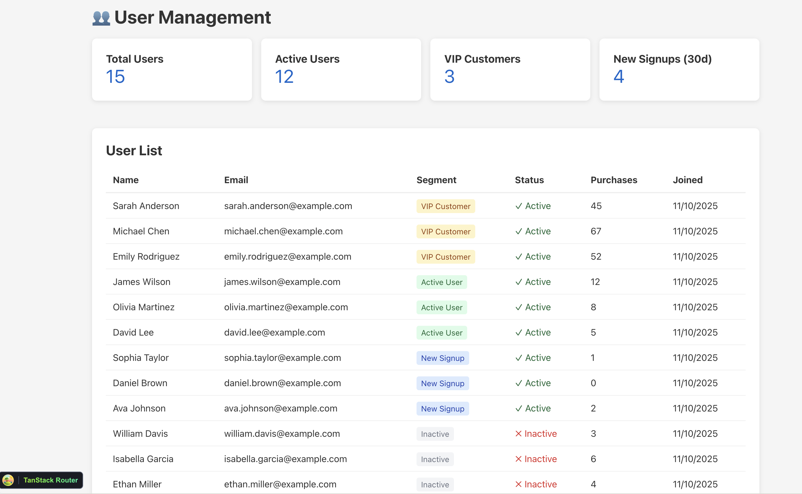
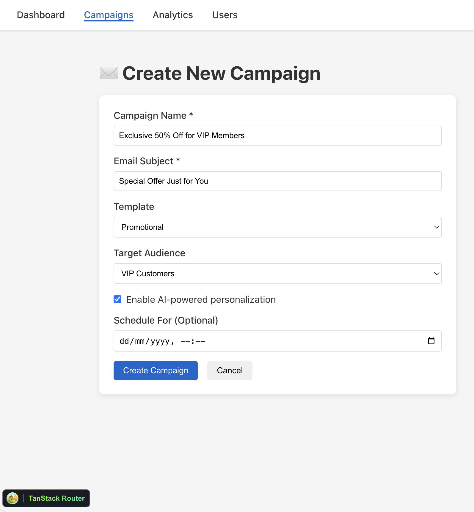
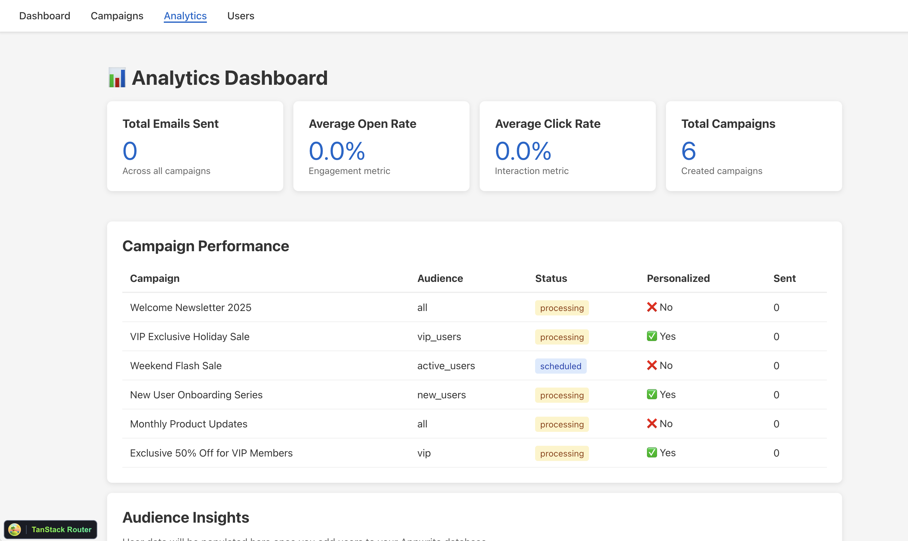
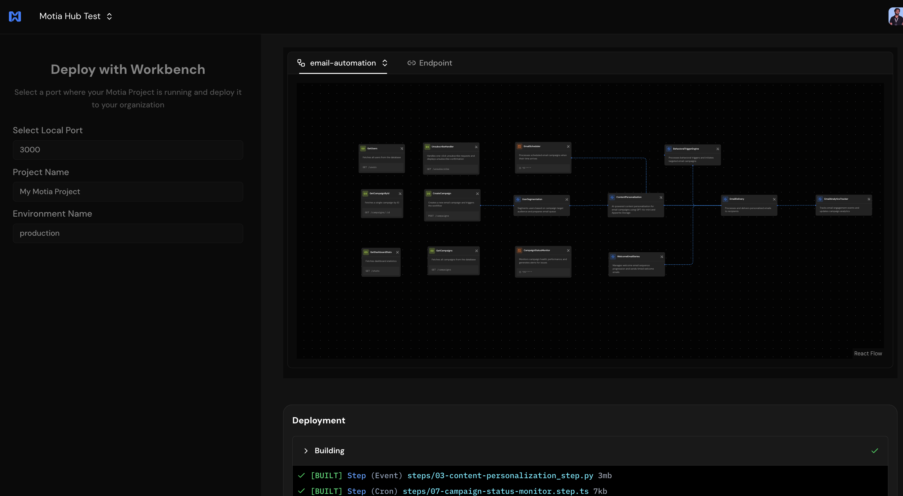
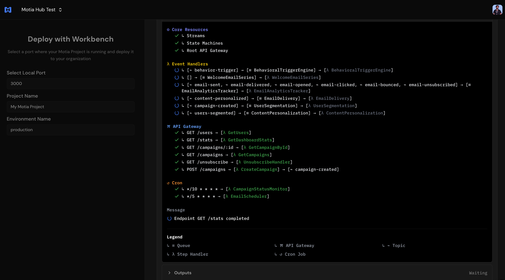

# Email Marketing Automation Engine

A comprehensive email marketing automation platform built with Motia and Appwrite, featuring AI-powered personalization, behavioral triggers, and scalable campaign management.


## Overview

This project demonstrates building a complete email marketing automation system using Motia's event-driven architecture integrated with Appwrite as the backend service. The system handles campaign creation, user segmentation, AI-powered content personalization, email delivery, and analytics tracking.

### 🎯 What You'll Build

This complete email marketing platform includes:
- **Web Dashboard** - React UI for campaign management
- **AI Personalization** - GPT-4o-mini powered content generation
- **Backend Automation** - Motia workflow orchestration
- **Database & Storage** - Appwrite for data persistence

**Dashboard:**


**Campaign Management:**


## Features

- **Campaign Creation API** - REST endpoint for creating and managing email campaigns
- **Smart User Segmentation** - Advanced audience targeting (VIP, new users, active, inactive)
- **AI Content Personalization** - Python-based content generation with dynamic customization
- **Scheduled Campaigns** - Time-based campaign scheduling and automated delivery
- **Email Analytics** - Real-time tracking of delivery, opens, clicks, and engagement metrics
- **Behavioral Triggers** - Automated campaigns based on user actions and engagement patterns
- **Welcome Email Series** - Multi-step onboarding sequences for new users
- **Unsubscribe Management** - Compliant one-click unsubscribe handling

## Architecture

The system uses Motia's workflow orchestration with 10 interconnected steps:

1. **Campaign Creation** (`01-create-campaign.step.ts`) - API endpoint for campaign setup
2. **User Segmentation** (`02-user-segmentation.step.ts`) - Audience targeting and filtering
3. **Content Personalization** (`03-content-personalization.step.py`) - AI-powered content generation
4. **Email Delivery** (`04-email-delivery.step.ts`) - Batch email processing with rate limiting
5. **Email Scheduler** (`05-email-scheduler.step.ts`) - Cron-based scheduled campaign management
6. **Analytics Tracker** (`06-email-analytics-tracker.step.ts`) - Real-time engagement tracking
7. **Campaign Monitor** (`07-campaign-status-monitor.step.ts`) - Campaign health monitoring
8. **Unsubscribe Handler** (`08-unsubscribe-handler.step.ts`) - Compliance-focused unsubscribe processing
9. **Welcome Series** (`09-welcome-email-series.step.ts`) - Automated onboarding sequences
10. **Behavioral Triggers** (`10-behavioral-trigger-engine.step.ts`) - User behavior-based automation

## Technology Stack

### Backend
- **Framework**: Motia (workflow orchestration)
- **Backend**: Appwrite (database, authentication, messaging)
- **Languages**: TypeScript, Python
- **Email Delivery**: SendGrid (via Appwrite Messaging)
- **Validation**: Zod schemas
- **AI**: OpenAI GPT-4o-mini for content personalization (5x cheaper than GPT-3.5)

### Frontend
- **Framework**: React 18 with TypeScript
- **Router**: TanStack Router (type-safe file-based routing)
- **Build Tool**: Vite
- **UI**: Clean, responsive design with vanilla CSS
- **Dev Tools**: React DevTools, TanStack Router DevTools

## Getting Started

### Prerequisites

- Node.js (v18 or higher)
- Python 3.8+
- Motia CLI installed
- Appwrite account (cloud or self-hosted)
- SendGrid/Mailgun account for email delivery

### Installation

1. Clone the repository:

```bash
git clone <repository-url>
cd motia-email-automation-engine
```

2. Install dependencies:

```bash
npm install
npx motia install  # Install Python dependencies for AI step
```

3. Configure environment variables:

```bash
# Create .env file with:
APPWRITE_ENDPOINT=https://cloud.appwrite.io/v1
APPWRITE_PROJECT_ID=your-project-id
APPWRITE_API_KEY=your-api-key
OPENAI_API_KEY=your-openai-key  # Optional for AI personalization
```

4. Set up Appwrite:

   - Create database collections for campaigns, users, and analytics
   - Configure SendGrid as email provider in Appwrite Messaging console
   - Enable Users and Messaging services

Run the setup script:

```bash
npx tsx script/setup-appwrite.ts
```

This creates the required database structure in Appwrite:



5. Populate sample users (optional but recommended):

```bash
npx tsx script/populate-users.ts
```

This will add 15 sample users with different segments:
- 5 VIP Customers (vipStatus: true OR totalPurchases ≥ 10)
- 7 Active Users (active in last 30 days, includes VIP overlap)
- 2 New Users (signed up in last 7 days)
- Remaining users with various engagement levels

**Sample Users in Appwrite:**


**Users in Dashboard:**



6. Start the development servers:

**Backend (Motia):**
```bash
npm run dev
# Runs on http://localhost:3000
```

**Frontend (Vite + React):**
```bash
npm run dev:frontend
# Runs on http://localhost:3001
```

Or run both in separate terminals.

7. Create sample campaigns (optional but recommended for UI demo):

```bash
npx tsx script/create-sample-campaigns.ts
```

This creates 10 diverse campaigns:
- VIP campaigns with AI personalization (5 users each)
- Active user campaigns (7 users)
- All-user campaigns (15 users, AI disabled to avoid rate limits)
- Mix of immediate and scheduled campaigns

## Usage

### Creating a Campaign

You can create campaigns via:
1. **Frontend UI** (recommended for beginners)
2. **REST API** (programmatic access)

**Option 1: Via Frontend UI**

Navigate to `http://localhost:3001/campaigns/new` and fill the form:



**Option 2: Via REST API**

Send a POST request to create a campaign:

```bash
curl -X POST http://localhost:3000/campaigns \
  -H "Content-Type: application/json" \
  -d '{
    "name": "VIP Customer Exclusive Offer",
    "subject": "Exclusive VIP Benefits",
    "template": "promotional",
    "targetAudience": "vip_users",
    "personalizeContent": true,
    "scheduledFor": "2025-11-25T10:00:00Z"
  }'
```

### Campaign Types

**VIP Campaign with AI (Recommended - 5 users):**

```json
{
  "name": "VIP Exclusive Offer",
  "subject": "Your Exclusive VIP Discount Inside",
  "template": "promotional",
  "targetAudience": "vip_users",
  "personalizeContent": true
}
```

**Newsletter Campaign (No AI - Fast):**

```json
{
  "name": "Weekly Newsletter",
  "subject": "This Week's Updates",
  "template": "newsletter",
  "targetAudience": "all",
  "personalizeContent": false
}
```

**Welcome Campaign (AI - 2 users):**

```json
{
  "name": "Welcome New Members",
  "subject": "Welcome to Our Community!",
  "template": "welcome",
  "targetAudience": "new_users",
  "personalizeContent": true
}
```

**Scheduled Campaign:**

```json
{
  "name": "Black Friday Sale",
  "subject": "Black Friday Preview - Early Access",
  "template": "promotional",
  "targetAudience": "vip_users",
  "personalizeContent": true,
  "scheduledFor": "2025-11-29T08:00:00Z"
}
```

### Viewing Personalized Emails

After a campaign is processed, you can preview all personalized emails in the UI:

1. Navigate to campaign details page
2. Scroll to **"📧 Personalized Emails"** section
3. Select any recipient from the dropdown
4. View their personalized subject and HTML content

This feature shows exactly what each recipient will receive, making it perfect for:
- Quality assurance before scheduling
- Comparing personalization across users
- Debugging template issues
- Client demos and approvals

## User Segmentation

The system supports automatic user segmentation:

- **all** - All users in the database (15 users)
- **vip_users** - High-value customers with vipStatus: true OR totalPurchases ≥ 10 (5 users)
- **new_users** - Recently registered users (last 7 days) (2 users)
- **active_users** - Regularly engaged users (last 30 days) (7 users)

**Important:** VIP users are also included in active_users count since they're typically active customers.

### AI Personalization Best Practices

**OpenAI Free Tier Limits:** 3 requests/minute

**Recommended Usage:**
- ✅ **VIP campaigns (5 users)**: ~40-60 seconds processing time
- ✅ **New user campaigns (2 users)**: ~20-30 seconds processing time  
- ⚠️ **Active user campaigns (7 users)**: ~1-2 minutes with some rate limiting
- ❌ **All user campaigns (15 users)**: 3-5 minutes with heavy rate limiting

**Best Practice:** Only enable AI personalization for campaigns targeting ≤7 users on the free tier, or upgrade your OpenAI account for larger campaigns.

## Frontend Dashboard

Access the web interface at **http://localhost:3001** featuring:

### Pages
- **📧 Dashboard** - Campaign overview with key metrics (total campaigns, emails sent, open/click rates) - **Live data from Appwrite**
- **📨 Campaigns** - List, create, and manage campaigns with detailed status tracking - **Live data from Appwrite**
- **📋 Campaign Details** - Performance metrics for individual campaigns - **Live data from Appwrite**
- **📊 Analytics** - Comprehensive performance data and audience insights - **Live data from Appwrite**
- **👥 Users** - User management with automatic segmentation (VIP, Active, New Signups) - **Live data from Appwrite**

### Screenshots

**Dashboard Overview:**


**Campaign Management:**


**Campaign Creation Form:**


**User Management:**


**Analytics Dashboard:**



### Features
- ✅ Clean, responsive UI built with React + TanStack Router
- ✅ Type-safe routing with automatic route generation
- ✅ **Real-time data integration with backend API (Motia → Appwrite)**
- ✅ Campaign creation form with validation **→ Creates real campaigns in Appwrite**
- ✅ Audience segmentation targeting (VIP, Active, New Signups, All)
- ✅ AI personalization toggle
- ✅ Campaign scheduling for future delivery
- ✅ Performance metrics and analytics dashboards
- ✅ **User management with automatic segment detection**
- ✅ Sample data population script for quick setup

### API Endpoints
The frontend connects to these backend endpoints:
- **POST** `/campaigns` - Create new campaign (triggers full workflow)
- **GET** `/campaigns` - List all campaigns from Appwrite
- **GET** `/campaigns/:id` - Get campaign details (using proper REST path parameters)
- **GET** `/campaigns/:campaignId/emails` - Get personalized emails for a campaign from Motia state
- **GET** `/stats` - Dashboard statistics (campaigns, emails, open/click rates)
- **GET** `/users` - List all users with segmentation data

## Monitoring

Access the Motia Workbench at **http://localhost:3000** to view:

- Real-time workflow execution
- Campaign performance metrics
- Email delivery status
- System traces and logs

## Configuration

### Email Provider Setup

1. Configure SendGrid in Appwrite Console:

   - Go to Messaging → Providers
   - Add SendGrid provider with API key
   - Set sender email and domain

2. Update API key scopes in Appwrite:
   - Ensure `users.read`, `users.write`, `messaging.read`, `messaging.write` are enabled

### Database Schema

The system expects these Appwrite collections:

- **campaigns** - Campaign data with scheduledFor datetime field
- **users** - User profiles with email, status, metadata
- **analytics** - Email engagement tracking data

### Appwrite Database Structure

**Campaigns Collection:**


**Users Collection:**


The Appwrite database stores all campaign data, user profiles, and analytics records. The frontend and backend both connect to these collections for real-time data synchronization.

## Testing Different Scenarios

Test various workflow paths:

1. **Immediate Campaign** - Basic campaign sent immediately
2. **Scheduled Campaign** - Future delivery with scheduler step
3. **VIP Segmentation** - Targeted campaign for high-value users
4. **Personalized Content** - AI-generated custom messages
5. **Behavioral Triggers** - Campaigns based on user actions

## 🌐 Deployment

### Deploy to Motia Cloud

You can deploy your Email Marketing Automation Engine to Motia Cloud using either the CLI or the web interface.

#### Using the Motia CLI

Deploy with a specific version:

```bash
motia cloud deploy --api-key your-api-key-here --version-name 1.0.0
```

Deploy to a specific environment with environment variables:

```bash
motia cloud deploy --api-key your-api-key-here \
  --version-name 1.0.0 \
  --env-file .env.production \
  --environment-id env-id
```

#### Using the Web Interface

For a visual deployment experience, use the Motia Cloud web interface:

1. Have your local project running (`pnpm dev`)
2. Go to **Import from Workbench** on [Motia Cloud](https://cloud.motia.dev)
3. Select the port your local project is running on (default: 3000)
4. Choose the project and environment name
5. Add environment variables:
   - `APPWRITE_ENDPOINT`
   - `APPWRITE_PROJECT_ID`
   - `APPWRITE_API_KEY`
   - `OPENAI_API_KEY`
   - `SENDGRID_API_KEY`
6. Click **Deploy** and watch the magic happen! ✨





For detailed instructions, see the [Motia Cloud Deployment Guide](https://www.motia.dev/docs/deployment-guide/motia-cloud/deployment#using-web-interface).

## Development

The system demonstrates advanced Motia features:

- Multi-language workflows (TypeScript + Python)
- Event-driven architecture
- State management across steps
- Cron job scheduling
- External service integration
- Error handling and retries

Each step is designed to be modular and can be extended or customized based on specific requirements.
