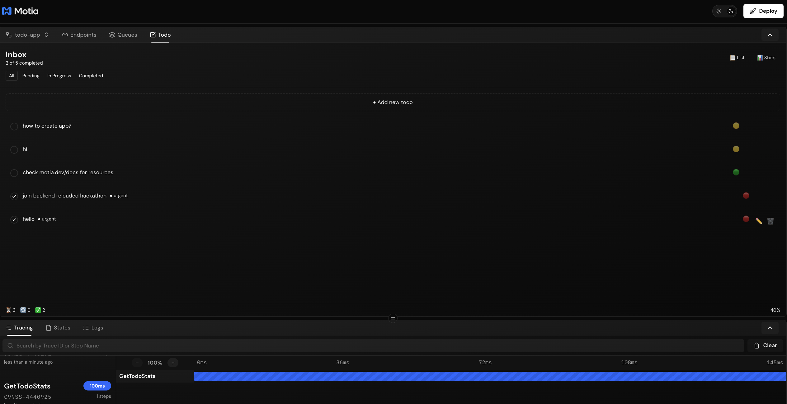
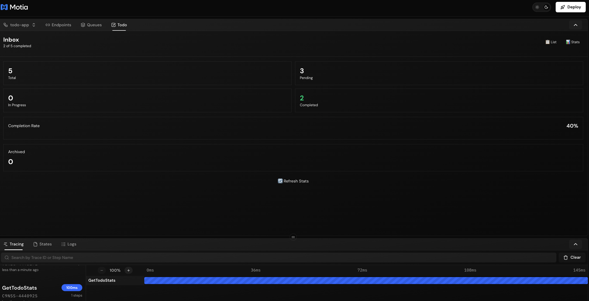
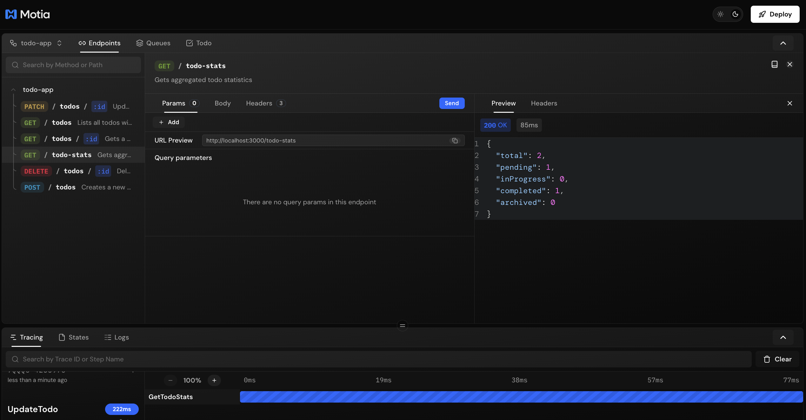
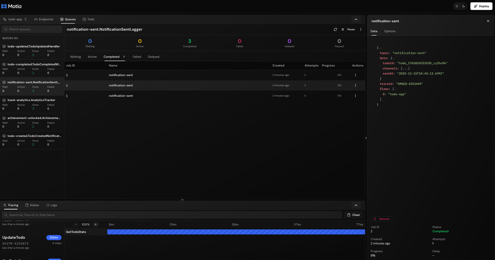

# Todo App - Motia Demo

A comprehensive **Todo application** built with [Motia](https://motia.dev) - showcasing APIs, background jobs, real-time streaming, scheduled tasks, and visual workflow management.


## ✨ Features

This demo showcases Motia's capabilities through a full-featured todo application:

- **RESTful API** - CRUD operations for todos
- **Real-time Updates** - Live todo synchronization via streams
- **Background Jobs** - Event-driven workflows for notifications, analytics, and gamification
- **Scheduled Tasks** - Automated cleanup and statistics generation
- **Visual Workbench** - Interactive UI plugin for managing todos
- **State Management** - Redis-backed persistence across all operations

## 🎯 What is Motia?

Motia is an open-source, unified backend framework that eliminates runtime fragmentation by bringing **APIs, background jobs, queueing, streaming, state, workflows, AI agents, observability, scaling, and deployment** into one unified system using a single core primitive, the **Step**.

## 🚀 Quick Start

```bash
# Install dependencies
npm install

# Start the development server
npm run dev
```

This starts the Motia runtime and the **Workbench** - a powerful UI for developing and debugging your workflows at [`http://localhost:3000`](http://localhost:3000).

## 📸 Screenshots

### Todo Management Plugin

*Interactive todo management with inline editing, filtering, and real-time updates*

### Statistics Dashboard

*Real-time statistics showing completion rates and task breakdown*

### API Endpoints

*RESTful API endpoints for todo operations*

### Background Jobs & Event Queues

*Event-driven workflows handling notifications, analytics, and gamification*

## 🏗️ Architecture

### Single Flow: `todo-app`

All 17 steps are unified in one cohesive flow:

| Type | Count | Steps |
|------|-------|-------|
| **API** | 6 | Create, List, Get, Update, Delete, Stats |
| **Event** | 8 | Notifications, Analytics, Audit Logging, Achievements, Cleanup Handler |
| **Cron** | 2 | Daily Cleanup, Hourly Statistics |
| **Stream** | 1 | Real-time Todo Updates |

### Step Types

Every Step has a `type` that defines how it triggers:

| Type | When it runs | Use case |
|------|--------------|----------|
| **`api`** | HTTP request | REST APIs, webhooks |
| **`event`** | Event emitted | Background jobs, workflows |
| **`cron`** | Schedule | Cleanup, reports, reminders |

## 📁 Project Structure

```
src/
├── todo/                      # Todo application
│   ├── create-todo.step.ts         # POST /todos
│   ├── list-todos.step.ts          # GET /todos
│   ├── get-todo.step.ts            # GET /todos/:id
│   ├── update-todo.step.ts         # PUT /todos/:id
│   ├── delete-todo.step.ts         # DELETE /todos/:id
│   ├── get-stats.step.ts           # GET /todo-stats
│   ├── todo-created-notification.step.ts
│   ├── todo-completed-workflow.step.ts
│   ├── todo-updated-handler.step.ts
│   ├── todo-deleted-handler.step.ts
│   ├── analytics-tracker.step.ts
│   ├── notification-sent-logger.step.ts
│   ├── achievement-handler.step.ts
│   ├── cleanup-completed-handler.step.ts
│   ├── cleanup-cron.step.ts
│   ├── daily-stats-cron.step.ts
│   └── todo.stream.ts              # Real-time stream
└── services/
    ├── todo.service.ts             # Business logic
    └── todo-types.ts               # Type definitions

plugins/
└── todo-tester/                    # Workbench UI plugin
    ├── index.ts
    └── components/
        └── todo-tester-panel.tsx

motia.config.ts                     # Motia configuration
```

## 🔄 Event-Driven Workflows

The todo app demonstrates complex event-driven patterns:

```
Create Todo (API)
  └─> todo-created
       └─> Notification Service
            └─> notification-sent
                 └─> Logging Service

Complete Todo (API)
  └─> todo-completed
       ├─> Update User Stats
       ├─> Track Analytics
       └─> achievement-unlocked
            └─> Award Points

Update Todo (API)
  └─> todo-updated
       ├─> Audit Log
       └─> Real-time Stream Broadcast

Delete Todo (API)
  └─> todo-deleted
       └─> Audit Log

Daily Cleanup (Cron)
  └─> cleanup-completed
       └─> Log Results
```

## 🛠️ Development Commands

```bash
# Start Workbench and development server
npm run dev

# Generate TypeScript types from Step configs
npm run generate-types
```

## 🌐 API Endpoints

| Method | Endpoint | Description |
|--------|----------|-------------|
| `POST` | `/todos` | Create new todo |
| `GET` | `/todos` | List all todos (with filters) |
| `GET` | `/todos/:id` | Get specific todo |
| `PUT` | `/todos/:id` | Update todo |
| `DELETE` | `/todos/:id` | Delete todo |
| `GET` | `/todo-stats` | Get statistics |

### Query Parameters

**List Todos (`GET /todos`)**:
- `status` - Filter by status (pending, in-progress, completed)
- `priority` - Filter by priority (low, medium, high)

## 📊 Features Demonstrated

### 1. **API Steps** - RESTful Endpoints
- Request validation with Zod schemas
- Automatic type generation
- Response schemas
- Event emissions for workflow triggers

### 2. **Event Steps** - Background Processing
- Asynchronous event handling
- Multi-step workflows
- Event chaining
- Error handling and retries

### 3. **Cron Steps** - Scheduled Tasks
- Cron expression-based scheduling
- Automated cleanup (daily)
- Statistics generation (hourly)

### 4. **State Management**
- Redis-backed persistence
- Group-based data organization
- TTL support
- Cross-step data sharing

### 5. **Real-time Streaming**
- WebSocket-based updates
- Schema validation
- Client synchronization
- Live UI updates

### 6. **Custom Plugins**
- Workbench UI extensions
- Backend API integration
- React-based components
- Tailwind styling

## 🎨 Workbench Plugin

The custom Todo Tester plugin provides:

- ✅ **List View** - See all todos with inline editing
- ✅ **Stats View** - Real-time completion metrics
- ✅ **Quick Actions** - Mark complete, edit, delete
- ✅ **Filters** - By status (All, Pending, In Progress, Completed)
- ✅ **Priority Management** - Low, Medium, High
- ✅ **Real-time Updates** - Instant synchronization
- ✅ **Beautiful UI** - Clean, modern design

## 🚢 Deployment

### Motia Cloud (Recommended)

The easiest way to deploy your Motia app is using [Motia Cloud](https://motia.dev/docs/deployment-guide/motia-cloud/deployment) - a serverless platform optimized for Motia applications.

#### Option 1: Deploy via CLI

```bash
# Deploy with version tag
motia cloud deploy --api-key <your-api-key> --version-name 1.0.0

# Deploy to specific project and environment
motia cloud deploy --api-key <your-api-key> \
  --version-name 1.0.0 \
  --project-name my-todo-app \
  --environment-id <env-id> \
  --env-file .env.production
```

**CLI Options:**

| Option | Alias | Description |
|--------|-------|-------------|
| `--api-key` | `-k` | API key for authentication (required) |
| `--version-name` | `-v` | Version tag for deployment (required) |
| `--project-name` | `-p` | Project name (creates if doesn't exist) |
| `--environment-id` | `-s` | Environment ID |
| `--env-file` | `-e` | Path to environment file |

#### Option 2: Deploy via Web Interface (One-Click)

1. Have your local project running (`npm run dev`)
2. Go to **Import from Workbench** on [Motia Cloud](https://motia.cloud)
3. Select the port your local project is running on
4. Choose project and environment name
5. Add environment variables (upload `.env` file or paste content)
6. Click **Deploy**

---

### Self-Hosted Deployment

For self-hosted deployments, you'll need Redis for production adapters.

#### Prerequisites

- Docker and Docker Compose (for local testing)
- Railway CLI (`npm install -g @railway/cli`) or Fly CLI
- Railway account (https://railway.com) or Fly.io account

#### Local Docker Testing

```bash
# Start local production environment with Redis
docker-compose up -d

# Check logs
docker logs motia-app

# Test endpoints
curl http://localhost:3000/todos
curl -X POST http://localhost:3000/todos -H "Content-Type: application/json" -d '{"title":"Test Todo"}'

# Stop
docker-compose down
```

#### Railway Deployment

**Step 1: Authenticate with Railway**

```bash
railway login
```

**Step 2: Initialize Railway Project**

```bash
railway init
```

Select "Empty Project" when prompted.

**Step 3: Add Redis Service**

```bash
railway add
```

Select **Redis** from the list. This provisions a managed Redis instance.

**Step 4: Link and Deploy Motia App**

```bash
# Create a new service for the Motia app
railway service

# Deploy the app
railway up
```

**Step 5: Set Environment Variables**

```bash
# Set production environment variables
railway variables set NODE_ENV=production
railway variables set USE_REDIS=true
```

The Redis connection is automatically injected by Railway when you add a Redis service.

**Step 6: Generate Public Domain**

```bash
railway domain
```

This generates a public URL like `https://your-app.up.railway.app`

**Step 7: Verify Deployment**

```bash
curl https://your-app.up.railway.app/todos
curl -X POST https://your-app.up.railway.app/todos -H "Content-Type: application/json" -d '{"title":"Production Todo"}'
```

#### PM2 Process Management

For running the app with PM2 (process manager for Node.js):

```bash
# Install PM2 globally
npm install -g pm2

# Start the app with PM2
pm2 start "npx motia start --port 3000 --host 0.0.0.0" --name motia-todo-app

# Check status
pm2 status

# View logs
pm2 logs motia-todo-app

# Restart the app
pm2 restart motia-todo-app

# Stop the app
pm2 stop motia-todo-app

# Delete from PM2
pm2 delete motia-todo-app
```

**PM2 Ecosystem File (Optional):**

Create `ecosystem.config.cjs` for advanced configuration:

```javascript
module.exports = {
  apps: [{
    name: 'motia-todo-app',
    script: 'npx',
    args: 'motia start --port 3000 --host 0.0.0.0',
    env: {
      NODE_ENV: 'development',
    },
    env_production: {
      NODE_ENV: 'production',
      USE_REDIS: 'true',
    },
  }],
};
```

Then start with:
```bash
pm2 start ecosystem.config.cjs --env production
```

#### Fly.io Deployment

```bash
# Install Fly CLI
curl -L https://fly.io/install.sh | sh

# Login and launch
fly auth login
fly launch --no-deploy

# Create Redis (Upstash)
fly redis create --name motia-redis

# Set environment variables
fly secrets set NODE_ENV=production USE_REDIS=true

# Deploy
fly deploy
```

#### Environment Variables (Self-Hosted)

| Variable | Description | Default |
|----------|-------------|---------|
| `NODE_ENV` | Set to `production` for Redis adapters | - |
| `USE_REDIS` | Force Redis adapters | `false` |
| `REDIS_HOST` | Redis hostname | `localhost` |
| `REDIS_PORT` | Redis port | `6379` |
| `REDIS_PASSWORD` | Redis password (optional) | - |

#### Configuration Details (Self-Hosted)

The `motia.config.ts` automatically detects production mode and uses Redis adapters:

- **State Adapter**: RedisStateAdapter (node-redis)
- **Streams Adapter**: RedisStreamAdapterManager (node-redis)  
- **Events Adapter**: BullMQEventAdapter (ioredis)
- **Cron Adapter**: RedisCronAdapter (node-redis)

#### Troubleshooting

**Redis Connection Issues:**
```bash
docker exec motia-redis redis-cli ping
# Should return: PONG
```

**View Logs:**
```bash
# Local Docker
docker logs motia-app -f

# Railway
railway logs

# Fly.io
fly logs
```

**Health Check:**
```bash
curl http://localhost:3000/todos
# Should return: {"todos":[...],"count":0}
```

## 📚 Learn More

- [Motia Documentation](https://motia.dev/docs) - Complete guides and API reference
- [Quick Start Guide](https://motia.dev/docs/getting-started/quick-start) - Detailed getting started tutorial
- [Core Concepts](https://motia.dev/docs/concepts/overview) - Learn about Steps and Motia architecture
- [Discord Community](https://discord.gg/motia) - Get help and connect with other developers

## 🎓 Learning Path

1. **Start the dev server** - `npm run dev`
2. **Open Workbench** - http://localhost:3000
3. **Explore the Todo flow** - See all steps visualized
4. **Open Todo Plugin** - Test CRUD operations
5. **Check Queues** - Watch events flow in real-time
6. **Review Code** - Examine step patterns in `src/todo/`

## 📝 Key Concepts

- **Steps** - The core primitive for all backend operations
- **Flows** - Logical groupings of related steps
- **Emits** - Trigger events to other steps
- **Subscribes** - Listen for events from other steps
- **State** - Persistent data across all steps
- **Streams** - Real-time data to clients


---

Built with ❤️ using [Motia](https://motia.dev)
