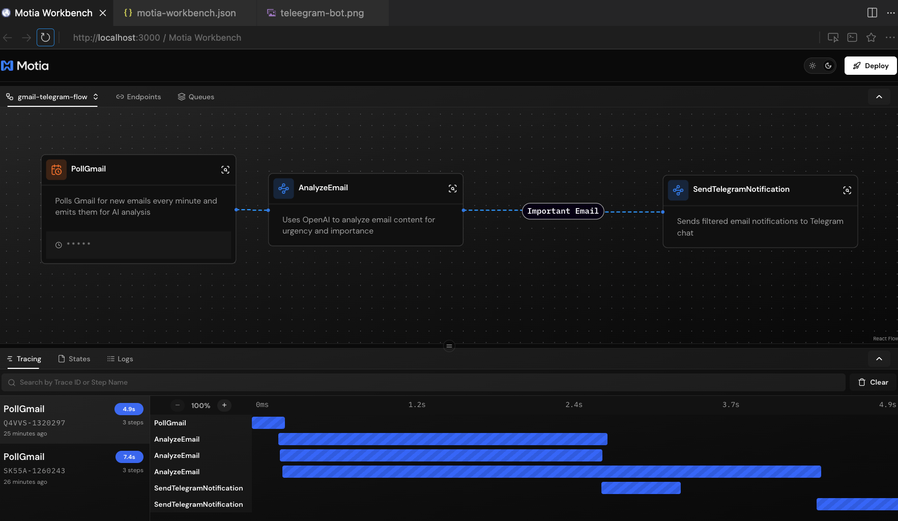
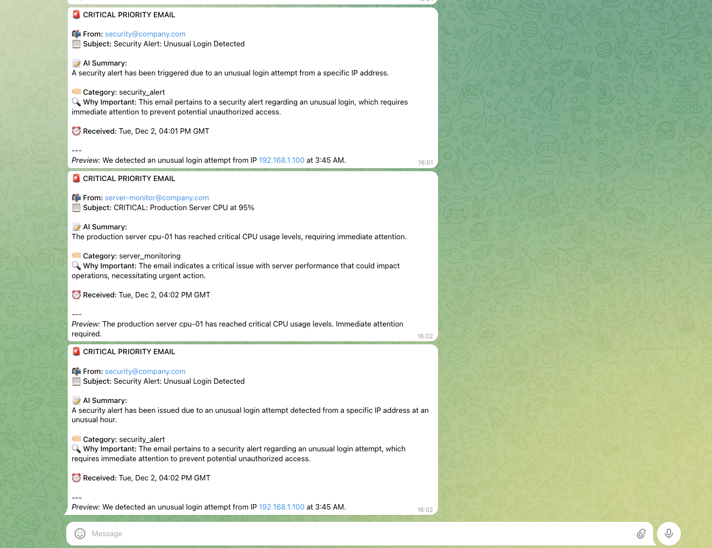

# 📬 Gmail-to-Telegram AI Notifier

An intelligent email notification system built with **Motia** that uses **OpenAI GPT** to filter important emails and forward them to **Telegram** — replacing simple keyword matching with smart AI analysis.

## ✨ What It Does

Instead of filtering emails with basic keywords like "Urgent" or "Server Down", this workflow uses AI to understand the actual meaning and context of your emails:

| Traditional  Approach (Keywords) | AI-Powered Approach (AI) |
|------------------------|-------------------|
| Only matches exact words | Understands context and intent |
| Misses "CRITICAL", "emergency", "help!" | Catches all urgency signals |
| Can't understand email content | Analyzes full email meaning |
| High false positive/negative rate | Smart categorization |

## 🏗️ Workflow Architecture



### Step Breakdown

| Step | Type | Description |
|------|------|-------------|
| **PollGmail** | Cron | Runs every minute to check for new emails |
| **AnalyzeEmail** | Event | Uses GPT-4o-mini to analyze urgency & importance |
| **SendTelegramNotification** | Event | Sends formatted alerts to your Telegram |

## 📱 Telegram Notifications



Get beautifully formatted notifications with:
- 🚨 **Urgency indicators** (Critical, High, Medium, Low)
- 📝 **AI-generated summaries** of the email content
- 🏷️ **Smart categorization** (security_alert, server_monitoring, etc.)
- 🔍 **Reasoning** for why the email was flagged

## 🚀 Quick Start

### 1. Install Dependencies

```bash
npm install
```

### 2. Configure Environment

Create a `.env` file:

```bash
# OpenAI Configuration (required for AI analysis)
OPENAI_API_KEY=sk-your-openai-api-key

# Telegram Configuration
TELEGRAM_BOT_TOKEN=your-telegram-bot-token
TELEGRAM_CHAT_ID=your-telegram-chat-id
```

### 3. Run the Workflow

```bash
npm run dev
```

Open the **Motia Workbench** at [http://localhost:3000](http://localhost:3000) to visualize and debug your workflow.

## 📊 Email Categories

The AI classifies emails into these urgency levels:

| Level | Emoji | Examples | Action |
|-------|-------|----------|--------|
| **Critical** | 🚨 | Server down, security breach, system failure | Immediate notification |
| **High** | ⚠️ | Unusual login, important deadline, urgent request | Notification sent |
| **Medium** | 📧 | Work updates, meeting requests | Logged only |
| **Low** | 📬 | Newsletters, promotions, social media | Filtered out |

## 🔧 Configuration

### Getting Your Telegram Bot Token

1. Message [@BotFather](https://t.me/BotFather) on Telegram
2. Send `/newbot` and follow the prompts
3. Copy the bot token provided

### Getting Your Telegram Chat ID

1. Start a chat with your new bot
2. Send any message to it
3. Visit: `https://api.telegram.org/bot<YOUR_BOT_TOKEN>/getUpdates`
4. Find your `chat.id` in the response

### Getting Your OpenAI API Key

1. Go to [OpenAI Platform](https://platform.openai.com/api-keys)
2. Create a new API key
3. Copy it to your `.env` file

## 📁 Project Structure

```
day4automation/
├── steps/
│   ├── gmail-telegram/
│   │   ├── poll-gmail.step.ts      # Cron: polls emails every minute
│   │   ├── analyze-email.step.ts   # Event: OpenAI analysis
│   │   └── send-telegram.step.ts   # Event: sends Telegram messages
│   └── hello/                      # Example hello world flow
├── docs/
│   └── img/                        # Screenshots
├── .env                            # Environment variables
├── motia.config.ts                 # Motia configuration
└── types.d.ts                      # Auto-generated types
```

## 🛠️ Development Commands

```bash
# Start development server with Workbench
npm run dev

# Generate TypeScript types from Step configs
npm run generate-types
```

## 🔄 How It Works

1. **PollGmail** cron job triggers every minute
2. Fetches new unread emails from Gmail
3. For each email, emits an `analyze-email` event
4. **AnalyzeEmail** step receives the event
5. Sends email content to OpenAI GPT-4o-mini for analysis
6. AI returns urgency level, category, and summary
7. If critical/high priority → emits `send-telegram-notification`
8. **SendTelegramNotification** formats and sends the alert

## 🔒 Fail-Safe Design

- If OpenAI analysis fails → email is forwarded anyway (better safe than sorry)
- If Telegram send fails → error is logged for retry
- All processed emails are tracked in state to prevent duplicates

## 📚 Learn More

- [Motia Documentation](https://motia.dev/docs)
- [OpenAI API Docs](https://platform.openai.com/docs)
- [Telegram Bot API](https://core.telegram.org/bots/api)

---

Built with ❤️ using [Motia](https://motia.dev)
