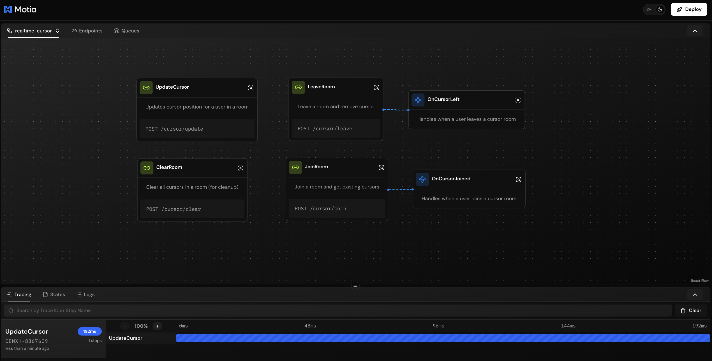
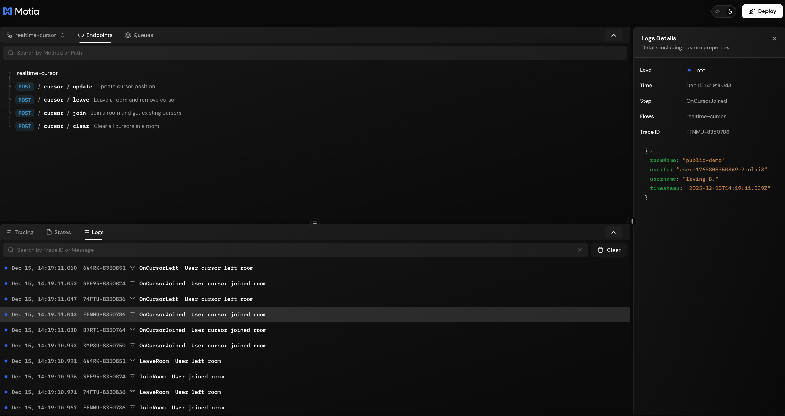
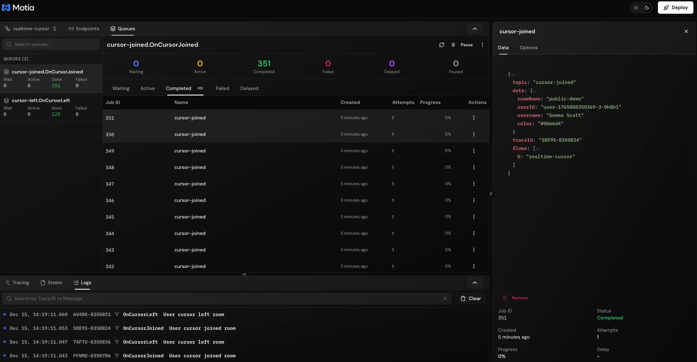

# Real-time Cursor Sharing

Real-time cursor sharing demo built with [Motia Streams](https://motia.dev).


## Features

- ⚡ **Real-time** - Cursor positions sync via WebSocket (no polling)
- 🏠 **Room-based** - Cursors grouped by room for collaboration
- 🎨 **Customizable** - User colors and names
- 🧹 **Auto Cleanup** - Cursors removed when users leave



## Quick Start

### 1. Start Motia Backend

```bash
npm install
npm run dev
```

Server runs at `http://localhost:3000`

### 2. Start Frontend

```bash
cd frontend
npm install
npm run dev
```

Demo available at `http://localhost:3001`

## Project Structure

```
├── src/cursor/                      # Motia backend
│   ├── cursor-positions.stream.ts   # Stream definition
│   ├── join-room.step.ts            # Join room endpoint
│   ├── update-cursor.step.ts        # Update cursor endpoint
│   ├── leave-room.step.ts           # Leave room endpoint
│   ├── clear-room.step.ts           # Clear room endpoint
│   ├── on-cursor-joined.step.ts     # Join event handler
│   └── on-cursor-left.step.ts       # Leave event handler
├── frontend/                         # Next.js demo
│   └── src/
│       ├── app/                     # App routes & API proxy
│       └── components/              # React components
└── motia.config.ts
```

### Logs and queues are available in the Workbench







## How It Works

### Backend

Cursor positions are stored in a Motia Stream that broadcasts updates to all subscribers:

```typescript
// Update cursor position
await streams.cursorPosition.set(roomName, userId, {
  id: userId,
  x,
  y,
  username,
  color,
  lastUpdated: new Date().toISOString(),
})
```

### Frontend

Subscribe to real-time updates with `useStreamGroup`:

```tsx
import { useStreamGroup } from '@motiadev/stream-client-react'

function CursorOverlay({ roomId }) {
  const { data: cursors } = useStreamGroup({
    streamName: 'cursorPosition',
    groupId: roomId,
  })

  return (
    <>
      {cursors?.map((cursor) => (
        <Cursor key={cursor.id} {...cursor} />
      ))}
    </>
  )
}
```

## API Endpoints

| Method | Endpoint | Description |
|--------|----------|-------------|
| POST | `/cursor/join` | Join room, get existing cursors |
| POST | `/cursor/update` | Update cursor position |
| POST | `/cursor/leave` | Leave room |
| POST | `/cursor/clear` | Clear all cursors in room |

## Integration

```bash
npm install @motiadev/stream-client-react
```

```tsx
import { MotiaStreamProvider } from '@motiadev/stream-client-react'

function App() {
  return (
    <MotiaStreamProvider address="ws://localhost:3000">
      <YourApp />
    </MotiaStreamProvider>
  )
}
```

## License

MIT
