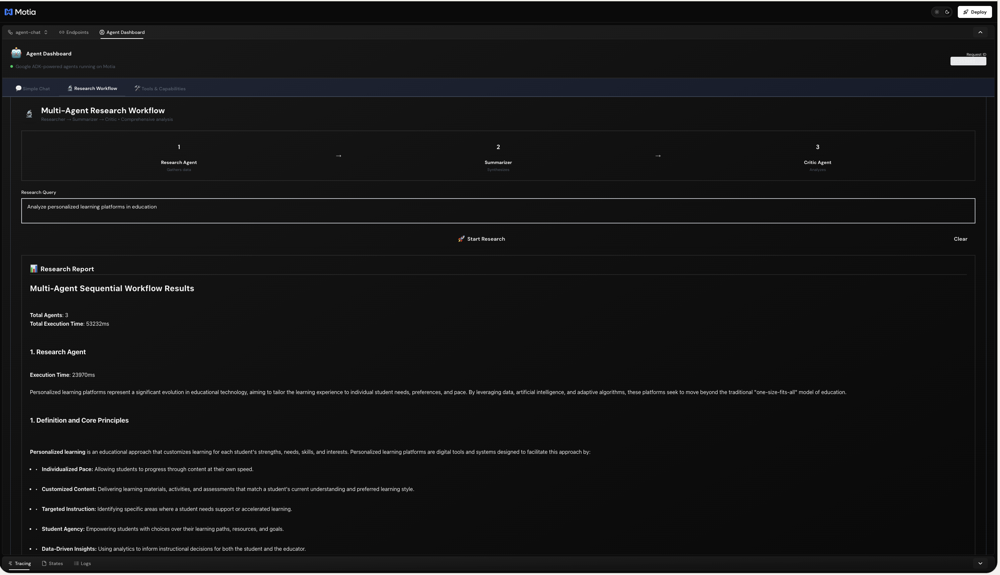
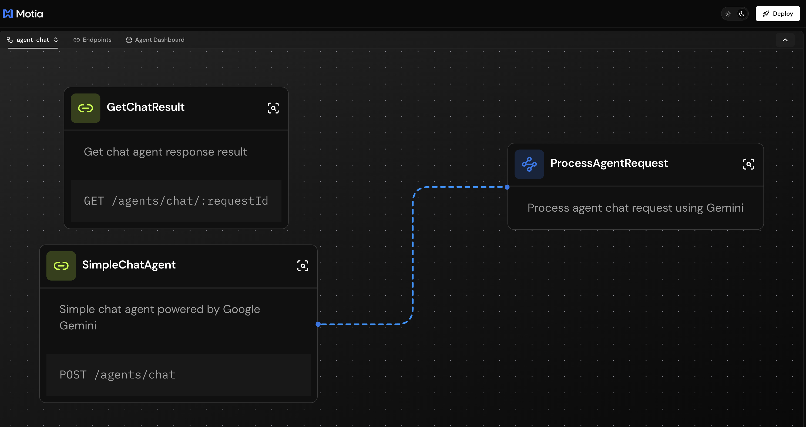
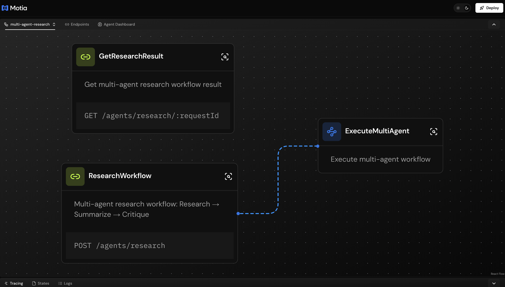
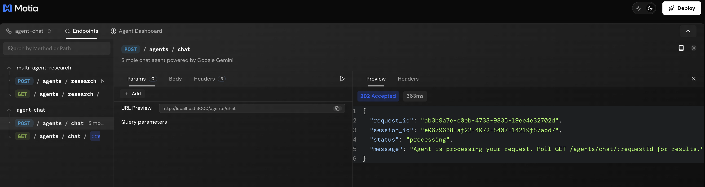
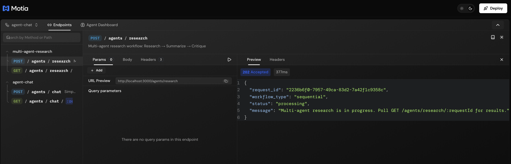

# 🤖 Google ADK Agents on Motia

**Google ADK meets Motia** - Build production-grade AI agents with the power of Google's Agent Development Kit, simplified by Motia's event-driven architecture. No complex orchestration code, no manual state management, no deployment headaches.

**What you get:**
- 🚀 **Google ADK Agents** - Leverage Gemini's advanced capabilities
- ⚡ **Motia Simplicity** - Event-driven architecture handles complexity
- 📊 **Visual Debugging** - See your agents flow in real-time
- 🔄 **Zero DevOps** - Built-in scaling, retries, and observability

## 🎨 Screenshots

### Agent Dashboard UI


### Simple Chat Interface


### Workbench Flow Visualization


### Real-time Tracing & Observability


## 🎯 Why Google ADK + Motia?

### Traditional Approach (Complex)
```python
# Manual orchestration, state management, retry logic...
async def run_multi_agent():
    try:
        # Setup agents
        researcher = Agent(model="gemini", tools=["search"])
        summarizer = Agent(model="gemini")
        
        # Manual state management
        state = StateManager()
        
        # Orchestrate manually
        research_result = await researcher.execute(query)
        state.save("research", research_result)
        
        summary = await summarizer.execute(research_result)
        state.save("summary", summary)
        
        # Handle errors, retries, logging...
    except Exception as e:
        # Manual error handling...
```

### Motia Approach (Simple)
```typescript
// 1. Define API endpoint (one step)
export const config: ApiRouteConfig = {
  type: 'api',
  path: '/agents/research',
  method: 'POST',
  emits: ['execute-multi-agent'],  // Trigger background processing
  flows: ['multi-agent-research'],
};

// 2. Motia handles everything else:
//    ✅ Async processing (background workers)
//    ✅ State management (automatic)
//    ✅ Error handling & retries (built-in)
//    ✅ Observability & tracing (real-time)
//    ✅ API endpoints (auto-generated)
//    ✅ Type safety (full TypeScript)
```

### What Motia Does For You

| Challenge | Traditional ADK | Motia Solution |
|-----------|----------------|----------------|
| **Async Processing** | Write custom queues & workers | `emit()` - automatic background execution |
| **State Management** | Manual DB setup & queries | `state.set()` - built-in key-value store |
| **API Endpoints** | Flask/FastAPI boilerplate | Auto-generated from step configs |
| **Error Handling** | Try/catch everywhere | Automatic retries + error states |
| **Monitoring** | Setup logging & metrics | Built-in Workbench visualization |
| **Scaling** | Manual worker pools | Event-driven, scales automatically |
| **Type Safety** | Runtime errors | Zod schemas + TypeScript |

## ✨ Features

- **💬 Simple Chat Agent** - Conversational AI powered by Google Gemini 2.5 Flash
- **🔬 Multi-Agent Research** - Coordinated specialist agents (Researcher → Summarizer → Critic)
- **⚡ Fast Polling** - Real-time updates with 500ms polling (feels instant!)
- **🎨 Beautiful UI** - Formatted output with syntax highlighting, headers, and proper contrast
- **🔄 Async Processing** - Background task execution with efficient state management
- **📝 Conversation History** - Session persistence across requests
- **🛠️ Tool Integration** - Extensible tool system (search, code, scraping, weather, etc.)
- **🎯 Type Safety** - Full TypeScript with Zod validation
- **📊 Observability** - Built-in logging, tracing, and monitoring

## 🏗️ Architecture

### Google ADK Concepts → Motia Implementation

This project demonstrates how Google ADK patterns map beautifully to Motia's architecture:

| Google ADK Concept | Motia Implementation | Benefits |
|-------------------|---------------------|----------|
| **Single Agent** | API Step → Event Step → Gemini Service | Async by default, no blocking |
| **Multi-Agent** | Sequential Event Steps | Automatic orchestration |
| **Tools** | Reusable service functions | Type-safe, testable |
| **Memory** | Motia State Management | Built-in persistence |
| **Streaming** | Motia Streams + Fast Polling | Real-time updates |
| **Observability** | Workbench Tracing | Visual debugging |

### Agent Types

1. **Simple Chat Agent** (`steps/agents/chat/`)
   - ✅ **API Step**: Receives user message, returns request ID
   - ✅ **Event Step**: Processes in background, calls Gemini
   - ✅ **State**: Stores conversation history
   - ✅ **Result**: Poll endpoint returns when ready
   - **Benefits**: Non-blocking, scalable, observable

2. **Multi-Agent Research Workflow** (`steps/agents/multi-agent/`)
   - ✅ **Sequential Execution**: Researcher → Summarizer → Critic
   - ✅ **Result Chaining**: Each agent builds on previous output
   - ✅ **Automatic Orchestration**: Motia handles the flow
   - ✅ **Error Recovery**: Built-in retries for each agent
   - **Benefits**: Complex workflows without orchestration code

### System Flow (Event-Driven Architecture)

```
┌─────────────────────────────────────────────────────────────────┐
│  User Request (Agent Dashboard or API)                          │
└────────────────────────┬────────────────────────────────────────┘
                         ↓ HTTP POST
┌─────────────────────────────────────────────────────────────────┐
│  API Step (simple-chat.step.ts / research-workflow.step.ts)     │
│  • Validates input (Zod schemas)                                │
│  • Stores request in state                                      │
│  • Returns request_id immediately (202 Accepted)                │
│  • Emits event → triggers background processing                 │
└────────────────────────┬────────────────────────────────────────┘
                         ↓ Event Emission (Non-blocking!)
┌─────────────────────────────────────────────────────────────────┐
│  Event Step (process-agent.step.ts / execute-multi-agent.step)  │
│  • Runs asynchronously in background                            │
│  • Calls Google Gemini API (15-20s per agent)                   │
│  • Handles errors with automatic retries                        │
│  • Updates state with results                                   │
│  • Streams progress updates (optional)                          │
└────────────────────────┬────────────────────────────────────────┘
                         ↓ Store Results
┌─────────────────────────────────────────────────────────────────┐
│  State Management (Built-in)                                    │
│  • agent-requests: Request status & metadata                    │
│  • agent-results: Final AI responses                            │
│  • conversations: Chat history per session                      │
└────────────────────────┬────────────────────────────────────────┘
                         ↓ Poll for Result
┌─────────────────────────────────────────────────────────────────┐
│  GET Endpoint (Fast 500ms polling)                              │
│  • Returns 202 if still processing                              │
│  • Returns 200 with result when complete                        │
│  • Returns 404 if request not found                             │
└────────────────────────┬────────────────────────────────────────┘
                         ↓ Display
┌─────────────────────────────────────────────────────────────────┐
│  Dashboard UI (Beautiful, formatted output)                     │
│  • Syntax highlighting for code blocks                          │
│  • Proper text contrast (light/dark mode)                       │
│  • Real-time progress indicators                                │
└─────────────────────────────────────────────────────────────────┘
```

### 🎯 Key Advantages

1. **🚀 Zero Blocking**
   - API returns immediately with request ID
   - User gets instant feedback, no waiting
   - Long-running AI calls happen in background

2. **📊 Full Observability**
   - Every step visible in Workbench
   - Real-time tracing of agent execution
   - Debug issues visually, no log diving

3. **🔄 Automatic Retries**
   - Network failures? Motia retries automatically
   - API rate limits? Built-in backoff
   - Transient errors? Never lose requests

4. **⚡ Production Ready**
   - Scales horizontally (add more workers)
   - Built-in monitoring and metrics
   - Type-safe from API to Gemini call

5. **🎨 Developer Experience**
   - Write business logic, not infrastructure
   - Visual debugging with Workbench
   - Hot reload during development

### Fast Polling System

- **Simple Chat**: 500ms intervals, max 15 seconds
- **Research**: 500ms intervals, max 30 seconds
- Near real-time updates without complex streaming infrastructure
- Shows progress with elapsed time

## 💡 From Google ADK Example to Production

**See how simple it is to go from an ADK example to a production-ready system:**

```typescript
// Google ADK Example (from the crash course)
const agent = new Agent({
  model: 'gemini-2.5-flash',
  systemPrompt: 'You are a helpful assistant'
});
const response = await agent.execute(userMessage);

// ↓ Same concept, now production-ready with Motia ↓

// 1️⃣ Create API endpoint (steps/chat.step.ts)
export const config: ApiRouteConfig = {
  type: 'api',
  path: '/agents/chat',
  method: 'POST',
  emits: ['process-agent'],  // ← Automatic async processing!
};

// 2️⃣ Motia automatically provides:
// ✅ Non-blocking API (returns immediately)
// ✅ Background processing (Event Step)
// ✅ State management (conversation history)
// ✅ Error handling (automatic retries)
// ✅ Observability (Workbench tracing)
// ✅ Scaling (event-driven workers)
// ✅ Type safety (Zod + TypeScript)

// That's it! 🎉 Your ADK agent is now production-ready!
```

## 🚀 Quick Start

### Prerequisites

- Node.js 18+ or Bun
- **Google AI Studio API key** ([Get it here](https://aistudio.google.com/app/apikey))
- 5 minutes to see the magic ✨

### Installation

```bash
# Clone or download the project
cd flows-demo-app

# Install dependencies
npm install

# Generate Motia types
npm run generate-types
```

### Configuration

Create `.env` file in the project root:

```env
# Required: Get from https://aistudio.google.com/app/apikey
GEMINI_API_KEY=AIzaSy...your_api_key_here
```

**🔒 Security**: Never commit `.env` to git! It's already in `.gitignore`.

### Start the Server

```bash
npm run dev
```

Server runs at **http://localhost:3000**

## 🎨 Agent Dashboard

Open **http://localhost:3000** in your browser to access the interactive dashboard.

### Tabs

1. **💬 Simple Chat**
   - Direct conversation with Gemini
   - Example prompts for quick testing
   - Real-time response with formatted output

2. **🔬 Research Workflow**
   - Multi-agent research orchestration
   - 3-stage analysis: Research → Summarize → Critique
   - Comprehensive reports with sources

3. **🛠️ Tools & Capabilities**
   - View all available agent tools
   - 6 built-in tools (search, code, weather, etc.)
   - Extensible architecture for custom tools

### Output Formatting

The dashboard automatically formats AI responses with:
- **Syntax-highlighted code blocks** (dark background, green text)
- **Inline code** (pink badges)
- **Headers** (H1, H2, H3 properly styled)
- **Bold text** (high contrast)
- **Lists** (bullets and numbered)
- **High contrast text** (readable in light & dark modes)

## 📖 API Usage

### 1. Simple Chat

#### POST /agents/chat - Start a conversation


```bash
# Start a chat
curl -X POST http://localhost:3000/agents/chat \
  -H "Content-Type: application/json" \
  -d '{
    "message": "Explain quantum computing in simple terms",
    "config": {
      "model": "gemini-2.5-flash",
      "temperature": 0.7
    }
  }'

# Response includes request_id
{
  "request_id": "abc-123",
  "session_id": "session-456",
  "status": "processing",
  "message": "Agent is processing your request..."
}

# Poll for result (500ms polling, ~2-5 seconds total)
curl http://localhost:3000/agents/chat/abc-123
```

#### GET /agents/chat/:requestId - Retrieve result


```bash
# Final response
{
  "request_id": "abc-123",
  "session_id": "session-456",
  "response": "Quantum computing uses qubits...",
  "metadata": {
    "model_used": "gemini-2.5-flash",
    "tokens_used": 245,
    "execution_time_ms": 1823,
    "agent_type": "simple"
  },
  "created_at": "2025-11-14T10:30:00Z"
}
```

### 2. Multi-Agent Research

#### POST /agents/research - Start multi-agent workflow


```bash
# Start research workflow
curl -X POST http://localhost:3000/agents/research \
  -H "Content-Type: application/json" \
  -d '{
    "query": "Investigate CRISPR gene editing developments",
    "workflow_type": "sequential"
  }'

# Response
{
  "request_id": "xyz-789",
  "workflow_type": "sequential",
  "status": "processing"
}

# Poll for complete results (takes ~50-70 seconds)
curl http://localhost:3000/agents/research/xyz-789
```

#### GET /agents/research/:requestId - Retrieve research results


```bash
# Final comprehensive report
{
  "request_id": "xyz-789",
  "results": [
    {
      "agent_id": "researcher",
      "agent_name": "Research Agent",
      "response": "CRISPR technology has...",
      "execution_time_ms": 25000
    },
    {
      "agent_id": "summarizer",
      "response": "Key findings: 1. Clinical trials...",
      "execution_time_ms": 15000
    },
    {
      "agent_id": "critic",
      "response": "Critical analysis: Strong opportunities...",
      "execution_time_ms": 18000
    }
  ],
  "final_output": "# Multi-Agent Research Report\n\n...",
  "total_execution_time_ms": 58000
}
```

## 🛠️ Available Tools

| Tool | Icon | Description | Type |
|------|------|-------------|------|
| **Web Search** | 🔍 | Search the web for current information | Built-in |
| **Code Execution** | 💻 | Execute Python code in sandbox | Built-in |
| **Web Scraping** | 🌐 | Extract content from web pages | Built-in |
| **Calculator** | 🧮 | Perform mathematical calculations | Function |
| **Weather** | ☁️ | Get current weather information | Function |
| **Date/Time** | 📅 | Get current date and time | Function |

*Easily add custom tools in `src/services/agents/tools.ts`*

## 📁 Project Structure

```
flows-demo-app/
├── steps/                          # Motia step definitions
│   ├── agents/
│   │   ├── chat/                   # Simple chat endpoints
│   │   │   ├── simple-chat.step.ts       # POST /agents/chat
│   │   │   └── get-chat-result.step.ts   # GET /agents/chat/:id
│   │   ├── multi-agent/            # Research endpoints
│   │   │   ├── research-workflow.step.ts # POST /agents/research
│   │   │   └── get-research-result.step.ts
│   │   └── process/                # Background workers
│   │       ├── process-agent.step.ts      # Single agent execution
│   │       └── execute-multi-agent.step.ts # Multi-agent orchestration
│   └── streams/                    # Real-time stream definitions
│       ├── agent-response.stream.ts
│       └── research-progress.stream.ts
├── src/
│   ├── types/                      # TypeScript types + Zod schemas
│   │   ├── agent.types.ts         # Agent configs, requests, responses
│   │   └── state.types.ts         # State management types
│   └── services/                   # Business logic
│       └── agents/
│           ├── gemini-agent.ts    # Gemini API integration
│           ├── multi-agent.ts     # Multi-agent orchestration
│           ├── tools.ts           # Tool definitions
│           └── index.ts           # Exports
├── plugins/                        # Workbench UI
│   └── plugin-agent-dashboard/
│       ├── index.tsx              # React dashboard component
│       ├── package.json
│       └── tsconfig.json
├── motia.config.ts                 # Motia configuration
├── package.json                    # Dependencies
└── README.md                       # This file
```

## ⚙️ Configuration

### Supported Models

You can use any Google Gemini model:

```typescript
{
  "config": {
    "model": "gemini-2.5-flash",     // Default: fast & efficient
    // "model": "gemini-2.0-flash-exp", // Experimental
    // "model": "gemini-1.5-pro",       // High-quality reasoning
    // "model": "gemini-1.5-flash",     // Previous generation
    "temperature": 0.7,               // 0.0-2.0 (randomness)
    "max_tokens": 8192,              // Max response length
    "system_prompt": "Custom instructions..."
  }
}
```

### Agent Configuration

```typescript
interface AgentConfig {
  model: string;              // Gemini model name
  temperature?: number;       // 0.0 (deterministic) to 2.0 (creative)
  max_tokens?: number;        // Maximum response length
  system_prompt?: string;     // Custom agent instructions
  tools?: string[];          // Array of tool names to enable
}
```

### Multi-Agent Workflow Types

```typescript
type WorkflowType = 
  | 'sequential'  // Agents run one after another (default)
  | 'parallel'    // Agents run simultaneously
  | 'loop'        // Iterative refinement
```

## 🎯 Motia Concepts

### API Steps
HTTP endpoints that trigger workflows:
- Export `config` (ApiRouteConfig) and `handler`
- Use Zod for request/response validation
- Emit events to trigger background processing
- Example: `simple-chat.step.ts`

### Event Steps
Asynchronous background task handlers:
- Subscribe to events emitted by API steps
- Process long-running tasks (AI calls, data processing)
- Store results in state for later retrieval
- Example: `process-agent.step.ts`

### State Management
Persistent key-value storage:
- Grouped by domain (`agent-requests`, `conversations`, etc.)
- Used for session management and conversation history
- Accessible via `state.get()`, `state.set()`, `state.getGroup()`

### Streams
Real-time data updates:
- Push status updates to subscribers
- Schema-validated with Zod
- Used internally for state management
- Frontend uses fast polling for simplicity

### Workbench Plugins
Custom React UI components:
- Integrated into Motia Workbench
- Access backend APIs directly
- Full Tailwind CSS styling support

## 🧪 Testing

### Ready-to-Use Test Payloads

Copy and paste these JSON payloads for quick testing!

#### 1. Simple Chat - Basic Question

```bash
curl -X POST http://localhost:3000/agents/chat \
  -H "Content-Type: application/json" \
  -d '{
    "message": "Explain machine learning in simple terms",
    "agent_type": "simple",
    "config": {
      "model": "gemini-2.5-flash",
      "temperature": 0.7
    }
  }'
```

**JSON Payload:**
```json
{
  "message": "Explain machine learning in simple terms",
  "agent_type": "simple",
  "config": {
    "model": "gemini-2.5-flash",
    "temperature": 0.7
  }
}
```

#### 2. Simple Chat - Code Generation

```bash
curl -X POST http://localhost:3000/agents/chat \
  -H "Content-Type: application/json" \
  -d '{
    "message": "Write a Python function to calculate fibonacci numbers with memoization",
    "agent_type": "simple",
    "config": {
      "model": "gemini-2.5-flash",
      "temperature": 0.3,
      "max_tokens": 2048
    }
  }'
```

**JSON Payload:**
```json
{
  "message": "Write a Python function to calculate fibonacci numbers with memoization",
  "agent_type": "simple",
  "config": {
    "model": "gemini-2.5-flash",
    "temperature": 0.3,
    "max_tokens": 2048
  }
}
```

#### 3. Simple Chat - Creative Writing

```bash
curl -X POST http://localhost:3000/agents/chat \
  -H "Content-Type: application/json" \
  -d '{
    "message": "Write a short story about a robot learning to paint",
    "agent_type": "simple",
    "config": {
      "model": "gemini-2.5-flash",
      "temperature": 0.9
    }
  }'
```

**JSON Payload:**
```json
{
  "message": "Write a short story about a robot learning to paint",
  "agent_type": "simple",
  "config": {
    "model": "gemini-2.5-flash",
    "temperature": 0.9
  }
}
```

#### 4. Multi-Agent Research - Technology

```bash
curl -X POST http://localhost:3000/agents/research \
  -H "Content-Type: application/json" \
  -d '{
    "query": "Research the current state of AI regulation in the European Union",
    "workflow_type": "sequential"
  }'
```

**JSON Payload:**
```json
{
  "query": "Research the current state of AI regulation in the European Union",
  "workflow_type": "sequential"
}
```

#### 5. Multi-Agent Research - Science

```bash
curl -X POST http://localhost:3000/agents/research \
  -H "Content-Type: application/json" \
  -d '{
    "query": "Investigate CRISPR gene editing developments and clinical applications",
    "workflow_type": "sequential",
    "max_iterations": 1
  }'
```

**JSON Payload:**
```json
{
  "query": "Investigate CRISPR gene editing developments and clinical applications",
  "workflow_type": "sequential",
  "max_iterations": 1
}
```

#### 6. Multi-Agent Research - Education

```bash
curl -X POST http://localhost:3000/agents/research \
  -H "Content-Type: application/json" \
  -d '{
    "query": "Analyze the effectiveness of personalized learning platforms in modern education",
    "workflow_type": "sequential"
  }'
```

**JSON Payload:**
```json
{
  "query": "Analyze the effectiveness of personalized learning platforms in modern education",
  "workflow_type": "sequential"
}
```

### Testing Workflow

#### Step 1: Send Request
```bash
# Example: Simple Chat
curl -X POST http://localhost:3000/agents/chat \
  -H "Content-Type: application/json" \
  -d '{"message": "Hello!", "agent_type": "simple", "config": {"model": "gemini-2.5-flash"}}'
```

**Response:**
```json
{
  "request_id": "abc-123-def-456",
  "session_id": "session-789",
  "status": "processing",
  "message": "Agent is processing your request. Poll GET /agents/chat/:requestId for results."
}
```

#### Step 2: Poll for Result (Fast polling every 500ms)
```bash
# Replace REQUEST_ID with the actual request_id from Step 1
curl http://localhost:3000/agents/chat/abc-123-def-456
```

**Response (while processing):**
```json
{
  "request_id": "abc-123-def-456",
  "status": "processing",
  "message": "Chat is still being processed. Please check again in a few seconds."
}
```

**Response (completed):**
```json
{
  "request_id": "abc-123-def-456",
  "session_id": "session-789",
  "response": "Hello! I'm a helpful AI assistant...",
  "metadata": {
    "model_used": "gemini-2.5-flash",
    "tokens_used": 45,
    "execution_time_ms": 1234,
    "agent_type": "simple"
  },
  "created_at": "2025-11-14T10:30:00.000Z",
  "completed_at": "2025-11-14T10:30:01.234Z"
}
```

### Automated Test Script

Save this as `test-agents.sh`:

```bash
#!/bin/bash

echo "🧪 Testing Simple Chat Agent..."
REQUEST_ID=$(curl -s -X POST http://localhost:3000/agents/chat \
  -H "Content-Type: application/json" \
  -d '{
    "message": "What is TypeScript?",
    "agent_type": "simple",
    "config": {"model": "gemini-2.5-flash", "temperature": 0.7}
  }' | jq -r '.request_id')

echo "📝 Request ID: $REQUEST_ID"
echo "⏳ Waiting for response (polling every 2s)..."

for i in {1..10}; do
  sleep 2
  RESULT=$(curl -s http://localhost:3000/agents/chat/$REQUEST_ID)
  STATUS=$(echo $RESULT | jq -r '.response // .status')
  
  if [ "$STATUS" != "processing" ] && [ "$STATUS" != "null" ]; then
    echo "✅ Response received!"
    echo $RESULT | jq
    break
  else
    echo "⏳ Still processing... (attempt $i/10)"
  fi
done

echo ""
echo "🔬 Testing Multi-Agent Research..."
RESEARCH_ID=$(curl -s -X POST http://localhost:3000/agents/research \
  -H "Content-Type: application/json" \
  -d '{
    "query": "Explain quantum computing basics",
    "workflow_type": "sequential"
  }' | jq -r '.request_id')

echo "📝 Research ID: $RESEARCH_ID"
echo "⏳ This will take 30-60 seconds..."
echo "📊 Check the result at: http://localhost:3000/agents/research/$RESEARCH_ID"
```

Make it executable:
```bash
chmod +x test-agents.sh
./test-agents.sh
```

### Expected Response Times

- **Simple Chat**: 2-5 seconds (polling timeout: 15s)
- **Multi-Agent Research**: 50-70 seconds (3 sequential agents, polling timeout: 90s)
- **First Request**: May be slower (cold start)
- **Polling**: Checks every 500ms, feels near real-time

**Why is research slow?**
- Each agent makes a separate Gemini API call (~15-20s each)
- Sequential execution: Researcher → Summarizer → Critic
- Total: 3 agents × ~18s average = ~54 seconds
- This is normal for comprehensive multi-agent analysis!

### Rate Limits

**Free Tier (Gemini API):**
- 15 requests per minute
- 1,500 requests per day
- 1 million tokens per minute

**Solution**: Wait or upgrade to paid tier

## 🎓 Learning Path: From Google ADK to Motia

This project is your bridge from Google ADK concepts to production-ready systems:

### 1. **Start with Google ADK**
Learn the concepts: agents, tools, memory, multi-agent patterns
- ✅ **Single Agents** → `steps/agents/chat/`
- ✅ **Multi-Agent** → `steps/agents/multi-agent/`
- ✅ **Tools** → `src/services/agents/tools.ts`
- ✅ **Memory** → Motia State Management
- ✅ **Observability** → Workbench Tracing

### 2. **Build Your Own**
Use this as a template:
- Replace Gemini with other LLMs (OpenAI, Anthropic)
- Add custom tools (database, APIs, external services)
- Create new agent workflows (sequential, parallel, conditional)
- Deploy to production (Docker, K8s ready)

### 3. **Why This Matters**

Google ADK teaches you: What agents can do
Motia shows you: How to build them at scale

Result: You learn agent patterns AND production engineering
        No more "cool demo" vs "production system" gap!

## 📚 Learn More

**Motia Resources:**
- [Motia Documentation](https://motia.dev/docs)
- [Motia Workbench](https://motia.dev/docs/workbench)
- [Event-Driven Architecture](https://motia.dev/docs/concepts)

**Google AI Resources:**
- [Google Gemini API](https://ai.google.dev/docs)
- [Google AI Studio](https://aistudio.google.com/)
- [Gemini Models](https://ai.google.dev/models/gemini)

**Development Tools:**
- [TypeScript](https://www.typescriptlang.org/)
- [Zod Validation](https://zod.dev/)
- [React](https://react.dev/)

## 🔑 Key Features Implemented

- ✅ Real Google Gemini API integration
- ✅ Single & multi-agent systems
- ✅ Fast polling (500ms) for near real-time updates
- ✅ Beautiful formatted output (syntax highlighting, headers, lists)
- ✅ State management & conversation history
- ✅ Async event-driven processing
- ✅ Interactive dashboard with 3 tabs
- ✅ Error handling & retry logic
- ✅ Token tracking & execution metrics
- ✅ Type-safe with full TypeScript & Zod

## 🤝 Contributing

This is a **reference implementation** showing how to build production-grade Google ADK agents with Motia.

### Extend This Project:
- 🛠️ **Add Tools**: Weather, database queries, API integrations
- 🤖 **New Agents**: Customer support, data analysis, code review
- 🔄 **Workflows**: Parallel execution, conditional routing, loops
- 🎨 **UI**: Custom dashboards, mobile app, Slack bot
- 🌍 **Multi-Model**: Mix Gemini, GPT-4, Claude in same workflow

### Why Motia for AI Agents?

```typescript
// Traditional AI Agent Challenges:
❌ Complex orchestration code
❌ Manual state management  
❌ Difficult to debug
❌ Hard to scale
❌ Deployment headaches

// Motia Solution:
✅ Emit events, let Motia orchestrate
✅ Built-in state.set() / state.get()
✅ Visual Workbench debugging
✅ Event-driven scaling
✅ Deploy anywhere (Docker ready)

// Focus on: Agent logic, not infrastructure!
```

## 📄 License

MIT - Feel free to use as a template for your own projects!

---

<div align="center">

### **Built with ❤️ using [Motia](https://motia.dev) + [Google Gemini](https://gemini.google.com)**

**🎯 Google ADK Concepts + ⚡ Motia Simplicity = 🚀 Production-Ready Agents**

*Transform your agent ideas into production systems in hours, not weeks.*

[⭐ Star on GitHub](https://github.com/your-repo) • [📖 Read Docs](https://motia.dev/docs) • [💬 Join Discord](https://discord.gg/motia)

</div>
