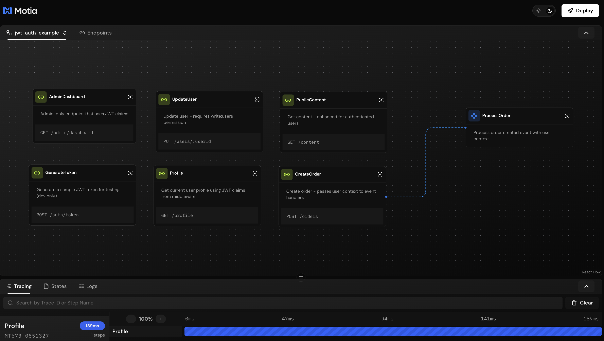
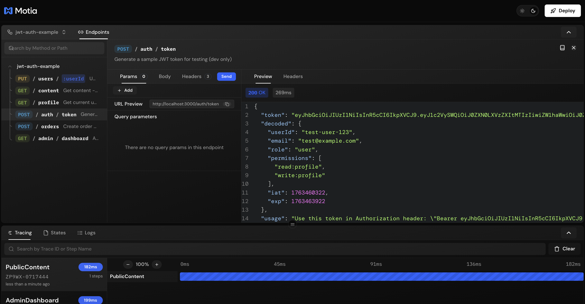

# Passing Context from Middlewares to Handlers in Motia

This example demonstrates how to pass context (like JWT claims) from middlewares to handlers in Motia, avoiding the need to verify tokens multiple times.

## 🚀 Quick Start

```bash
# Install dependencies
npm install

# Generate TypeScript types (IMPORTANT!)
npx motia generate-types

# Start development server
npm run dev
```

Then visit http://localhost:3000 to see the Motia Workbench with all endpoints.



### Available Endpoints

- **POST** `/auth/token` - Generate test JWT tokens
- **GET** `/profile` - Get user profile (requires auth)
- **GET** `/admin/dashboard` - Admin dashboard (requires admin role)
- **PUT** `/users/:userId` - Update user (requires write:users permission)
- **GET** `/content` - Public content (enhanced for authenticated users)
- **POST** `/orders` - Create order (emits event with user context)

## 🎯 Problem Statement

When building authenticated APIs, you often need to:
1. Verify JWT tokens
2. Extract user information from tokens
3. Use that information in your handlers

The **naive approach** would verify the token in every handler, which is:
- ❌ Inefficient (multiple verifications)
- ❌ Repetitive (duplicate code)
- ❌ Error-prone (inconsistent verification logic)

## ✅ Solution: Middleware Context Passing

The **Motia pattern** is:
1. **Middleware** verifies JWT once and attaches claims to `request` object
2. **TypeScript** module augmentation provides type safety
3. **Handlers** access the claims directly without re-verification

## 📁 Project Structure

```
├── api.d.ts                              # TypeScript module augmentation
├── src/
│   └── utils/
│       └── jwt.ts                        # JWT utilities
├── middlewares/
│   ├── auth.middleware.ts                # Required auth
│   ├── optional-auth.middleware.ts       # Optional auth
│   ├── require-role.middleware.ts        # Role-based authorization
│   └── require-permission.middleware.ts  # Permission-based authorization
└── steps/
    ├── api/
    │   ├── generate-token.step.ts        # Generate test tokens
    │   ├── profile.step.ts               # Basic auth example
    │   ├── admin-dashboard.step.ts       # Role-based example
    │   ├── update-user.step.ts           # Permission-based example
    │   ├── public-content.step.ts        # Optional auth example
    │   └── create-order.step.ts          # Event emission with context
    └── events/
        └── process-order.step.ts         # Event processing with context
```

## 🔧 How It Works

### Step 1: TypeScript Module Augmentation

Define additional properties on the `ApiRequest` interface:

```typescript
// api.d.ts
import { ApiRequest } from 'motia'

export interface TokenData {
  userId: string
  email: string
  role: 'admin' | 'user' | 'guest'
  permissions: string[]
  iat: number
  exp: number
}

declare module 'motia' {
  interface ApiRequest<TBody = unknown> {
    tokenInfo?: TokenData
    userId?: string
    isAuthenticated?: boolean
  }
}
```

This tells TypeScript that `req.tokenInfo` exists and what it looks like.

### Step 2: Create Auth Middleware

The middleware verifies the JWT and attaches the decoded claims:

```typescript
// middlewares/auth.middleware.ts
import { ApiMiddleware } from 'motia'

export const authMiddleware: ApiMiddleware = async (req, ctx, next) => {
  const { logger } = ctx
  const token = extractToken(req.headers.authorization)
  
  if (!token) {
    return {
      status: 401,
      body: { error: 'No token provided' }
    }
  }
  
  const tokenData = await verifyToken(token)
  
  if (!tokenData) {
    return {
      status: 401,
      body: { error: 'Invalid token' }
    }
  }
  
  // Attach to request - available to all subsequent middlewares and handlers!
  req.tokenInfo = tokenData
  req.userId = tokenData.userId
  req.isAuthenticated = true
  
  logger.info('Request authenticated', {
    userId: tokenData.userId,
    role: tokenData.role
  })
  
  return await next()
}
```

**Key Points:**
- Token is verified **once**
- Claims are attached to `req`
- Same `req` object flows through all middlewares and the handler
- **IMPORTANT**: Middleware is exported as a function and imported in step configs (not referenced by string)

### Step 3: Use in Handlers

Handlers can now access `req.tokenInfo` directly:

```typescript
// steps/api/profile.step.ts
import { ApiRouteConfig, Handlers } from 'motia'
import { authMiddleware } from '../../middlewares/auth.middleware'

export const config: ApiRouteConfig = {
  name: 'Profile',
  type: 'api',
  path: '/profile',
  method: 'GET',
  middleware: [authMiddleware], // ✅ Runs first, verifies JWT
  emits: [],
  flows: ['jwt-auth-example']
}

export const handler: Handlers['Profile'] = async (req, { logger }) => {
  // ✅ Access tokenInfo directly - no re-verification needed!
  const { tokenInfo } = req
  
  logger.info('Fetching profile', {
    userId: tokenInfo!.userId,
    role: tokenInfo!.role
  })
  
  return {
    status: 200,
    body: {
      userId: tokenInfo!.userId,
      email: tokenInfo!.email,
      role: tokenInfo!.role,
      message: 'Token verified once in middleware'
    }
  }
}
```

## 🚀 Usage Examples

### Example 1: Basic Authentication

```typescript
// steps/api/profile.step.ts
import { ApiRouteConfig, Handlers } from 'motia'
import { authMiddleware } from '../../middlewares/auth.middleware'

export const config: ApiRouteConfig = {
  name: 'Profile',
  type: 'api',
  path: '/profile',
  method: 'GET',
  middleware: [authMiddleware],
  emits: [],
  flows: ['jwt-auth-example']
}

export const handler: Handlers['Profile'] = async (req, { logger }) => {
  const { tokenInfo } = req
  // Use tokenInfo.userId, tokenInfo.email, etc.
}
```

### Example 2: Role-Based Authorization

```typescript
// steps/api/admin-dashboard.step.ts
import { ApiRouteConfig, Handlers } from 'motia'
import { authMiddleware } from '../../middlewares/auth.middleware'
import { requireRole } from '../../middlewares/require-role.middleware'

export const config: ApiRouteConfig = {
  name: 'AdminDashboard',
  type: 'api',
  path: '/admin/dashboard',
  method: 'GET',
  middleware: [authMiddleware, requireRole('admin')],
  emits: [],
  flows: ['jwt-auth-example']
}

export const handler: Handlers['AdminDashboard'] = async (req, { logger }) => {
  // By the time we're here, user is authenticated AND has admin role
  const { tokenInfo } = req
}
```

### Example 3: Permission-Based Authorization

```typescript
// steps/api/update-user.step.ts
import { ApiRouteConfig, Handlers } from 'motia'
import { authMiddleware } from '../../middlewares/auth.middleware'
import { requirePermission } from '../../middlewares/require-permission.middleware'

export const config: ApiRouteConfig = {
  name: 'UpdateUser',
  type: 'api',
  path: '/users/:userId',
  method: 'PUT',
  middleware: [authMiddleware, requirePermission('write:users')],
  emits: [],
  flows: ['jwt-auth-example']
}

export const handler: Handlers['UpdateUser'] = async (req, { logger }) => {
  // User has 'write:users' permission
  const { tokenInfo } = req
}
```

### Example 4: Optional Authentication

```typescript
// steps/api/public-content.step.ts
import { ApiRouteConfig, Handlers } from 'motia'
import { optionalAuthMiddleware } from '../../middlewares/optional-auth.middleware'

export const config: ApiRouteConfig = {
  name: 'PublicContent',
  type: 'api',
  path: '/content',
  method: 'GET',
  middleware: [optionalAuthMiddleware],
  emits: [],
  flows: ['jwt-auth-example']
}

export const handler: Handlers['PublicContent'] = async (req, { logger }) => {
  if (req.isAuthenticated && req.tokenInfo) {
    // Return enhanced content for authenticated users
  } else {
    // Return public content for anonymous users
  }
}
```

### Example 5: Passing Context to Events

```typescript
// steps/api/create-order.step.ts
export const handler = async (input, { req, emit }) => {
  const { tokenInfo } = req
  
  // Emit event with user context from JWT
  await emit({
    topic: 'order.created',
    data: {
      orderId: 'order-123',
      userContext: {
        userId: tokenInfo!.userId,
        email: tokenInfo!.email,
        role: tokenInfo!.role
      }
    }
  })
}

// steps/events/process-order.step.ts
export const handler = async (input, { logger }) => {
  // Receive user context from the emitted event
  const { orderId, userContext } = input
  
  logger.info('Processing order for user', userContext)
  // No need to verify JWT again!
}
```

## 🧪 Testing

### 1. Start the Development Server

```bash
npm run dev
```

The Motia Workbench will open at http://localhost:3000

### 2. Generate a Test Token

In the Workbench, navigate to the **POST `/auth/token`** endpoint and click "Send":



Or use cURL:

```bash
curl -X POST http://localhost:3000/auth/token \
  -H "Content-Type: application/json" \
  -d '{
    "userId": "test-user-123",
    "email": "test@example.com",
    "role": "user",
    "permissions": ["read:profile", "write:profile"]
  }'
```

Response:
```json
{
  "token": "eyJhbGc...",
  "decoded": { ... },
  "usage": "Use this token in Authorization header: Bearer ..."
}
```

**Important**: Copy the full token value from the response. You'll need it for authenticated requests.

### 3. Test Authenticated Endpoint

In the Workbench, navigate to **GET `/profile`**, paste your token in the Authorization header (replace `$TOKEN` with the actual token value), and click "Send":


**Note**: In the Workbench UI, you must paste the **actual token value** - environment variables like `$TOKEN` don't work in the UI.

Or use cURL in terminal (where `$TOKEN` does work):

```bash
# Copy the token from the previous response
export TOKEN="eyJhbGc..."

# Test profile endpoint
curl http://localhost:3000/profile \
  -H "Authorization: Bearer $TOKEN"
```

Response:
```json
{
  "userId": "test-user-123",
  "email": "test@example.com",
  "role": "user",
  "permissions": ["read:profile", "write:profile"],
  "message": "Profile retrieved from JWT claims (verified once in middleware)"
}
```

### 4. Test Admin Endpoint (will fail with user role)

```bash
curl http://localhost:3000/admin/dashboard \
  -H "Authorization: Bearer $TOKEN"
```

Response:
```json
{
  "error": "Forbidden",
  "message": "This endpoint requires admin role"
}
```

### 5. Generate Admin Token

Generate a new token with admin role:

```bash
curl -X POST http://localhost:3000/auth/token \
  -H "Content-Type: application/json" \
  -d '{
    "role": "admin",
    "permissions": ["read:users", "write:users", "admin:all"]
  }'
```

Now test the admin endpoint with the new token:


### 6. Test Optional Auth Endpoint

Test the **GET `/content`** endpoint - it works both with and without authentication:


```bash
# With token
curl http://localhost:3000/content \
  -H "Authorization: Bearer $TOKEN"

# Without token
curl http://localhost:3000/content
```

Both will work, but authenticated requests get enhanced content (including premium articles).

## 📝 Key Benefits

| Aspect | Without Middleware Context | With Middleware Context |
|--------|---------------------------|------------------------|
| **Token Verification** | Once per handler (❌ multiple times) | Once per request (✅ efficient) |
| **Code Duplication** | Verification logic in every handler | Verification logic in one place |
| **Type Safety** | Manual typing or `any` | Full TypeScript support via augmentation |
| **Maintainability** | Hard to update verification logic | Update in one place |
| **Consistency** | Risk of different verification logic | Guaranteed consistent verification |

## 🎓 Advanced Patterns

### Composing Multiple Middlewares

Middlewares run in order and can build on each other:

```typescript
import { ApiRouteConfig } from 'motia'
import { authMiddleware } from '../../middlewares/auth.middleware'
import { requireRole } from '../../middlewares/require-role.middleware'
import { requirePermission } from '../../middlewares/require-permission.middleware'

export const config: ApiRouteConfig = {
  name: 'SuperAdmin',
  type: 'api',
  path: '/super-admin',
  method: 'GET',
  middleware: [
    authMiddleware,                // ① Attach tokenInfo
    requireRole('admin'),          // ② Check role (uses tokenInfo)
    requirePermission('admin:all') // ③ Check permission (uses tokenInfo)
  ],
  emits: [],
  flows: ['jwt-auth-example']
}
```

### Custom Middleware Building Blocks

Create reusable authorization functions:

```typescript
// middlewares/require-role.middleware.ts
import { ApiMiddleware } from 'motia'

export function requireRole(role: string): ApiMiddleware {
  return async (req, ctx, next) => {
    const { logger } = ctx
    
    if (!req.tokenInfo || req.tokenInfo.role !== role) {
      return {
        status: 403,
        body: { error: 'Forbidden' }
      }
    }
    
    logger.info('Role check passed', { role })
    return await next()
  }
}

// Use in any step
import { authMiddleware } from '../../middlewares/auth.middleware'
import { requireRole } from '../../middlewares/require-role.middleware'

export const config: ApiRouteConfig = {
  middleware: [authMiddleware, requireRole('admin')]
}
```

### Extending Request with More Context

You can add any properties you need:

```typescript
// api.d.ts
declare module 'motia' {
  interface ApiRequest<TBody = unknown> {
    tokenInfo?: TokenData
    userId?: string
    isAuthenticated?: boolean
    
    // Add more context
    organizationId?: string
    ipAddress?: string
    userAgent?: string
    requestId?: string
  }
}

// middleware
import { ApiMiddleware } from 'motia'

export const enrichContextMiddleware: ApiMiddleware = async (req, ctx, next) => {
  req.organizationId = req.tokenInfo?.organizationId
  req.ipAddress = req.headers['x-forwarded-for'] as string
  req.userAgent = req.headers['user-agent'] as string
  req.requestId = generateRequestId()
  
  return await next()
}
```

## 🔒 Production Considerations

### 1. Use a Proper JWT Library

```bash
npm install jsonwebtoken
npm install --save-dev @types/jsonwebtoken
```

```typescript
import jwt from 'jsonwebtoken'

export async function verifyToken(token: string): Promise<TokenData | null> {
  try {
    const decoded = jwt.verify(token, process.env.JWT_SECRET!) as TokenData
    return decoded
  } catch (error) {
    return null
  }
}
```

### 2. Store JWT Secret Securely

```bash
# .env
JWT_SECRET=your-secret-key-here
JWT_ISSUER=your-app-name
JWT_AUDIENCE=your-api-audience
```

### 3. Implement Token Refresh

Add refresh token logic to handle expired tokens gracefully.

### 4. Add Rate Limiting

Protect authentication endpoints from brute force attacks.

### 5. Log Security Events

```typescript
logger.warn('Authentication failed', {
  ip: req.ipAddress,
  reason: 'invalid_token'
})
```
## 🐛 Troubleshooting

### "Unauthorized" Error in Workbench

If you see a 401 error when testing endpoints in the Workbench:

1. **Generate a token first** using POST `/auth/token`
2. **Copy the actual token value** (the long string starting with `eyJ...`)
3. **Paste it in the Authorization header** - Don't use `Bearer $TOKEN`, use `Bearer <actual-token>`
4. **Environment variables don't work in the UI** - You must paste the real token value

See the screenshots above for examples of how to properly use tokens in the Workbench.

### TypeScript Errors: "Property 'Profile' does not exist on type 'Handlers'"

**Solution**: Run `npx motia generate-types` to regenerate the type definitions.

### Endpoints Not Showing in Workbench

**Solution**:
1. Run `npx motia generate-types`
2. Restart the dev server: `npm run dev`
3. Refresh your browser

## 📚 Resources

- **Motia Documentation**: https://motia.dev/docs
- **Motia Middlewares Guide**: See `.cursor/rules/motia/middlewares.mdc`
- **JWT Best Practices**: https://tools.ietf.org/html/rfc8725
- **TypeScript Module Augmentation**: https://www.typescriptlang.org/docs/handbook/declaration-merging.html

## 📋 Key Takeaways

1. **Module Augmentation** - Extend `ApiRequest` interface in `api.d.ts` for type-safe custom properties
2. **Middleware Functions** - Export middlewares as `ApiMiddleware` functions and import them (not strings)
3. **Single Verification** - JWT verified once in middleware, claims available everywhere
4. **Return Objects** - Middlewares return `{status, body}` objects, not `res.json()`
5. **Composable** - Stack multiple middlewares for complex authorization logic
6. **Type Safe** - Full TypeScript support for all custom request properties
7. **Generate Types** - Always run `npx motia generate-types` after creating/modifying steps

## 📄 License

MIT

---

**Need Help?** Check out the Motia docs at https://motia.dev or the comprehensive cursor rules in `.cursor/rules/`

