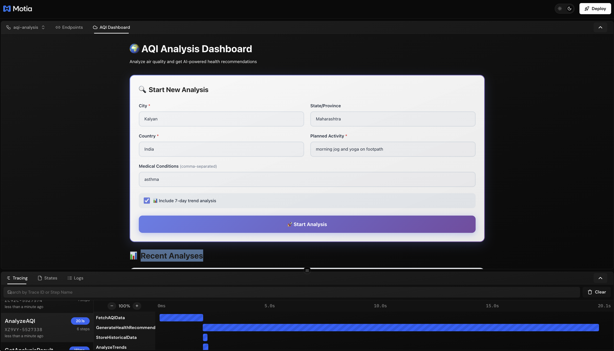
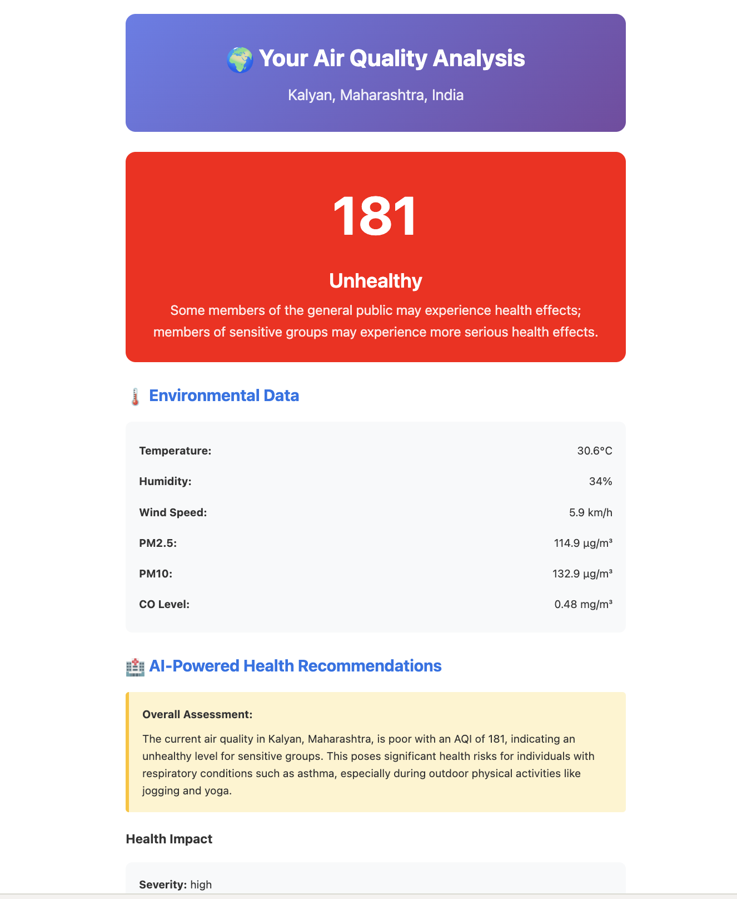

# AQI Analysis System

A comprehensive Air Quality Index (AQI) analysis backend built with Motia, providing real-time air quality monitoring, health recommendations, trend analysis, and alert notifications.


## Features

- ✅ **Real-time AQI Analysis** - Fetch current air quality data for any location
- ✅ **AI Health Recommendations** - Personalized advice based on AQI levels
- ✅ **Trend Analysis** - Track air quality changes over 7 days
- ✅ **Alert System** - Email notifications when AQI exceeds thresholds


## Plugins

- ✅ **AQI Dashboard** - A dashboard for viewing AQI data and recommendations
- ✅ **AQI Analysis** - A plugin for analyzing AQI data



## Architecture

### Main Analysis Flow
```
POST /aqi/analyze
  ↓ (async)
FetchAQIData → GenerateHealthRecommendations
  ↓ (optional)     ↓
AnalyzeTrends   StoreHistoricalData
  ↓
GET /aqi/analyze/:requestId (returns result)
```

### Alert System Flow
```
POST /aqi/alerts/subscribe (create alert)
  ↓
Cron (every hour) → CheckAlert → SendAlertEmail (via Resend)
```

## Quick Start

After setup, start the server:
```bash
npm run dev
```

Then try the API:

```bash
# 1. Start an analysis
REQUEST_ID=$(curl -s -X POST http://localhost:3000/aqi/analyze \
  -H "Content-Type: application/json" \
  -d '{
    "location": {
      "country": "USA",
      "state": "California",
      "city": "Los Angeles"
    },
    "user_context": {
      "planned_activity": "outdoor jogging"
    },
    "include_trends": true
  }' | jq -r '.request_id')

echo "Request ID: $REQUEST_ID"

# 2. Wait a few seconds for processing
sleep 5

# 3. Get the result
curl http://localhost:3000/aqi/analyze/$REQUEST_ID | jq

# 4. Subscribe to alerts (optional)
curl -X POST http://localhost:3000/aqi/alerts/subscribe \
  -H "Content-Type: application/json" \
  -d '{
    "user_id": "user123",
    "email": "your-email@example.com",
    "location": {
      "country": "USA",
      "state": "California",
      "city": "Los Angeles"
    },
    "aqi_threshold": 100
  }' | jq
```

## Setup

1. **Install dependencies**
```bash
npm install
```

2. **Configure environment variables**

Create a `.env` file in the project root:

```env
# AQI Data Sources (provide at least one, both recommended for fallback)
# Primary: Firecrawl - Web scraping from IQAir (slower but free tier available)
FIRECRAWL_API_KEY=your_firecrawl_api_key_here

# Fallback: OpenWeatherMap - Direct API (fast, free tier: 1,000 calls/day)
OPENWEATHER_API_KEY=your_openweathermap_api_key_here

# OpenAI API - For generating AI-powered health recommendations
OPENAI_API_KEY=your_openai_api_key_here

# Resend API - For sending alert email notifications
RESEND_API_KEY=re_your_resend_api_key_here

# Email configuration for Resend
FROM_EMAIL=alerts@yourdomain.com  # Must be verified in Resend
ALERT_RECIPIENTS=your-email@example.com  # Recipient for analysis emails
```

**Where to get API keys:**
- **FIRECRAWL_API_KEY**: Sign up at [firecrawl.dev](https://firecrawl.dev) - Primary source (web scraping)
- **OPENWEATHER_API_KEY**: Sign up at [openweathermap.org/api](https://openweathermap.org/api) - Fallback source (**FREE**)
- **OPENAI_API_KEY**: Get from [platform.openai.com](https://platform.openai.com)
- **RESEND_API_KEY**: Sign up at [resend.com](https://resend.com)
- **FROM_EMAIL**: Must be a verified domain/email in your Resend account
- **ALERT_RECIPIENTS**: Your email address to receive AI-powered analysis results

**💡 Recommended:** Provide **both** FIRECRAWL_API_KEY and OPENWEATHER_API_KEY for automatic fallback if one fails.

3. **Generate types**
```bash
npm run generate-types
```

4. **Start development server**
```bash
npm run dev
```

## API Endpoints Reference

### 1. Analyze AQI (Async)

Start an AQI analysis for a location. Returns immediately with a request ID while processing continues in the background.

**Endpoint:** `POST /aqi/analyze`

**Request Body:**
```json
{
  "location": {
    "country": "USA",
    "state": "California", 
    "city": "Los Angeles"
  },
  "user_context": {
    "planned_activity": "outdoor jogging",
    "sensitivity_level": "moderate",
    "medical_conditions": ["asthma"]
  },
  "include_trends": true
}
```

**Example cURL:**
```bash
curl -X POST http://localhost:3000/aqi/analyze \
  -H "Content-Type: application/json" \
  -d '{
    "location": {
      "country": "USA",
      "state": "California",
      "city": "Los Angeles"
    },
    "user_context": {
      "planned_activity": "outdoor jogging",
      "sensitivity_level": "moderate"
    },
    "include_trends": true
  }'
```

> **Note:** The analysis is processed asynchronously in the background. Poll the GET endpoint to retrieve the final results.

---

### 2. Get Analysis Result

Retrieve the result of an AQI analysis. Poll this endpoint to check if processing is complete.

**Endpoint:** `GET /aqi/analyze/:requestId`

**Example cURL:**
```bash
# Replace REQUEST_ID with the ID from the analyze response
curl http://localhost:3000/aqi/analyze/550e8400-e29b-41d4-a716-446655440000
```

**Response (200 OK - Completed):**
```json
{
  "request_id": "550e8400-e29b-41d4-a716-446655440000",
  "location": {
    "country": "USA",
    "state": "California",
    "city": "Los Angeles"
  },
  "aqi_data": {
    "aqi": 85,
    "temperature": 22.5,
    "humidity": 65,
    "wind_speed": 12.5,
    "pm25": 35.2,
    "pm10": 58.1,
    "co": 0.8,
    "timestamp": "2024-01-15T10:30:00Z",
    "source_url": "https://..."
  },
  "recommendations": {
    "overall_assessment": "Air quality is moderate...",
    "health_impact": {
      "severity": "moderate",
      "description": "...",
      "affected_groups": ["sensitive individuals"]
    },
    "activity_advice": {
      "advisability": "with_caution",
      "precautions": ["..."],
      "alternative_times": ["..."]
    },
    "protective_measures": ["..."],
    "best_time_windows": [...]
  },
  "trends": {
    "trend_direction": "improving",
    "average_aqi": 78,
    "max_aqi": 95,
    "min_aqi": 65,
    "data_points": 24,
    "period_days": 7,
    "analysis": "..."
  },
  "created_at": "2024-01-15T10:30:00Z"
}
```

**Response (202 Accepted - Still Processing):**
```json
{
  "request_id": "550e8400-e29b-41d4-a716-446655440000",
  "status": "generating_recommendations",
  "message": "Analysis is still in progress. Please check again in a few seconds."
}
```

---

### 3. Subscribe to AQI Alerts

Create an alert subscription. You'll receive email notifications when AQI exceeds your threshold.

**Endpoint:** `POST /aqi/alerts/subscribe`

**Request Body:**
```json
{
  "user_id": "user123",
  "email": "user@example.com",
  "location": {
    "country": "USA",
    "state": "California",
    "city": "Los Angeles"
  },
  "aqi_threshold": 100
}
```

**Example cURL:**
```bash
curl -X POST http://localhost:3000/aqi/alerts/subscribe \
  -H "Content-Type: application/json" \
  -d '{
    "user_id": "user123",
    "email": "user@example.com",
    "location": {
      "country": "USA",
      "state": "California",
      "city": "Los Angeles"
    },
    "aqi_threshold": 100
  }'
```

**Response (201 Created):**
```json
{
  "alert_id": "alert-550e8400-e29b-41d4-a716-446655440000",
  "message": "Alert subscription created successfully"
}
```

**Alert Email Preview:**

## Output in Plugin


## Output in Email


When AQI exceeds threshold, you'll receive an email like:

```
Subject: 🚨 AQI Alert: Los Angeles, California, USA - 125 (Unhealthy for Sensitive Groups)

🚨 AQI Alert for Los Angeles, California, USA

The air quality has exceeded your threshold.

• Current AQI: 125 (Unhealthy for Sensitive Groups)
• Your Threshold: 100
• Temperature: 28°C
• Humidity: 45%
• PM2.5: 55.3 µg/m³
• PM10: 89.7 µg/m³

Health Impact: Increased likelihood of respiratory symptoms...
Recommendations: Reduce prolonged outdoor exertion...
```

## Project Structure

```
flows-demo-app/
├── steps/                    # Motia step definitions
│   └── aqi-analysis/
│       ├── analyze/          # Main analysis endpoints
│       ├── fetch-data/       # AQI data fetching
│       ├── recommendations/  # AI recommendations
│       ├── trends/           # Trend analysis
│       ├── historical/       # Data storage
│       └── alerts/           # Alert system
├── src/
│   ├── services/             # Business logic
│   ├── types/                # TypeScript types
│   └── utils/                # Utility functions
└── docs/                     # Documentation
```

## How It Works

### Analysis Flow (Async Pattern)
1. **User sends request** → `POST /aqi/analyze`
2. **System returns immediately** → `202 Accepted` with `request_id`
3. **Background processing:**
   - Fetches AQI data (tries Firecrawl, falls back to OpenWeatherMap)
   - AI generates personalized recommendations via OpenAI (GPT-4)
   - Optional: Analyzes 7-day trends (if `include_trends: true`)
   - Stores historical data
   - **Automatically sends beautiful HTML email** with full AI-powered analysis 📧
4. **User polls for result** → `GET /aqi/analyze/:requestId` until status is `completed`

### Alert Flow
1. **User subscribes** → `POST /aqi/alerts/subscribe`
2. **Cron runs hourly** → Checks all subscriptions
3. **Fetches current AQI** → For each subscribed location
4. **Sends email if threshold exceeded** → Via Resend

## State Management

The system uses Motia's state management with the following groups:
- `aqi-requests` - Ongoing analysis requests
- `aqi-results` - Completed analysis results
- `aqi-trends` - Historical trend data
- `historical-data` - Stored AQI measurements
- `alert-subscriptions` - Active alert subscriptions

## Troubleshooting

### "At least one API key required"
- Make sure `.env` file exists in project root
- Provide at least one of:
  - `FIRECRAWL_API_KEY` from [firecrawl.dev](https://firecrawl.dev)
  - `OPENWEATHER_API_KEY` from [openweathermap.org](https://openweathermap.org/api) (**recommended**)
- For best reliability, provide **both** keys for automatic fallback
- Restart the dev server after changing `.env`

### "FROM_EMAIL not configured" 
- Add `FROM_EMAIL=alerts@yourdomain.com` to `.env`
- Verify the email/domain in your Resend dashboard
- Resend requires domain verification for production use

### Analysis stuck at "Processing..."
- Check logs: `npm run dev` will show errors
- Verify API keys are valid
- Some locations may not have AQI data available

### No alert emails received
- Check Resend dashboard for delivery status
- Verify `FROM_EMAIL` is verified in Resend
- Check spam/junk folder
- Alerts only send when AQI >= threshold

## Tech Stack

- **Framework**: [Motia](https://motia.dev) - Event-driven backend framework
- **Language**: TypeScript
- **Validation**: Zod
- **APIs**: Firecrawl (web scraping) + OpenWeatherMap (fallback), OpenAI (AI), Resend (email)

## License

MIT
