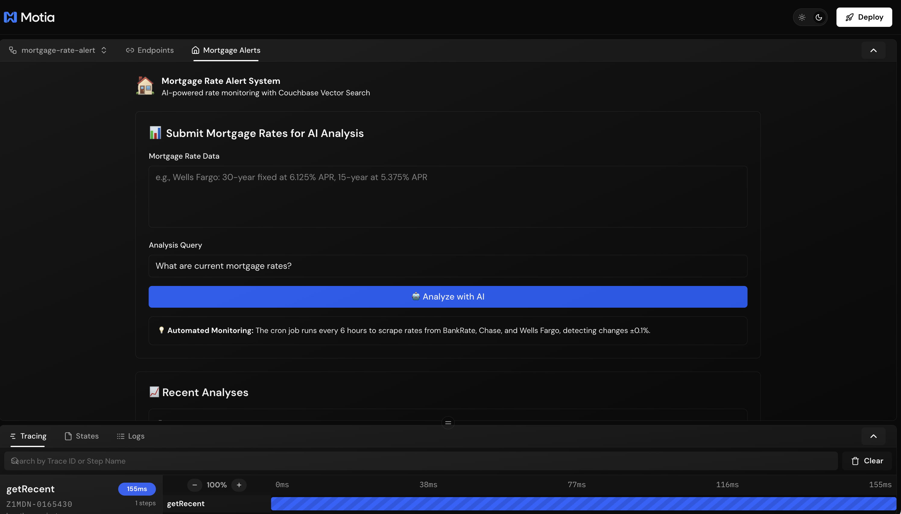

# 🏠 AI-Powered Mortgage Rate Alert System

An intelligent, real-time mortgage rate monitoring and analysis system built with **Motia**, **OpenAI**, **Couchbase Vector Search**, and **Resend**. This system automatically scrapes mortgage rates, stores them in a vector database, and provides AI-powered insights via email.


## ✨ Features

- **🤖 AI-Powered Analysis**: Uses OpenAI GPT-4 to analyze mortgage rate trends and provide insights
- **🔍 Vector Search**: Leverages Couchbase vector search with 1536-dimensional embeddings for semantic similarity
- **📧 Email Alerts**: Beautiful HTML emails with AI analysis delivered via Resend
- **⏰ Automated Monitoring**: Cron-based scheduled rate scraping from multiple sources
- **🌐 Web Scraping**: Fetches live mortgage rates from major lenders
- **📊 CSV Logging**: Tracks all analyses with timestamps and context
- **🔄 Real-time Processing**: Immediate analysis of newly submitted rates

## 🏗️ Architecture

### System Components

1. **Manual Webhook Flow**
   ```
   POST /mortgage_rate_alert → Process Data → Generate Embeddings → 
   Store in Couchbase → Vector Search → AI Analysis → Email + Log
   ```

2. **Automated Monitoring Flow**
   ```
   Cron Job (Daily) → Scrape Websites → Detect Rate Changes → 
   Send Alert Emails
   ```

### Technology Stack

- **Framework**: [Motia](https://motia.dev) - Backend Framework
- **AI**: OpenAI (text-embedding-ada-002, GPT-4)
- **Database**: Couchbase Capella (Vector Search + N1QL)
- **Email**: Resend API
- **Language**: TypeScript (100% type-safe)

## 🚀 Quick Start

### Prerequisites

- Node.js 18+
- Couchbase Capella account
- OpenAI API key
- Resend API key

### Installation

```bash
# Clone the repository
git clone https://github.com/motiadev/motia-examples
cd mortgage-rate-alert

# Install dependencies
npm install

# Generate types
npm run generate-types

# Start development server
npm run dev
```

Server will be available at `http://localhost:3000`

## 🔧 Environment Variables

Create a `.env` file in the root directory:

```bash
# OpenAI Configuration
OPENAI_API_KEY=sk-...

# Couchbase Capella Configuration
COUCHBASE_CONNECTION_STRING=couchbases://cb.xxxxx.cloud.couchbase.com
COUCHBASE_DATA_API_URL=https://xxxxx.data.cloud.couchbase.com
COUCHBASE_USERNAME=your-username
COUCHBASE_PASSWORD=your-password
COUCHBASE_BUCKET=morgage-data
COUCHBASE_SCOPE=_default
COUCHBASE_COLLECTION=_default
COUCHBASE_INDEX=mortgage-vector-index

# Resend Email Configuration
RESEND_API_KEY=re_...
FROM_EMAIL=onboarding@resend.dev
ALERT_RECIPIENTS=email1@example.com,email2@example.com
```

### Couchbase Setup

1. **Create a Vector Search Index** in Couchbase Cloud:
   - Index Name: `mortgage-vector-index`
   - Bucket: `morgage-data`
   - Scope: `_default`
   - Collections: `_default`
   - Add Type Mapping:
     - Field: `embedding`
     - Type: **vector**
     - Dimensions: **1536**
     - Similarity: **dot_product**

2. **Grant User Permissions**:
   - Data Writer
   - Data Reader
   - Search Admin

## 📖 Usage

### 🎨 Plugin UI (Recommended)

The easiest way to interact with the system is through the **Motia Plugin UI**:

1. Start the development server: `npm run dev`
2. Open `http://localhost:3000` in your browser
3. Click on **"Mortgage Alerts 🏠"** in the plugins sidebar

The plugin provides:
- **Manual Rate Submission**: Test the AI analysis with custom mortgage data
- **Automated Rate Fetching**: Trigger cron jobs manually to scrape live rates
- **Recent Analyses**: View the last 10 AI-powered analyses
- **Real-time Status**: Watch processing pipeline in action
- **Quick Testing**: No need for curl commands or Postman



### Manual Rate Submission (API)

You can also use the API directly:

```bash
curl -X POST http://localhost:3000/api/mortgage_rate_alert \
  -H "Content-Type: application/json" \
  -d '{
    "content": "Wells Fargo: 30-year fixed at 6.125% APR, 15-year at 5.375% APR"
  }'
```

The system will:
1. ✅ Chunk the text
2. ✅ Generate embeddings (OpenAI)
3. ✅ Store in Couchbase with vectors
4. ✅ Perform vector search for similar rates
5. ✅ AI analysis with GPT-4
6. ✅ Send email with insights
7. ✅ Log to CSV

### Automated Monitoring

The cron job (`fetchRates.step.ts`) automatically:
- Scrapes mortgage websites daily
- Compares with previous rates
- Detects significant changes (>0.1%)
- Sends alert emails

### View Results

- **Logs**: Check `logs/mortgage-rate-alert-log.csv`
- **Workbench**: Open `http://localhost:3000` for visual flow monitoring

## 📂 Project Structure

```
mortgage-rate-alert/
├── plugins/
│   └── plugin-mortgage-alert/
│       ├── index.tsx             # React UI for testing & monitoring
│       └── package.json          # Plugin configuration
│
├── steps/mortgageRateAlert/
│   ├── webhook.step.ts           # API endpoint for rate submission
│   ├── triggerFetch.step.ts      # API to manually trigger rate fetch
│   ├── getRecent.step.ts         # API to fetch recent analyses
│   ├── processData.step.ts       # Text chunking
│   ├── storeEmbeddings.step.ts   # OpenAI embeddings + Couchbase storage
│   ├── analyzeData.step.ts       # Vector search + AI analysis
│   ├── sendAnalysis.step.ts      # Email AI analysis results
│   ├── logResults.step.ts        # CSV logging
│   ├── fetchRates.step.ts        # Cron job for rate scraping
│   ├── manualFetch.step.ts       # Event handler for manual fetch
│   └── sendAlerts.step.ts        # Email rate change alerts
│
├── src/
│   ├── services/
│   │   ├── openai/               # OpenAI API integration
│   │   ├── couchbase/            # Couchbase vector DB operations
│   │   ├── resend/               # Email service
│   │   └── scraper/              # Web scraping for mortgage rates
│   └── utils/
│       ├── text-chunker.ts       # Text splitting utility
│       └── email-templates.ts    # HTML email generation
│
├── logs/                         # CSV analysis logs
├── package.json
└── README.md
```


## 🧪 Testing

### Test Manual Webhook

```bash
npm run test:webhook
```

### Test Cron Job

The cron job runs automatically based on the schedule defined in `fetchRates.step.ts`. To test manually, modify the cron expression to `* * * * *` (every minute).

## 🐛 Troubleshooting

### FTS Indexing Lag

Vector search may take seconds to minutes to index new documents. The system uses **state-backed immediate access** to bypass this lag for newly submitted rates.

### SSL Certificate Issues

The system disables SSL verification for Couchbase in development:
```typescript
process.env.NODE_TLS_REJECT_UNAUTHORIZED = '0'
```

⚠️ **Remove this in production** and use proper SSL certificates.

## 📊 Monitoring

Access the Motia Workbench at `http://localhost:3000` to:
- View workflow execution traces
- Monitor step durations
- Debug failures
- Visualize data flow

## 📄 License

MIT

## 🙏 Acknowledgments

- [Motia](https://motia.dev) - Workflow orchestration framework
- [OpenAI](https://openai.com) - AI embeddings and chat completions
- [Couchbase](https://www.couchbase.com) - Vector database
- [Resend](https://resend.com) - Email delivery

---

**Built with ❤️ using Motia, TypeScript, and AI**

