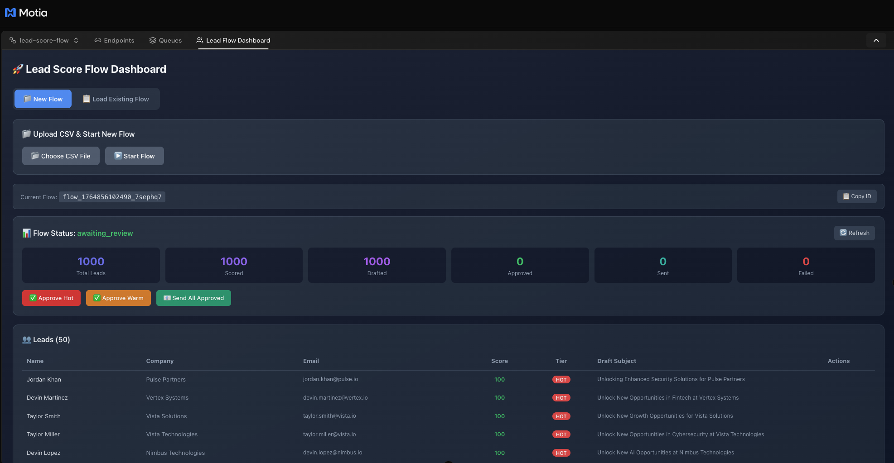
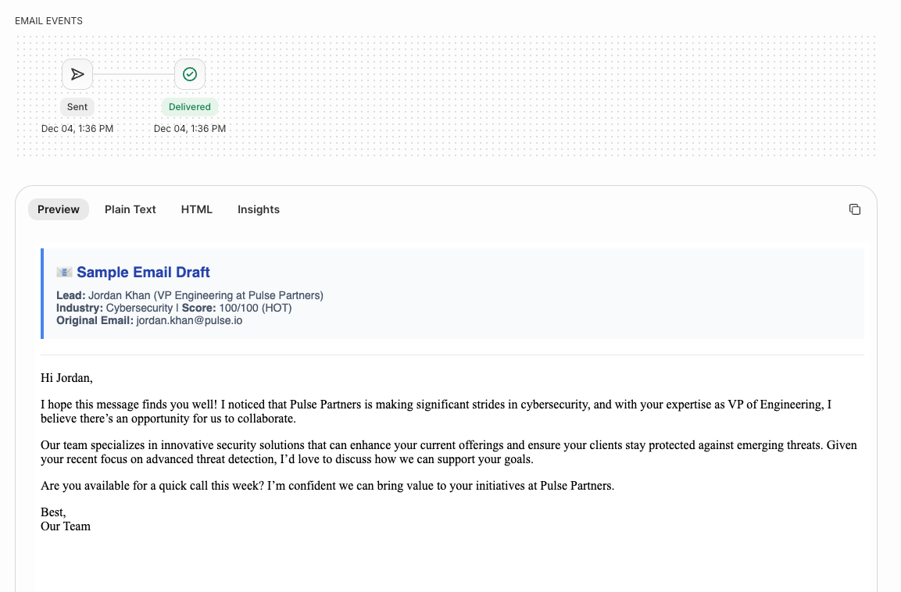

# Lead Score Flow - Motia Backend System

An event-driven backend system for lead scoring, email draft generation, and automated outreach campaigns powered by **Motia**, **LangGraph**, and **Resend**.


## Overview

This system ingests leads from CSV, scores them using LangGraph-based AI analysis, generates personalized email drafts with GPT, and sends campaigns through Resend's email API.

### Key Features

- 🎯 **LangGraph Lead Scoring** - Multi-step AI pipeline (enrich → score → analyze)
- ✉️ **GPT Email Generation** - Personalized drafts based on lead tier (hot/warm/cold)
- 👤 **Human-in-the-Loop** - Review checkpoint before sending campaigns
- 📊 **Batch Processing** - Rate-limited email sending with progress tracking
- 🔄 **Retry Mechanism** - Resend failed emails with one API call
- 📬 **Completion Notifications** - Email alerts when campaigns finish
- 🚀 **Lead Flow Dashboard** - Visual plugin for managing flows in Workbench

## Quick Start

### 1. Install Dependencies

```bash
npm install
```

### 2. Set Environment Variables

Create a `.env` file or export these variables:

```bash
export OPENAI_API_KEY="your-openai-api-key"
export RESEND_API_KEY="your-resend-api-key"
export FROM_EMAIL="onboarding@resend.dev"
export ALERT_RECIPIENTS="your-email@example.com"
```

### 3. Start Development Server

```bash
npm run dev
```

The Motia runtime and **Workbench** UI will be available at [http://localhost:3000](http://localhost:3000).

## Lead Flow Dashboard Plugin

The **Lead Flow Dashboard** is a custom Workbench plugin that provides a visual interface for managing lead scoring workflows.



### Features

- **📁 New Flow** - Upload CSV files and start new scoring flows
- **📋 Load Existing Flow** - Enter a flow ID to resume or check existing flows
- **📊 Real-time Status** - View progress (scored, drafted, approved, sent, failed)
- **✅ Bulk Actions** - Approve hot/warm leads with one click
- **📧 Send Emails** - Send all approved emails or individual sends
- **👥 Leads Table** - View all leads with scores, tiers, and draft subjects

### Loading an Existing Flow


To check a flow that's already been processed:

1. Click the **"Load Existing Flow"** tab
2. Enter the flow ID (e.g., `flow_1764856102490_7sephq7`)
3. Click **"Load Flow"** to view status and results

### Using the API Endpoints

The dashboard uses these real API endpoints under the hood:


## API Endpoints

| Method | Endpoint | Description |
|--------|----------|-------------|
| POST | `/lead-flows/upload` | Upload CSV to start scoring flow |
| GET | `/lead-flows/:flowId/status` | Get flow status and metrics |
| GET | `/lead-flows/:flowId/results` | Get scored leads and drafts |
| POST | `/lead-flows/:flowId/approve` | Approve drafts for sending |
| POST | `/lead-flows/:flowId/send` | Send approved emails |
| POST | `/leads/:flowId/:leadId/send` | Send individual email |
| POST | `/lead-flows/:flowId/retry` | Retry failed emails |

## Testing with curl

### Test 1: Upload Leads CSV

Upload the included `leads.csv` file to start a new flow:

```bash
# Read CSV content and upload
curl -X POST http://localhost:3000/lead-flows/upload \
  -H "Content-Type: application/json" \
  -d '{
    "csvContent": "id,name,company,role,industry,email,website,employee_range,country,notes\n1,Morgan Patel,Nova Software,Head of Sales,SaaS,morgan.patel@nova.io,https://www.nova.io,51-200,DE,Inbound from referral",
    "flowName": "Test Campaign",
    "autoApproveThreshold": 80
  }'
```

**Expected Response:**
```json
{
  "flowId": "flow_1733318400000_abc123",
  "status": "processing",
  "totalLeads": 1,
  "validLeads": 1,
  "invalidLeads": 0,
  "message": "Flow created. Processing 1 leads."
}
```

### Test 2: Check Flow Status

Monitor the flow progress:

```bash
curl http://localhost:3000/lead-flows/{flowId}/status
```

**Expected Response:**
```json
{
  "flowId": "flow_1733318400000_abc123",
  "status": "awaiting_review",
  "progress": {
    "totalLeads": 1000,
    "processedLeads": 1000,
    "scoredLeads": 1000,
    "draftedLeads": 1000,
    "approvedLeads": 0,
    "sentLeads": 0,
    "failedLeads": 0
  }
}
```

### Test 3: Get Scored Results

Retrieve scored leads with email drafts:

```bash
# Get all results
curl http://localhost:3000/lead-flows/{flowId}/results

# Filter by tier
curl "http://localhost:3000/lead-flows/{flowId}/results?tier=hot"

# Filter by minimum score
curl "http://localhost:3000/lead-flows/{flowId}/results?minScore=75"
```

### Test 4: Approve Email Drafts

Approve drafts for sending:

```bash
# Approve all hot leads
curl -X POST http://localhost:3000/lead-flows/{flowId}/approve \
  -H "Content-Type: application/json" \
  -d '{"tier": "hot"}'

# Approve by minimum score
curl -X POST http://localhost:3000/lead-flows/{flowId}/approve \
  -H "Content-Type: application/json" \
  -d '{"minScore": 75}'

# Approve specific leads
curl -X POST http://localhost:3000/lead-flows/{flowId}/approve \
  -H "Content-Type: application/json" \
  -d '{"leadIds": ["1", "2"]}'

# Approve all
curl -X POST http://localhost:3000/lead-flows/{flowId}/approve \
  -H "Content-Type: application/json" \
  -d '{"approveAll": true}'
```

### Test 5: Send Emails

Send approved emails via Resend:

```bash
# Send all approved emails (max 10 by default)
curl -X POST http://localhost:3000/lead-flows/{flowId}/send \
  -H "Content-Type: application/json" \
  -d '{"sendAllApproved": true, "maxRecipients": 5}'

# Send only hot leads
curl -X POST http://localhost:3000/lead-flows/{flowId}/send \
  -H "Content-Type: application/json" \
  -d '{"tier": "hot", "maxRecipients": 10}'
```

### Test 6: Send Individual Email

Send to a specific lead with optional custom content:

```bash
curl -X POST http://localhost:3000/leads/{flowId}/{leadId}/send \
  -H "Content-Type: application/json" \
  -d '{
    "customSubject": "Quick follow-up",
    "customHtml": "<p>Hi there! Just following up on our conversation.</p>"
  }'
```

### Test 7: Retry Failed Emails

Retry any failed email sends:

```bash
curl -X POST http://localhost:3000/lead-flows/{flowId}/retry
```


## Project Structure

```
├── steps/
│   └── lead-flow/
│       ├── upload-csv.step.ts          # CSV upload API endpoint
│       ├── get-flow-status.step.ts     # Flow status API
│       ├── get-flow-results.step.ts    # Results API with filtering
│       ├── approve-emails.step.ts      # Approve drafts API
│       ├── send-emails.step.ts         # Batch send API
│       ├── send-individual-email.step.ts # Individual send API
│       ├── retry-failed-emails.step.ts # Retry API
│       ├── process-csv.step.ts         # CSV processing event
│       ├── score-leads.step.ts         # LangGraph scoring event
│       ├── generate-drafts.step.ts     # GPT draft generation (parallel)
│       ├── drafts-ready.step.ts        # Human-in-loop checkpoint
│       ├── send-batch-emails.step.ts   # Resend batch sending event
│       └── notify-completion.step.ts   # Completion notification event
├── plugins/
│   └── lead-flow-dashboard/
│       └── components/
│           └── LeadFlowDashboard.tsx   # Workbench dashboard plugin
├── src/
│   └── services/
│       ├── lead-service.ts             # Lead parsing & validation
│       ├── scoring-service.ts          # LangGraph scoring logic
│       ├── email-draft-service.ts      # GPT email generation (parallel)
│       └── resend-service.ts           # Resend API integration
├── docs/
│   └── img/                            # Documentation images
├── leads.csv                           # Sample leads data (1000 leads)
├── motia.config.ts                     # Motia configuration with plugin
└── types.d.ts                          # Auto-generated types
```

## Lead Scoring Logic

Leads are scored on a 0-100 scale based on:

| Factor | Weight | High Value |
|--------|--------|------------|
| Industry Fit | 25 pts | SaaS, AI/ML, Fintech, DevTools, Cybersecurity |
| Company Size | 25 pts | 1000+ employees |
| Role Relevance | 25 pts | CTO, VP Engineering, Head of Product, Founder |
| Engagement Signals | 25 pts | "Requested pricing", "Inbound from referral" |

**Tiers:**
- 🔥 **Hot** (80-100): High priority, ready for immediate outreach
- 🌡️ **Warm** (60-79): Good fit, worth nurturing
- ❄️ **Cold** (<60): Lower priority, educational content

## Draft Generation

Email drafts are generated using GPT-4o-mini with **parallel processing** for faster performance:

- **Concurrency**: 10 parallel API calls
- **Progress Tracking**: Real-time updates during generation
- **Fallback Templates**: Automatic fallback if GPT fails
- **Auto-Approve**: Optional threshold to auto-approve high-score leads

For 1000 leads with parallel processing:
- **Sequential**: ~2-3 hours
- **Parallel (10x)**: ~15-30 minutes

## Development Commands

```bash
# Start development server with Workbench
npm run dev

# Generate TypeScript types from Step configs
npm run generate-types

# Build for deployment
npm run build

# Clean build artifacts
npm run clean
```

## Environment Variables

| Variable | Required | Description |
|----------|----------|-------------|
| `OPENAI_API_KEY` | Yes | OpenAI API key for GPT-4 |
| `RESEND_API_KEY` | Yes | Resend API key for email sending |
| `FROM_EMAIL` | Yes | Verified sender email (e.g., `onboarding@resend.dev`) |
| `ALERT_RECIPIENTS` | No | Comma-separated emails for completion notifications |

## Workbench Features

Open [http://localhost:3000](http://localhost:3000) to access:

- **Flow Visualization** - See the complete event pipeline
- **Lead Flow Dashboard** - Custom plugin for managing flows
- **Endpoints Tab** - API documentation with schemas
- **Tracing** - Real-time request/event tracing
- **States** - Inspect stored flow data
- **Logs** - Live logging output

## Screenshots

### Flow Visualization


### Lead Flow Dashboard - New Flow


### Lead Flow Dashboard - Load Existing


### API Endpoints


## Learn More

- [Motia Documentation](https://motia.dev/docs)
- [LangGraph Documentation](https://langchain-ai.github.io/langgraph/)
- [Resend Documentation](https://resend.com/docs)
