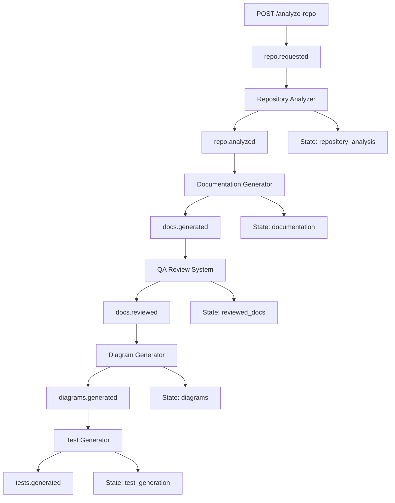

# NVIDIA Docs Motia Agent - Deep Dive Video Script
## Understanding Motia's Power & NVIDIA NIM Synergy

**Title:** "Why Motia + NVIDIA NIM is the Future of AI Automation - Deep Architecture Walkthrough"  
**Duration:** 60-75 minutes  
**Target Audience:** Developers, AI Engineers, DevOps professionals interested in event-driven AI systems

---

## Introduction: The Revolution of Event-Driven AI (5 minutes)

### Opening Hook
"What if I told you that you could build complex AI workflows that automatically scale, handle failures gracefully, and maintain perfect data consistency - all without writing a single line of orchestration code? Today, we're diving deep into Motia, the event-driven framework that's revolutionizing how we build AI applications, and how it creates perfect synergy with NVIDIA NIM's powerful language models."

### The Problem Motia Solves
"Traditional AI applications suffer from three critical problems:
1. **Tight Coupling** - Everything depends on everything else
2. **Poor Error Handling** - One failure breaks the entire pipeline  
3. **Scaling Nightmares** - Adding new features requires rewriting existing code

Motia solves all of these through its event-driven architecture."

### What Makes This Project Special
"This isn't just another documentation generator. It's a masterclass in:
- **Event-Driven Architecture** with Motia
- **AI Model Integration** with NVIDIA NIM
- **Production-Ready Patterns** for real-world applications
- **Scalable Design** that grows with your needs"

---

## Part 1: Motia Framework Deep Dive (15 minutes)

### The Event-Driven Paradigm
"Let's start with the fundamental concept that makes Motia powerful: **Events as First-Class Citizens**"

```typescript
// Traditional approach - tightly coupled
function processRepository(repoUrl: string) {
  const analysis = analyzeRepo(repoUrl);        // Step 1
  const docs = generateDocs(analysis);          // Step 2 depends on 1
  const qa = reviewDocs(docs);                  // Step 3 depends on 2
  const diagrams = createDiagrams(qa);         // Step 4 depends on 3
  return { docs, diagrams };                   // Brittle chain
}

// Motia approach - event-driven
// Each step is independent and reacts to events
repo.requested → repo.analyzed → docs.generated → docs.reviewed → diagrams.generated
```

**Why This Matters:**
- **Resilience**: If one step fails, others continue
- **Scalability**: Add new steps without touching existing code
- **Testability**: Each step can be tested in isolation
- **Monitoring**: Built-in observability for each event

### Motia's Core Architecture Principles

#### 1. **Steps as Pure Functions**
```typescript
// Every Motia step follows this pattern
export const handler: Handlers['step-name'] = async (input, { logger, emit, state }) => {
  // 1. Receive typed input
  // 2. Process data (pure business logic)
  // 3. Emit events for downstream steps
  // 4. Store state for persistence
};
```

#### 2. **Type Safety Throughout**
```typescript
// Motia generates types automatically from your step definitions
interface Handlers {
  'repository-analyzer': EventHandler<
    { repo_url: string },                    // Input type
    { topic: 'repo.analyzed'; data: AnalysisPayload }  // Output event type
  >
}
```

#### 3. **Configuration as Code**
```typescript
export const config: EventConfig = {
  type: 'event',
  name: 'repository-analyzer',
  subscribes: ['repo.requested'],    // What events trigger this step
  emits: ['repo.analyzed'],          // What events this step produces
  input: inputSchema,                // Zod schema for validation
  flows: ['nvidia-doc-flow']         // Which flows this belongs to
};
```

### The Power of Declarative Workflows

"Look at how we define our entire documentation pipeline:"

```typescript
// The entire workflow is just event subscriptions
trigger_analysis.step.ts    → emits: ['repo.requested']
analyze_repo.step.ts       → subscribes: ['repo.requested']     → emits: ['repo.analyzed']
write_docs.step.ts         → subscribes: ['repo.analyzed']      → emits: ['docs.generated']
qa_review.step.ts          → subscribes: ['docs.generated']     → emits: ['docs.reviewed']
render_mermaid.step.ts     → subscribes: ['docs.reviewed']      → emits: ['diagrams.generated']
generate_tests.step.ts     → subscribes: ['diagrams.generated'] → emits: ['tests.generated']
```

**This gives us:**
- **Visual Flow Understanding**: The workflow is self-documenting
- **Easy Modifications**: Change subscriptions to alter the flow
- **Parallel Processing**: Multiple steps can subscribe to the same event
- **Conditional Logic**: Steps can emit different events based on conditions

### State Management & Persistence

```typescript
// Motia provides built-in state management
await state.set('repository_analysis', 'latest_analysis', analysisPayload);
const previousAnalysis = await state.get('repository_analysis', 'latest_analysis');

// Benefits:
// - Automatic serialization/deserialization
// - Namespace organization
// - Persistence across restarts
// - Easy debugging and inspection
```

---

## Part 2: NVIDIA NIM Integration - The AI Powerhouse (12 minutes)

### Why NVIDIA NIM is Perfect for Motia

"NVIDIA NIM (NVIDIA Inference Microservices) provides enterprise-grade AI model serving that perfectly complements Motia's architecture:"

#### 1. **Enterprise-Grade Reliability**
```typescript
export class NIMClient {
  constructor() {
    this.apiKey = process.env.NVIDIA_NIM_API_KEY || '';
    this.baseURL = process.env.NVIDIA_BASE_URL || 'https://integrate.api.nvidia.com/v1';
    
    if (!this.apiKey) {
      throw new Error('NVIDIA_NIM_API_KEY is required');
    }
  }

  async chat(prompt: string, model: string = 'meta/llama-3.3-70b-instruct'): Promise<string> {
    // Production-ready error handling
    // Automatic retries
    // Request/response logging
    // Model flexibility
  }
}
```

#### 2. **Model Flexibility & Performance**
"Notice how we use different models for different tasks:"

```typescript
// Heavy analysis tasks - Use powerful models
const summary = await nim.chat(summaryPrompt, 'meta/llama-3.3-70b-instruct');

// Quick generation tasks - Use efficient models  
const overview = await nim.chat(overviewPrompt, 'meta/llama-3.1-8b-instruct');

// Specialized tasks - Use domain-specific models
const code = await nim.chat(codePrompt, 'nvidia/nemotron-4-340b-instruct');
```

**Benefits:**
- **Cost Optimization**: Right model for the right task
- **Performance Tuning**: Balance speed vs quality
- **Scalability**: NVIDIA's infrastructure handles the load
- **Latest Models**: Access to cutting-edge AI capabilities

#### 3. **Seamless Integration with Motia's Event System**

```typescript
// Each step can use different AI strategies
export const handler: Handlers['documentation-generator'] = async (input, { emit, logger }) => {
  // Parallel AI generation with different models
  const [overview, architecture, gettingStarted, apiReference] = await Promise.all([
    generateOverview(input, 'meta/llama-3.1-8b-instruct'),      // Fast for simple content
    generateArchitecture(input, 'meta/llama-3.3-70b-instruct'), // Powerful for complex analysis
    generateGettingStarted(input, 'meta/llama-3.1-8b-instruct'), // Fast for structured content
    generateApiReference(input, 'nvidia/nemotron-4-340b-instruct') // Specialized for code
  ]);
  
  // Emit results for next step
  await emit({ topic: 'docs.generated', data: documentationPayload });
};
```

### Template-Driven AI Prompting

"One of the most powerful patterns in our system is template-driven prompting:"

```typescript
// prompts/write_docs/overview.mustache
`You are a senior technical writer. Create a comprehensive overview for this repository.

Repository: {{repoUrl}}
Primary Language: {{primaryLanguage}}
Total Files: {{totalFiles}}
Summary: {{summary}}

Generate a professional overview that includes:
1. Project purpose and functionality
2. Key features and capabilities  
3. Technology stack overview
4. Target audience
5. Primary use cases

Write in clear Markdown format (300-400 words).`
```

**Why This Approach is Powerful:**
- **Consistency**: Same prompt structure across all generations
- **Maintainability**: Update prompts without touching code
- **Experimentation**: A/B test different prompt strategies
- **Localization**: Easy to support multiple languages
- **Version Control**: Track prompt changes over time

---

## Part 3: Repository Analysis Engine - Intelligence at Scale (10 minutes)

### Smart File System Analysis

"Let's examine how we intelligently analyze repositories:"

```typescript
const EXT_TO_LANG: Record<string, string> = {
  '.py': 'python', '.ts': 'typescript', '.js': 'javascript',
  '.jsx': 'javascript', '.tsx': 'typescript', '.java': 'java',
  '.go': 'go', '.rb': 'ruby', '.cpp': 'cpp', '.c': 'c',
  '.rs': 'rust', '.kt': 'kotlin', '.swift': 'swift'
  // ... comprehensive language detection
};

const SKIP_DIRS = new Set([
  '.git', '.github', 'node_modules', '__pycache__', 
  '.pytest_cache', 'venv', '.venv', 'env', '.env',
  'dist', 'build', '.DS_Store', 'coverage', '.nyc_output'
]);
```

**Intelligent Filtering:**
- **Performance**: Skip irrelevant directories (node_modules, .git)
- **Security**: Avoid sensitive files (.env, credentials)
- **Accuracy**: Focus on actual source code
- **Scalability**: Handle large repositories efficiently

### Repository Structure Detection

```typescript
function analyzeRepositoryStructure(files: FileData[]): RepositoryStructure {
  const filePaths = files.map(f => f.path.toLowerCase());
  
  return {
    has_readme: filePaths.some(p => p.startsWith('readme')),
    has_license: filePaths.some(p => p.includes('license')),
    has_tests: filePaths.some(p => 
      p.includes('test') || p.includes('spec') || p.includes('__tests__')
    ),
    has_docs: filePaths.some(p => p.includes('doc') || p.startsWith('docs/')),
    has_package_json: filePaths.includes('package.json'),
    has_dockerfile: filePaths.some(p => p.includes('dockerfile'))
  };
}
```

**Why This Matters for AI Generation:**
- **Context Awareness**: AI knows what type of project it's analyzing
- **Template Selection**: Different templates for different project types
- **Quality Metrics**: Better documentation for well-structured projects
- **Recommendations**: Suggest missing components (tests, docs, etc.)

### Secure & Efficient Repository Cloning

```typescript
function cloneRepository(repoUrl: string): string {
  const tempDir = fs.mkdtempSync(path.join(os.tmpdir(), 'repo-analysis-'));
  
  try {
    execSync(`git clone --depth 1 "${repoUrl}" "${tempDir}"`, {
      stdio: 'pipe',        // Capture output securely
      timeout: 60000        // 60-second timeout
    });
    return tempDir;
  } catch (error) {
    fs.rmSync(tempDir, { recursive: true, force: true }); // Cleanup on failure
    throw new Error(`Failed to clone repository: ${errorMessage}`);
  }
}
```

**Production-Ready Patterns:**
- **Shallow Clone**: `--depth 1` for faster cloning
- **Timeout Protection**: Prevent hanging on large repos
- **Automatic Cleanup**: No leftover temporary files
- **Error Handling**: Graceful failure with meaningful messages
- **Security**: Controlled execution environment

---

## Part 4: Documentation Generation - AI-Powered Content Creation (12 minutes)

### Multi-Section Parallel Generation

"Here's where Motia's architecture really shines - parallel AI generation:"

```typescript
export async function generateDocumentation(
  analysis: RepositoryAnalysis, 
  logger: { info: Function }
): Promise<DocumentationPayload> {
  
  logger.info('Starting parallel documentation generation...');
  
  // Generate all sections simultaneously - massive time savings!
  const [overview, architecture, gettingStarted, apiReference] = await Promise.all([
    generateOverview(analysis),      // ~3-5 seconds
    generateArchitecture(analysis),  // ~4-6 seconds  
    generateGettingStarted(analysis), // ~3-4 seconds
    generateApiReference(analysis)   // ~4-5 seconds
  ]);
  
  // Total time: ~6 seconds instead of ~18 seconds sequential
}
```

**Performance Benefits:**
- **3x Faster**: Parallel execution vs sequential
- **Resource Efficient**: Maximize NVIDIA NIM throughput
- **Better UX**: Faster response times for users
- **Scalable**: Easily add more sections without time penalty

### Template-Driven Content Generation

"Each section uses specialized templates for consistent, high-quality output:"

```typescript
// prompts/write_docs/architecture.mustache
async function generateArchitecture(analysis: RepositoryAnalysis): Promise<string> {
  const template = await fs.promises.readFile(
    'prompts/write_docs/architecture.mustache', 'utf-8'
  );
  
  const templateData = {
    repoUrl: analysis.repo_url,
    primaryLanguage: analysis.statistics.primary_language,
    topFiles: analysis.files.slice(0, 20).map(f => `${f.path} (${f.language})`),
    languageDistribution: getTopLanguagesString(analysis.statistics.language_breakdown),
    hasTests: analysis.repository_structure.has_tests,
    hasDockerfile: analysis.repository_structure.has_dockerfile
  };
  
  const prompt = Mustache.render(template, templateData);
  return await nim.chat(prompt, 'meta/llama-3.1-8b-instruct');
}
```

**Template Strategy Benefits:**
- **Consistency**: Same structure across all repositories
- **Customization**: Easy to modify for different domains
- **A/B Testing**: Compare different prompt approaches
- **Maintenance**: Update prompts without code changes
- **Quality Control**: Standardized output format

### Data Processing & Visualization

```typescript
function generateLanguageBreakdownTable(languageBreakdown: Record<string, number>): string {
  const sortedLanguages = Object.entries(languageBreakdown)
    .sort(([, a], [, b]) => b - a)    // Sort by file count
    .slice(0, 10);                    // Top 10 languages only
  
  const totalFiles = Object.values(languageBreakdown).reduce((sum, count) => sum + count, 0);
  
  const tableData = [
    ['Language', 'Files', 'Percentage'],
    ...sortedLanguages.map(([language, count]) => [
      language,
      count.toString(),
      `${((count / totalFiles) * 100).toFixed(1)}%`
    ])
  ];
  
  return markdownTable(tableData);  // Beautiful markdown tables
}
```

**Data Processing Excellence:**
- **Statistical Analysis**: Meaningful insights from raw data
- **Visual Presentation**: Tables, charts, and formatted output
- **Performance**: Efficient processing of large datasets
- **Accuracy**: Proper percentage calculations and rounding

---

## Part 5: Quality Assurance System - AI-Powered Review (8 minutes)

### Automated Quality Analysis

"This is where our system becomes truly intelligent - AI reviewing AI-generated content:"

```typescript
async function analyzeDocumentationQuality(
  documentation: string, 
  repoUrl: string
): Promise<QualityMetrics> {
  
  const template = await fs.promises.readFile(
    'prompts/qa_review/quality_analysis.mustache', 'utf-8'
  );
  
  const templateData = { 
    repoUrl, 
    documentationPreview: documentation.substring(0, 2000) 
  };
  
  const prompt = Mustache.render(template, templateData);
  const response = await nim.chat(prompt, 'meta/llama-3.1-8b-instruct');
  
  // Parse structured JSON response
  return JSON.parse(response);
}
```

**Quality Metrics Structure:**
```typescript
interface QualityMetrics {
  completeness_score: number;    // 0-100: Are all sections complete?
  clarity_score: number;         // 0-100: Is content clear and well-structured?
  accuracy_score: number;        // 0-100: Does content match the repository?
  issues_found: string[];        // Specific problems identified
  improvements_made: string[];   // Enhancements applied
}
```

### Intelligent Section Enhancement

```typescript
async function enhanceSection(
  sectionName: keyof EnhancedSections, 
  originalContent: string, 
  input: ReviewInput
): Promise<string> {
  
  const MIN_SECTION_LENGTH = 300;
  
  // Only enhance if content is too short
  if (originalContent.length >= MIN_SECTION_LENGTH) {
    return originalContent;
  }
  
  // Use section-specific enhancement templates
  const templates: Record<string, string> = {
    overview: 'prompts/qa_review/overview_enhancement.mustache',
    architecture: 'prompts/qa_review/architecture_enhancement.mustache',
    getting_started: 'prompts/qa_review/getting_started_enhancement.mustache',
    api_reference: 'prompts/qa_review/api_reference_enhancement.mustache'
  };
  
  // Context-aware enhancement
  const templateData = {
    repoUrl: input.repo_url,
    primaryLanguage: input.source_analysis.statistics?.primary_language || 'unknown',
    totalFiles: input.source_analysis.statistics?.total_files || 0,
    hasTests: input.source_analysis.repository_structure?.has_tests || false,
    originalContent
  };
  
  const enhancedContent = await nim.chat(enhancementPrompt, 'meta/llama-3.1-8b-instruct');
  return enhancedContent.trim();
}
```

**Smart Enhancement Strategy:**
- **Selective Enhancement**: Only improve content that needs it
- **Context Preservation**: Keep good content unchanged
- **Targeted Improvement**: Section-specific enhancement logic
- **Quality Thresholds**: Measurable improvement criteria

---

## Part 6: Visual Diagram Generation - AI-Created Architecture (8 minutes)

### Multi-Diagram Generation Strategy

"Our system creates five different types of diagrams to provide comprehensive visual documentation:"

```typescript
async function generateAllDiagrams(payload: DiagramInput): Promise<DiagramData[]> {
  const analysis = payload.source_analysis;
  const repoName = payload.repo_url.split('/').pop() || 'repository';
  const diagrams: DiagramData[] = [];
  
  // 1. Architecture Diagram - System components and relationships
  const architectureDiagram = await generateArchitectureDiagram(analysis, payload.repo_url);
  diagrams.push({
    type: 'architecture',
    title: `${repoName} Architecture`,
    content: architectureDiagram,
    filename: `${repoName}_architecture.mmd`,
    description: 'High-level system architecture showing main components and their relationships'
  });
  
  // 2. Workflow Diagram - Development and usage processes
  const workflowDiagram = await generateWorkflowDiagram(analysis, payload.repo_url);
  diagrams.push({
    type: 'workflow',
    title: `${repoName} Workflow`,
    content: workflowDiagram,
    filename: `${repoName}_workflow.mmd`,
    description: 'Development and usage workflow for the repository'
  });
  
  // 3. Component Diagram - Module dependencies
  const componentDiagram = await generateComponentDiagram(analysis, payload.repo_url);
  diagrams.push({
    type: 'component',
    title: `${repoName} Components`,
    content: componentDiagram,
    filename: `${repoName}_components.mmd`,
    description: 'Component relationships and module dependencies'
  });
  
  // 4. Data Flow Diagram - Data processing paths
  const dataFlowDiagram = await generateDataFlowDiagram(analysis, payload.repo_url);
  diagrams.push({
    type: 'dataflow',
    title: `${repoName} Data Flow`,
    content: dataFlowDiagram,
    filename: `${repoName}_dataflow.mmd`,
    description: 'Data processing and transformation flow'
  });
  
  // 5. Directory Structure - Repository organization
  const directoryDiagram = generateDirectoryStructureDiagram(analysis);
  diagrams.push({
    type: 'directory',
    title: `${repoName} Directory Structure`,
    content: directoryDiagram,
    filename: `${repoName}_directory.mmd`,
    description: 'Visual representation of the repository folder structure'
  });
  
  return diagrams;
}
```

### Context-Aware Diagram Generation

```typescript
async function generateArchitectureDiagram(
  analysis: DiagramInput['source_analysis'], 
  repoUrl: string
): Promise<string> {
  
  const template = await fs.promises.readFile(
    'prompts/render_mermaid/architecture_diagram.mustache', 'utf-8'
  );
  
  // Rich context for AI diagram generation
  const templateData = {
    repoUrl,
    primaryLanguage: analysis.statistics?.primary_language || 'unknown',
    fileTypes: Object.keys(analysis.statistics?.language_breakdown || {}).join(', '),
    hasTests: analysis.repository_structure?.has_tests || false,
    hasPackageJson: analysis.repository_structure?.has_package_json || false,
    hasDockerfile: analysis.repository_structure?.has_dockerfile || false,
    totalFiles: analysis.statistics?.total_files || 0,
    topDirectories: getTopDirectories(analysis.files || [])
  };
  
  const prompt = Mustache.render(template, templateData);
  const response = await nim.chat(prompt, 'meta/llama-3.1-8b-instruct');
  
  return response.trim();
}
```

**Diagram Generation Benefits:**
- **Multiple Perspectives**: Different views of the same system
- **Mermaid Format**: Industry-standard, renderable diagrams
- **Context-Aware**: Diagrams reflect actual repository structure
- **Automated**: No manual diagram creation required
- **Consistent**: Same quality across all repositories

---

## Part 7: Test Generation System - Comprehensive Test Coverage (8 minutes)

### Intelligent Framework Detection

```typescript
function detectTestingFrameworks(analysis: TestsInput['source_analysis']): { [language: string]: string } {
  const frameworks: { [language: string]: string } = {};
  const languageBreakdown = analysis.statistics?.language_breakdown || {};
  
  // Smart framework selection based on ecosystem
  if (languageBreakdown.typescript || languageBreakdown.javascript) {
    frameworks.typescript = 'jest';    // Most popular for TS/JS
    frameworks.javascript = 'jest';
  }
  
  if (languageBreakdown.python) {
    frameworks.python = 'pytest';     // Python standard
  }
  
  if (languageBreakdown.java) {
    frameworks.java = 'junit';         // Java standard
  }
  
  if (languageBreakdown.go) {
    frameworks.go = 'testing';         // Go built-in
  }
  
  return frameworks;
}
```

### Multi-Level Test Generation

```typescript
export async function generateTests(
  input: TestsInput, 
  logger: { info: Function }
): Promise<GeneratedTestsPayload> {
  
  const frameworks = detectTestingFrameworks(input.source_analysis);
  const testSuites: TestSuite[] = [];
  
  // Generate tests for each detected language/framework
  for (const [language, framework] of Object.entries(frameworks)) {
    logger.info(`Generating tests for ${language}/${framework}...`);
    
    // Unit Tests - Test individual functions/methods
    const unitTests = await generateUnitTests(
      input.source_analysis, input.repo_url, language, framework
    );
    testSuites.push(unitTests);
    
    // Integration Tests - Test module interactions
    const integrationTests = await generateIntegrationTests(
      input.source_analysis, input.repo_url, language, framework
    );
    testSuites.push(integrationTests);
    
    // Rate limiting between requests
    await new Promise(resolve => setTimeout(resolve, 1000));
  }
  
  // End-to-End Tests - Test complete workflows
  logger.info('Generating end-to-end tests...');
  const e2eTests = await generateE2ETests(input.source_analysis, input.repo_url);
  testSuites.push(e2eTests);
  
  return {
    repo_url: input.repo_url,
    test_suites: testSuites,
    summary: {
      total_test_files: testSuites.length,
      total_test_cases: testSuites.reduce((sum, suite) => sum + suite.test_count, 0),
      languages_covered: [...new Set(testSuites.map(s => s.language))],
      frameworks_used: [...new Set(testSuites.map(s => s.framework))]
    },
    files_created: savedFiles,
    generated_at: new Date().toISOString()
  };
}
```

**Test Generation Strategy:**
- **Comprehensive Coverage**: Unit, Integration, and E2E tests
- **Language-Specific**: Appropriate frameworks for each language
- **Production-Ready**: Real test code that can be executed
- **Organized Structure**: Clear file organization and naming
- **Metrics Tracking**: Count test cases and coverage

---

## Part 8: Event Flow & State Management - Motia's Orchestration Magic (10 minutes)

### Complete Event Flow Visualization

"Let's trace through the entire event flow to understand Motia's orchestration:"



### Event-Driven Benefits in Action

#### 1. **Resilience Through Isolation**
```typescript
// If documentation generation fails, other steps continue
export const handler: Handlers['documentation-generator'] = async (input, { logger, emit, state }) => {
  try {
    const payload = await generateDocumentation(input, logger);
    await emit({ topic: 'docs.generated', data: payload });
    await state.set('documentation', 'latest_docs', payload);
  } catch (error) {
    // Emit error event instead of crashing the entire pipeline
    await emit({ 
      topic: 'docs.generation.error', 
      data: { repo_url: input.repo_url, error: getErrorMessage(error) }
    });
    
    // Other steps can still proceed with fallback data
    throw error; // Let Motia handle retry logic
  }
};
```

#### 2. **Parallel Processing Opportunities**
```typescript
// Multiple steps can subscribe to the same event
// These could run in parallel:
'qa_review.step.ts'        → subscribes: ['docs.generated']
'diagram_generator.step.ts' → subscribes: ['docs.generated'] 
'summary_generator.step.ts' → subscribes: ['docs.generated']

// Motia automatically handles parallel execution
```

#### 3. **Easy Feature Addition**
```typescript
// Want to add email notifications? Just create a new step:
export const config: EventConfig = {
  type: 'event',
  name: 'notification-sender',
  subscribes: ['tests.generated'],  // Listen to final step
  emits: ['notifications.sent'],
  // ... rest of config
};

// No changes to existing code required!
```

### State Management Deep Dive

```typescript
// Motia's state system provides powerful persistence
interface StateOperations {
  // Hierarchical storage
  set(namespace: string, key: string, value: any): Promise<void>;
  get(namespace: string, key: string): Promise<any>;
  
  // Atomic operations
  update(namespace: string, key: string, updater: (current: any) => any): Promise<void>;
  
  // Cleanup
  delete(namespace: string, key?: string): Promise<void>;
}

// Example usage across steps
export const handler: Handlers['repository-analyzer'] = async (input, { state, emit }) => {
  const analysis = await analyzeRepository(input.repo_url);
  
  // Store for later steps
  await state.set('repository_analysis', 'latest_analysis', analysis);
  await state.set('repository_analysis', 'metadata', {
    analyzed_at: new Date().toISOString(),
    version: '1.0',
    analyzer_version: process.env.npm_package_version
  });
  
  await emit({ topic: 'repo.analyzed', data: analysis });
};

// Later steps can access this data
export const handler: Handlers['documentation-generator'] = async (input, { state }) => {
  // Access previous analysis if needed
  const previousAnalysis = await state.get('repository_analysis', 'latest_analysis');
  const metadata = await state.get('repository_analysis', 'metadata');
  
  // Use for enhanced documentation generation
};
```

**State Management Benefits:**
- **Persistence**: Data survives restarts and failures
- **Debugging**: Inspect state at any point in the workflow
- **Caching**: Avoid re-computation of expensive operations
- **Audit Trail**: Track what happened and when
- **Recovery**: Resume workflows from any point

---

## Part 9: Production Patterns & Best Practices (8 minutes)

### Error Handling & Resilience

```typescript
// Comprehensive error handling utility
export function getErrorMessage(error: unknown): string {
  if (error instanceof Error) {
    return error.message;
  }
  if (typeof error === 'string') {
    return error;
  }
  if (error && typeof error === 'object' && 'message' in error) {
    return String(error.message);
  }
  return 'Unknown error occurred';
}

// Graceful degradation pattern
async function generateSummary(
  repoUrl: string,
  stats: RepositoryStats,
  structure: RepositoryStructure
): Promise<string> {
  try {
    const summaryPrompt = await buildSummaryPrompt(repoUrl, stats, structure);
    return await nim.chat(summaryPrompt, 'meta/llama-3.3-70b-instruct');
  } catch (error) {
    const errorMessage = getErrorMessage(error);
    logger.error('Error generating AI summary:', errorMessage);
    
    // Fallback to template-based summary
    return `Repository Analysis Summary
    
Repository: ${repoUrl}
Primary Language: ${stats.primary_language}
Total Files: ${stats.total_files}
Size: ${stats.total_size_kb}KB

This ${stats.primary_language} project contains ${stats.total_files} files across multiple languages. 
${structure.has_tests ? 'Includes test suite.' : 'No tests detected.'}
${structure.has_docs ? 'Has documentation.' : 'Limited documentation.'}
${structure.has_package_json ? 'Uses package management.' : ''}`;
  }
}
```

### Performance Optimization Patterns

```typescript
// 1. Parallel Processing
const [overview, architecture, gettingStarted, apiReference] = await Promise.all([
  generateOverview(analysis),
  generateArchitecture(analysis),
  generateGettingStarted(analysis),
  generateApiReference(analysis)
]);

// 2. Efficient File Processing
const LARGE_FILE_THRESHOLD = 1024 * 1024; // 1MB
const MAX_FILES_TO_ANALYZE = 1000;

function analyzeDirectory(dirPath: string) {
  const files: FileData[] = [];
  
  function walkDirectory(currentPath: string): void {
    const items = fs.readdirSync(currentPath);
    
    for (const item of items) {
      // Skip hidden files and directories
      if (item.startsWith('.') && !item.match(/\.(env|gitignore|dockerignore)$/)) continue;
      
      // Skip common build/cache directories
      if (SKIP_DIRS.has(item)) continue;
      
      const fullPath = path.join(currentPath, item);
      const stat = fs.statSync(fullPath);
      
      if (stat.isDirectory()) {
        walkDirectory(fullPath);
      } else if (stat.isFile() && stat.size <= LARGE_FILE_THRESHOLD) {
        files.push(createFileData(fullPath, stat));
        
        // Prevent memory issues with huge repositories
        if (files.length >= MAX_FILES_TO_ANALYZE) break;
      }
    }
  }
  
  walkDirectory(dirPath);
  return files;
}

// 3. Memory Management
function cloneRepository(repoUrl: string): string {
  const tempDir = fs.mkdtempSync(path.join(os.tmpdir(), 'repo-analysis-'));
  
  try {
    // Shallow clone for performance
    execSync(`git clone --depth 1 "${repoUrl}" "${tempDir}"`, {
      stdio: 'pipe',
      timeout: 60000,
      maxBuffer: 1024 * 1024 * 10 // 10MB buffer
    });
    return tempDir;
  } catch (error) {
    // Always cleanup on failure
    fs.rmSync(tempDir, { recursive: true, force: true });
    throw new Error(`Failed to clone repository: ${getErrorMessage(error)}`);
  }
}
```

### Security Best Practices

```typescript
// 1. Environment Variable Validation
export class NIMClient {
  constructor() {
    this.apiKey = process.env.NVIDIA_NIM_API_KEY || '';
    this.baseURL = process.env.NVIDIA_BASE_URL || 'https://integrate.api.nvidia.com/v1';
    
    // Fail fast on missing credentials
    if (!this.apiKey) {
      throw new Error('NVIDIA_NIM_API_KEY is required in .env file');
    }
    
    // Validate URL format
    try {
      new URL(this.baseURL);
    } catch {
      throw new Error('NVIDIA_BASE_URL must be a valid URL');
    }
  }
}

// 2. Input Validation with Zod
const inputSchema = z.object({
  repo_url: z.string().url('Must be a valid GitHub URL').refine(
    (url) => url.includes('github.com'),
    'Only GitHub repositories are supported'
  )
});

// 3. Secure File Operations
function sanitizePath(filePath: string): string {
  // Prevent directory traversal attacks
  const normalized = path.normalize(filePath);
  if (normalized.includes('..')) {
    throw new Error('Invalid file path detected');
  }
  return normalized;
}

// 4. Rate Limiting
class RateLimiter {
  private requests: number[] = [];
  
  async checkLimit(maxRequests: number, windowMs: number): Promise<void> {
    const now = Date.now();
    this.requests = this.requests.filter(time => now - time < windowMs);
    
    if (this.requests.length >= maxRequests) {
      const oldestRequest = Math.min(...this.requests);
      const waitTime = windowMs - (now - oldestRequest);
      await new Promise(resolve => setTimeout(resolve, waitTime));
    }
    
    this.requests.push(now);
  }
}
```

---

## Part 10: Why Motia + NVIDIA NIM is Revolutionary (5 minutes)

### The Perfect Synergy

#### 1. **Motia's Strengths Complement NVIDIA NIM's Power**

```typescript
// Motia provides:
// ✅ Event-driven orchestration
// ✅ Type safety and validation  
// ✅ State management
// ✅ Error handling and resilience
// ✅ Scalable architecture

// NVIDIA NIM provides:
// ✅ Enterprise-grade AI models
// ✅ High-performance inference
// ✅ Model flexibility
// ✅ Reliable API infrastructure
// ✅ Cost-effective scaling
```

#### 2. **Real-World Production Benefits**

**Scalability:**
```typescript
// Easy horizontal scaling
// Each step can be scaled independently
// NVIDIA NIM handles AI model scaling
// Motia handles workflow orchestration

// Add more documentation generators:
const docGenerators = Array.from({ length: 5 }, () => 
  new DocumentationGenerator()
);

// Motia automatically load balances
```

**Reliability:**
```typescript
// Built-in retry logic
export const config: EventConfig = {
  retryPolicy: {
    maxRetries: 3,
    backoffStrategy: 'exponential',
    retryableErrors: ['RATE_LIMIT', 'TIMEOUT', 'NETWORK_ERROR']
  }
};

// Circuit breaker pattern
if (failureRate > 0.5) {
  // Fallback to cached responses or simplified generation
  return generateFallbackDocumentation(analysis);
}
```

**Cost Optimization:**
```typescript
// Smart model selection based on task complexity
function selectOptimalModel(task: TaskType, contentLength: number): string {
  if (task === 'simple_generation' && contentLength < 1000) {
    return 'meta/llama-3.1-8b-instruct';  // Fast and cheap
  }
  
  if (task === 'complex_analysis' || contentLength > 5000) {
    return 'meta/llama-3.3-70b-instruct'; // Powerful but expensive
  }
  
  return 'meta/llama-3.1-8b-instruct'; // Good balance
}
```

#### 3. **Developer Experience Excellence**

```typescript
// Type-safe development
interface Handlers {
  'repository-analyzer': EventHandler<
    { repo_url: string },
    { topic: 'repo.analyzed'; data: AnalysisPayload }
  >
}

// Auto-generated types mean:
// ✅ IntelliSense support
// ✅ Compile-time error checking
// ✅ Refactoring safety
// ✅ Documentation in code
```

### Future-Proof Architecture

"This architecture is designed to evolve with the AI landscape:"

```typescript
// Easy to add new AI providers
interface AIProvider {
  chat(prompt: string, model: string): Promise<string>;
}

class OpenAIProvider implements AIProvider { /* ... */ }
class AnthropicProvider implements AIProvider { /* ... */ }
class NVIDIANIMProvider implements AIProvider { /* ... */ }

// Easy to add new processing steps
export const config: EventConfig = {
  name: 'security-analyzer',
  subscribes: ['repo.analyzed'],
  emits: ['security.analyzed'],
  // ... rest of config
};

// Easy to modify workflows
// Change event subscriptions to alter the flow
// No code changes required
```

---

## Conclusion: The Future of AI Development (5 minutes)

### Key Takeaways

1. **Event-Driven Architecture is the Future**
   - Resilient, scalable, and maintainable
   - Perfect for AI workflows with multiple steps
   - Enables parallel processing and easy feature addition

2. **NVIDIA NIM Provides Enterprise-Grade AI**
   - Reliable, high-performance model serving
   - Cost-effective scaling and model flexibility
   - Perfect integration with event-driven systems

3. **Template-Driven AI is Powerful**
   - Consistent, maintainable prompts
   - Easy experimentation and A/B testing
   - Version control for AI behavior

4. **Production Patterns Matter**
   - Error handling and graceful degradation
   - Performance optimization and security
   - Monitoring and observability

### What You Can Build Next

"With this foundation, you can create:"

- **Multi-Modal AI Pipelines**: Text, images, audio, video
- **Real-Time AI Applications**: Streaming data processing
- **Enterprise AI Workflows**: Complex business process automation
- **AI-Powered APIs**: Scalable AI services for any domain

### Resources for Continued Learning

- **Motia Documentation**: [motia.dev](https://motia.dev)
- **NVIDIA NIM**: [developer.nvidia.com/nim](https://developer.nvidia.com/nim)
- **This Project**: Complete source code and examples
- **Community**: Join the Motia Discord for support and discussions

### Final Thoughts

"The combination of Motia's event-driven architecture and NVIDIA NIM's powerful AI models represents the future of AI application development. You're not just building applications - you're building intelligent systems that can evolve, scale, and adapt to changing requirements.

The patterns we've explored today will serve you well as you build the next generation of AI-powered applications. Remember: start with events, embrace type safety, plan for failure, and always optimize for developer experience.

Thank you for joining me on this deep dive into the future of AI development!"

---

## Technical Production Notes

### Screen Recording Sections
1. **Architecture Diagrams** (10 minutes) - Visual flow explanations
2. **Live Code Walkthrough** (25 minutes) - Step-by-step code analysis  
3. **Live Demo** (15 minutes) - Running the application
4. **Generated Output Review** (10 minutes) - Examining results
5. **Q&A and Wrap-up** (5 minutes) - Final thoughts

### Visual Elements
- **Mermaid Diagrams**: Event flows and architecture
- **Code Highlighting**: Syntax highlighting for all languages
- **Split Screen**: Code and output side-by-side
- **Animations**: Event flow animations
- **Performance Metrics**: Before/after comparisons

### Engagement Techniques
- **Interactive Elements**: Pause for questions
- **Real Examples**: Use actual repositories
- **Problem-Solution Format**: Show problems, then solutions
- **Progressive Complexity**: Start simple, build complexity
- **Practical Tips**: Actionable advice throughout

This enhanced script provides a comprehensive deep dive into both Motia's architecture and its powerful synergy with NVIDIA NIM, giving viewers a complete understanding of modern AI application development patterns.
