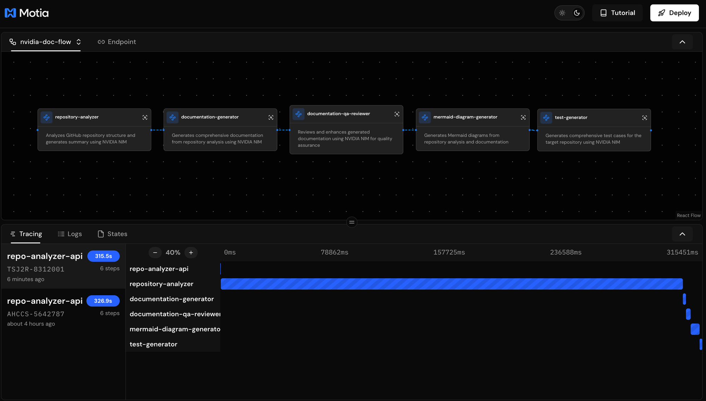
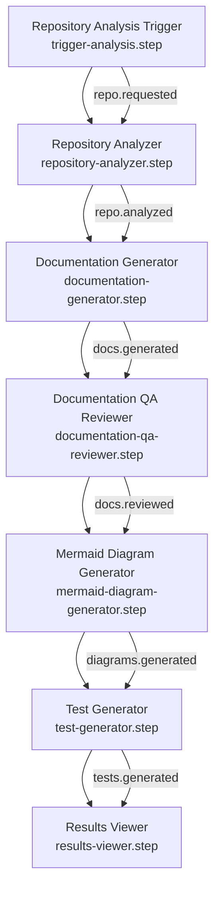

<h3 align="center">
  <a name="readme-top"></a>
  
</h3>

<div align="center">

  <h1>AI Documentation Generator (NVIDIA NIM + Motia)</h1>

  <p>
    An intelligent documentation generation system that automatically analyzes GitHub repositories and creates comprehensive documentation with architecture diagrams, code analysis, and test generation - powered by NVIDIA NIM LLMs.
  </p>

  <a href="https://motia.dev">
    
  </a>
  <a href="https://docs.nvidia.com/ai-enterprise/overview/">
    
  </a>
  <a href="https://mermaid.js.org/">
    
  </a>
  

</div>

---

## Features

-  AI-powered repository analysis using NVIDIA NIM LLMs
-  Automatic generation of architecture and workflow diagrams
-  Comprehensive documentation with multiple sections
-  Code quality analysis and improvement suggestions  
-  Automated test case generation
-  Event-driven architecture with Motia flows
-  Language statistics and repository metrics
-  Support for multiple programming languages

---

## Project Structure

```bash
.
├── lib/
│   └── nim.ts                     # NVIDIA NIM API client
├── prompts/                       # Mustache templates for AI prompts
│   ├── analyze_repo/             # Repository analysis prompts
│   ├── generate_tests/           # Test generation prompts
│   ├── qa_review/               # QA review prompts
│   ├── render_mermaid/          # Diagram generation prompts
│   └── write_docs/              # Documentation prompts
├── steps/                        # Motia flow steps
│   ├── analyze_repo.step.ts     # Repository analysis
│   ├── generate_tests.step.ts   # Test generation
│   ├── qa_review.step.ts        # Documentation QA
│   ├── render_mermaid.step.ts   # Diagram generation
│   ├── trigger_analysis.step.ts  # API trigger endpoint
│   └── write_docs.step.ts       # Documentation generation
└── types.d.ts                    # TypeScript type definitions
```

---

## Getting Started

### Prerequisites

- Node.js 16+
- NVIDIA NIM API key
- Motia CLI

### Installation

1. Clone the repository:
```bash
git clone https://github.com/motiadev/motia-examples/examples/nvidia-docs-motia.git
cd nvidia-docs-motia
```

2. Install dependencies:
```bash
npm install
```

3. Copy environment variables:
```bash
cp .env.example .env
```

4. Add your NVIDIA NIM API key to .env:
```env
NVIDIA_NIM_API_KEY=nvapi-xxxxx
```

### Running the Application

1. Start the Motia development server:
```bash
npm run dev
```

2. Trigger documentation generation:
```bash
curl -X POST http://localhost:3000/analyze-repo \
  -H "Content-Type: application/json" \
  -d '{"repo_url": "https://github.com/username/repo"}'
```

3. Check generated assets in:
- `assets/docs/` - Documentation files
- `assets/generated_tests/` - Generated tests
- `assets/diagrams/` - Mermaid diagrams

---

## Architecture



The system follows an event-driven architecture:



---

## Configuration

Key environment variables:

```env
# NVIDIA NIM Configuration
NVIDIA_NIM_API_KEY=your-api-key
NVIDIA_BASE_URL=https://integrate.api.nvidia.com/v1

# Repository Analysis
TARGET_REPO_URL=https://github.com/example/repo
MAX_FILES_PER_BATCH=50
MAX_FILE_SIZE_KB=500

# AI Generation
AI_TEMPERATURE=0.2
AI_MAX_TOKENS=4000
```

---

## Generated Assets

### Documentation
- Repository overview
- Architecture details
- Getting started guide
- API reference
- File structure

### Diagrams
- Architecture diagram
- Workflow diagram
- Component diagram
- Data flow diagram
- Directory structure

### Tests
- Unit tests
- Integration tests
- End-to-end tests

---

## Contributing

1. Fork the repository
2. Create your feature branch (`git checkout -b feature/amazing-feature`)
3. Commit your changes (`git commit -m 'Add some amazing feature'`)
4. Push to the branch (`git push origin feature/amazing-feature`)
5. Open a Pull Request

---

## License

MIT License

---

## Acknowledgments

- [Motia](https://motia.dev) - Low-code flow orchestration
- [NVIDIA NIM](https://developer.nvidia.com/nim) - AI model provider
- [Mermaid](https://mermaid.js.org/) - Diagram generation

<p align="right">(<a href="#readme-top">back to top</a>)</p>
