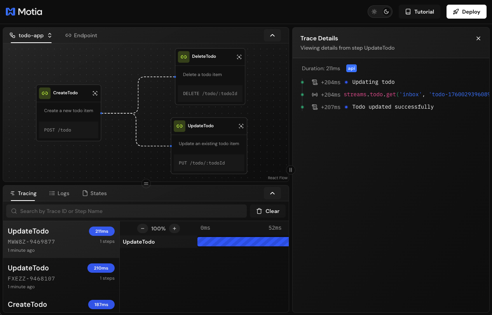

# Todo App

A modern todo application built with **Motia** framework, featuring real-time streaming capabilities, a React frontend, and a type-safe API backend.

Example used in this video: [https://www.youtube.com/watch?v=N3IsWC63X2U](https://www.youtube.com/watch?v=N3IsWC63X2U)

# Images

#### Workbench



#### Webapp


## 🏗️ Project Structure

This is a monorepo managed with pnpm workspaces, consisting of two main packages:

```
todo/
├── api/                          # Motia backend API
│   ├── steps/
│   │   └── todo/                 # Todo-related API steps
│   │       ├── create-todo.step.ts
│   │       ├── update-todo.step.ts
│   │       ├── delete-todo.step.ts
│   │       └── todo.stream.ts
│   ├── motia-workbench.json      # Motia flow configuration
│   ├── package.json
│   └── tsconfig.json
│
├── app/                          # React frontend application
│   ├── src/
│   │   ├── components/           # React components
│   │   │   ├── TodoItem.tsx
│   │   │   ├── Checkbox.tsx
│   │   │   └── IconButton.tsx
│   │   ├── hook/
│   │   │   └── useTodoEndpoints.ts
│   │   ├── App.tsx               # Main application component
│   │   ├── main.tsx              # Entry point
│   │   ├── constants.ts          # API and WebSocket URLs
│   │   └── index.css
│   ├── package.json
│   └── vite.config.ts
│
├── package.json                  # Root package configuration
└── pnpm-workspace.yaml           # pnpm workspace configuration
```

---

## 🔧 API Steps

The API is built using the **Motia** framework, which provides a type-safe, streaming-first architecture. All steps are defined in the `api/steps/todo/` directory.

### Stream Definition

**`todo.stream.ts`** - Defines the todo stream and schema

- **Stream Name**: `todo`
- **Storage Type**: `default`
- **Schema**:
  ```typescript
  {
    id: string
    description: string
    createdAt: string
    dueDate?: string
    completedAt?: string
  }
  ```

### API Endpoints

#### 1. **CreateTodo** (`create-todo.step.ts`)

Creates a new todo item in the system.

- **Type**: `api`
- **Method**: `POST`
- **Path**: `/todo`
- **Flow**: `todo-app`
- **Request Body**:
  ```typescript
  {
    description: string
    dueDate?: string
  }
  ```
- **Response**:
  - `200`: Returns the created todo object
  - `400`: Error if description is missing
- **Virtual Emits**: `todo-created`
- **Storage**: Stores todo in the `inbox` group

#### 2. **UpdateTodo** (`update-todo.step.ts`)

Updates an existing todo item.

- **Type**: `api`
- **Method**: `PUT`
- **Path**: `/todo/:todoId`
- **Flow**: `todo-app`
- **Request Body**:
  ```typescript
  {
    description?: string
    dueDate?: string
    checked?: boolean
  }
  ```
- **Response**:
  - `200`: Returns the updated todo object
  - `404`: Error if todo not found
- **Virtual Subscribes**: `todo-created`
- **Features**:
  - Updates `completedAt` timestamp when checked/unchecked
  - Partial updates supported for description and dueDate

#### 3. **DeleteTodo** (`delete-todo.step.ts`)

Deletes a todo item from the system.

- **Type**: `api`
- **Method**: `DELETE`
- **Path**: `/todo/:todoId`
- **Flow**: `todo-app`
- **Response**:
  - `200`: Returns the deleted todo ID
  - `404`: Error if todo not found
- **Virtual Subscribes**: `todo-created`

---

## 🎨 App Structure

The frontend is a modern React application built with **Vite**, **TypeScript**, and **TailwindCSS**.

### Key Technologies

- **React 19** - UI framework
- **Vite** - Build tool and dev server
- **TypeScript** - Type safety
- **TailwindCSS 4** - Styling
- **@motiadev/stream-client-react** - Real-time streaming client
- **@motiadev/ui** - UI component library
- **lucide-react** - Icon library

### Components

#### **App.tsx**

Main application component that:

- Manages todo state and loading states
- Connects to the real-time stream via `useStreamGroup` hook
- Handles CRUD operations through the `useTodoEndpoints` hook
- Provides a clean, modern UI with an "Inbox" layout

#### **TodoItem.tsx**

Individual todo item component featuring:

- Checkbox for completion status
- Inline editing (double-click to edit)
- Delete functionality
- Loading states for operations
- Smooth animations and transitions

#### **Checkbox.tsx**

Custom checkbox component with:

- Circular design
- Smooth transitions
- Custom check icon
- Tailwind CSS styling

#### **IconButton.tsx**

Reusable icon button wrapper component based on `@motiadev/ui` Button.

### Hooks

#### **useTodoEndpoints.ts**

Custom hook providing type-safe API calls:

- `createTodo(description: string)` - Creates a new todo
- `updateTodo(id: string, args: {...})` - Updates a todo
- `deleteTodo(id: string)` - Deletes a todo

All endpoints use the `API_URL` from constants.

### Real-time Streaming

The app uses **@motiadev/stream-client-react** to subscribe to real-time updates:

```typescript
const { data: todos } = useStreamGroup<Todo>({
  groupId: 'inbox',
  streamName: 'todo',
})
```

This ensures that all connected clients see updates immediately without polling.

---

## 🚀 Getting Started

### Prerequisites

- **Node.js** (v18 or higher recommended)
- **pnpm** (v10.11.0 or higher)

### Installation

Install dependencies for all packages:

```bash
pnpm install
```

This will install dependencies for both the API and app workspaces.

### Environment Variables

Create a `.env` file in the `app/` directory (use `app/.env.example` as a template):

```env
VITE_BASE_URL=http://localhost:4000
VITE_BASE_WS=ws://localhost:4000
```

### Starting the Development Servers

You have multiple options to start the development environment:

#### Option 1: Start Both Processes Together

```bash
pnpm dev
```

This runs both the API and app servers concurrently.

#### Option 2: Start Processes Separately

**Terminal 1 - Start the API server:**

```bash
pnpm api
```

The Motia API will start on `http://localhost:3000` (default)

**Terminal 2 - Start the frontend app:**

```bash
pnpm app
```

The React app will start on `http://localhost:5173` (default)

---

## 📦 Available Scripts

### Root Level

- `pnpm dev` - Start both API and app in development mode
- `pnpm api` - Start only the API server
- `pnpm app` - Start only the frontend app
- `pnpm lint` - Lint both packages
- `pnpm build` - Build both packages

### API Package

```bash
cd api/
pnpm dev              # Start Motia dev server
pnpm build            # Build the API
pnpm generate-types   # Generate TypeScript types
pnpm clean            # Clean build artifacts
```

### App Package

```bash
cd app/
pnpm dev      # Start Vite dev server
pnpm build    # Build for production
pnpm lint     # Run ESLint
pnpm preview  # Preview production build
```

---

## 🌟 Features

- ✅ **Real-time Synchronization** - All clients stay in sync via Motia Streams
- ✅ **Type-Safe** - End-to-end TypeScript with Zod schema validation
- ✅ **Modern UI** - Beautiful, responsive design with TailwindCSS
- ✅ **Inline Editing** - Double-click any todo to edit
- ✅ **Optimistic Updates** - Instant UI feedback with loading states
- ✅ **Virtual Events** - Uses Motia's virtual events for loose coupling
- ✅ **Stream Groups** - Todos organized in an "inbox" group

---

## 🛠️ Technical Highlights

### Motia Framework

This project leverages **Motia**, a framework designed for building streaming-first applications:

- **Type-Safe Steps**: All API routes are defined as "steps" with Zod schemas
- **Stream Management**: Built-in stream storage and real-time capabilities
- **Virtual Events**: Decoupled communication between steps
- **Flow Configuration**: Visual flow management via `motia-workbench.json`

### Type Safety

- Zod schemas ensure runtime validation
- Shared type definitions between API and frontend
- Full TypeScript support throughout the stack

### Developer Experience

- Hot module replacement in both API and frontend
- Monorepo setup with pnpm workspaces
- Automatic type generation from Motia steps
- Clean separation of concerns
