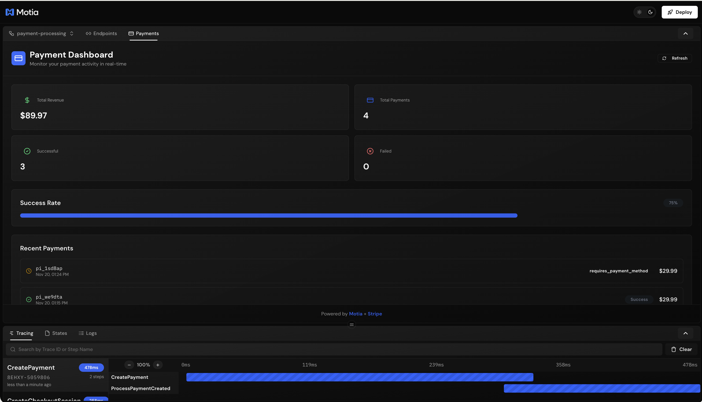
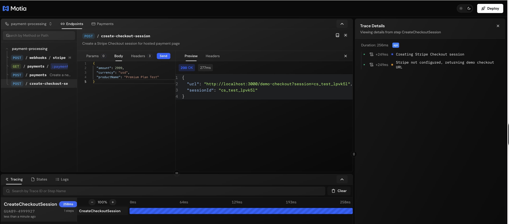
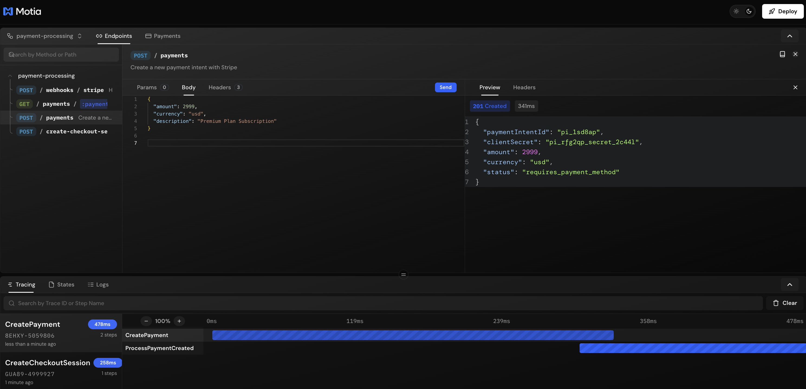

# 💳 Payments with Motia

**Build Stripe payment integration in minutes, not hours.**

<div align="center">
  


*Beautiful payment dashboard built as a Motia plugin*

</div>

---

## 🚀 Get Started

```bash
npm install
npm run dev
```

**Open http://localhost:3000** → Click **"Payments"** tab → Click **"Test Payment"**

That's it! Watch your payment flow from checkout to fulfillment in real-time.

---

## 💡 Why Motia for Payments?

### Simple API
```javascript
fetch('/payments', {
  method: 'POST',
  body: JSON.stringify({ amount: 2999, currency: 'usd' })
})
```

### Visual Workflow
See your entire payment flow in the Workbench - from API call to webhook to fulfillment.

### Real-time Dashboard
Monitor revenue, success rates, and recent transactions with a beautiful built-in dashboard.

### Type-Safe
Auto-generated TypeScript types from your step configurations. Zero manual type definitions.

---

## 🎨 Complete Payment Flow

### 1. Test the Checkout

<div align="center">



*Stripe-style checkout page (works without API keys!)*

</div>

Click "Test Payment" in the dashboard to open the checkout page.

### 2. Payment Success

<div align="center">



*Beautiful success page with automatic webhook triggering*

</div>

After payment, webhooks trigger automatically and the dashboard updates in real-time.

---

## 📊 What Happens Behind the Scenes

```
POST /create-checkout-session
    ↓
Opens Checkout Page
    ↓
User Completes Payment
    ↓
Success Page (triggers webhook automatically)
    ↓
Event Steps Process Payment
    ├── Send receipt
    ├── Fulfill order
    └── Update dashboard
    ↓
Dashboard Shows Real-Time Data!
```

All automatic. All type-safe. All visual in Workbench.

---

## 🏗️ Project Structure

```
steps/
├── api/                          # HTTP endpoints
│   ├── create-payment.step.ts   # Create payment intent
│   ├── create-checkout-session.step.ts  # Start checkout
│   ├── stripe-webhook.step.ts   # Handle Stripe events
│   ├── demo-checkout.step.ts    # Checkout page
│   └── success.step.ts          # Success page
└── events/                       # Background processing
    ├── process-payment-created.step.ts
    ├── process-payment-succeeded.step.ts
    └── process-payment-failed.step.ts

plugins/payment-dashboard/        # Custom dashboard
    └── index.tsx

src/services/stripe/              # Business logic
    ├── create-payment-intent.ts
    ├── retrieve-payment-intent.ts
    └── verify-webhook-signature.ts
```

---

## 🔌 API Endpoints

### Create Payment Intent
```bash
POST /payments
{
  "amount": 2999,
  "currency": "usd",
  "description": "Premium Plan"
}
```

### Create Checkout Session
```bash
POST /create-checkout-session
{
  "amount": 2999,
  "currency": "usd",
  "productName": "Premium Plan"
}
```

### Get Payment Status
```bash
GET /payments/:paymentIntentId
```

### Handle Webhooks
```bash
POST /webhooks/stripe
```

---

## 🔐 Production Setup (Optional)

The demo works without Stripe keys. To connect real Stripe:

**1. Get your keys**
- Visit https://dashboard.stripe.com/test/apikeys
- Copy your Secret key (starts with `sk_test_`)

**2. Add to `.env`**
```env
STRIPE_SECRET_KEY=sk_test_your_key_here
```

**3. Install Stripe SDK**
```bash
npm install stripe
```

**4. Test with real card**
- Card: `4242 4242 4242 4242`
- Expiry: Any future date
- CVC: Any 3 digits

---

## ✨ Features

| Feature | Included |
|---------|----------|
| Type-safe API | ✅ |
| Auto-generated types | ✅ |
| Event-driven processing | ✅ |
| Real-time dashboard | ✅ |
| Custom Workbench UI | ✅ |
| Automatic retries | ✅ |
| Webhook handling | ✅ |
| Beautiful checkout | ✅ |
| Production patterns | ✅ |

---

## 📚 Resources

- **Motia Documentation** - [motia.dev/docs](https://motia.dev/docs)
- **Stripe Payments Guide** - [docs.stripe.com/payments](https://docs.stripe.com/payments)
- **Stripe Checkout** - [docs.stripe.com/checkout](https://docs.stripe.com/checkout/quickstart?lang=node)

---

<div align="center">

**Built with [Motia](https://motia.dev)**

*Making payment integration simple, type-safe, and scalable.*

</div>
